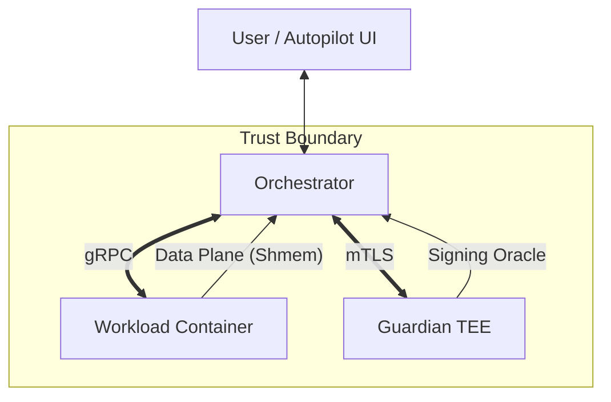

# IOI: Internet of Intelligence


**The Fractal Operating System for Agency.**

IOI is a Web4 infrastructure framework that bridges **probabilistic AI inference** with **deterministic blockchain settlement**. 

IOI implements a **Fractal Kernel**: the same verifiable runtime powers a free, private desktop assistant on a laptop (**Mode 0**), enables peer-to-peer agent swarms (**Mode 1**), and scales to a global settlement network for high-stakes liability (**Mode 2**).

This architecture enables **Service-as-a-Software (SaS)**: Developers compile agents into self-contained binaries that include logic, UI, and security policy. These binaries are verified on-chain but run locally or provisioned to designated cloud provider, solving the "Trust Gap" in AI.

---

## 🏗 The Architecture

IOI treats an AI Agent not as a script, but as a **kernel-managed process** with its own wallet, memory, and security boundary.

### System Topology
The node is composed of three isolated containers to enforce security boundaries:



1.  **Orchestrator (The Nervous System):** Handles P2P networking, mempool, and consensus ordering. It enforces the **Agency Firewall** and never exposes raw keys to the model.
2.  **Workload (The Brain):** Executes AI logic (Wasm/Python), manages vector memory (**SCS**), and runs the VM. It is ephemeral and stateless.
3.  **Guardian (The Conscience):** A hardware-anchored (SGX/Nitro) sidecar that holds keys and enforces non-equivocation. It provides the **Root of Trust**.

---

## ⚡ Key Innovations

### 1. Service-as-a-Software (SaS)
IOI transforms agents from cloud APIs into **Verifiable Artifacts**.
*   **The Artifact:** A single binary containing the Agent Logic, a custom React UI, and a Manifest.
*   **The Check:** The binary verifies an on-chain **Asset License** before booting, enabling decentralized DRM.
*   **The Result:** Developers sell full-stack AI applications that run on user hardware with zero infrastructure cost.

### 2. The Agency Firewall (Semantic Security)
A deterministic policy engine that sits between the LLM and the OS.
*   **Intercepts:** All tool calls (e.g., `fs::write`, `wallet::send`, `net::fetch`).
*   **Validates:** Checks intent against a user-defined policy (`policy.toml`).
*   **Enforces:** Blocks malicious actions *before* they happen, solving the "Prompt Injection" problem at the kernel level.

### 3. Sovereign Context Substrate (SCS)
A verifiable, append-only file format (`.scs`) for agent memory.
*   **Vector Native:** Uses **mHNSW** graphs for verifiable vector search.
*   **Proof of Retrieval:** Agents can prove they retrieved the correct memory without hallucination.
*   **Privacy First:** Supports "Scrub-on-Export" to redact PII before data leaves the device.

### 4. Lazarus Fault Tolerance (A-DMFT)
A bimodal consensus engine that breaks the classical 33% BFT threshold.
*   **Engine A (Settlement):** Uses hardware-anchored non-equivocation to achieve safety with **51% majority**.
*   **Engine B (Survival):** If a hardware compromise is detected (Proof of Divergence), the network executes a "Kill Switch" and transitions to a probabilistic mesh (A-PMFT) to maintain liveness.

---

## 📂 Repository Structure

The codebase is organized as a Rust workspace.

### Core Kernel
| Crate | Description |
| :--- | :--- |
| **`node`** | Entry points for the binaries (`ioi-agent`, `ioi-local`, `guardian`, `workload`). |
| **`consensus`** | Implementation of **A-DMFT** (Engine A), **A-PMFT** (Engine B), and the Kill Switch. |
| **`validator`** | Container orchestration, reactor loops, and the main event bus. |
| **`api`** | Core traits (`ChainStateMachine`, `CommitmentScheme`) defining the component interfaces. |

### Execution & State
| Crate | Description |
| :--- | :--- |
| **`execution`** | The state transition machine, including **Block-STM**-style parallel execution (`mv_memory`). |
| **`state`** | Pluggable state trees: **IAVL**, **Jellyfish**, **Verkle** (KZG), and **mHNSW**. |
| **`storage`** | Persistent storage layer based on **redb** with Write-Ahead Log (WAL) support. |
| **`scs`** | The Sovereign Context Substrate logic and vector indexing. |
| **`vm/wasm`** | Wasmtime-based runtime for smart contracts and services. |

### Interfaces & Drivers
| Crate | Description |
| :--- | :--- |
| **`drivers`** | Native hardware bindings: **GUI** (mouse/keyboard), **Browser** (CDP), **Terminal**, and **MCP**. |
| **`services`** | Native WASM modules: `Governance`, `IdentityHub`, `Market`, `IBC`, `DesktopAgent`. |
| **`cli`** | The developer toolchain. Handles `pack`, `deploy`, and devnets. |

---

## 🚀 Getting Started

### Prerequisites
*   **Rust (via rustup):** Stable toolchain (`1.93.1` pinned in `rust-toolchain.toml`)
    ```bash
    rustup toolchain install 1.93.1
    rustup override set 1.93.1
    ```
*   **Protobuf:** `protoc` (required for `tonic-build`; Debian/Ubuntu package: `protobuf-compiler`)
*   **Node.js/NPM:** Required for the Autopilot UI.
*   **System Deps:** `pkg-config`, `libssl-dev`, `libdbus-1-dev`, `libxcb1-dev`, `libxdo-dev`, `build-essential`

### 🛠 Running the Developer Stack (Mode 0)

Mode 0 runs the full stack locally for agent development.

#### 1. Start the IOI Kernel
In a terminal, build and initialize the local node. This generates your identity keys and genesis state in `./ioi-data`.

```bash
# Ensure you're using the pinned stable toolchain in this repo
rustup override set 1.93.1

# First run (initializes genesis and keys)
cargo run --bin ioi-local --features "local-mode" 
```

To enable real AI inference (required for complex agent demos), export your key and run the compiled binary:

```bash
export OPENAI_API_KEY=sk-proj-...
./target/debug/ioi-local
```
*Wait for log:* `ORCHESTRATION_RPC_LISTENING_ON_0.0.0.0:9000`

#### 2. Start the Autopilot UI
In a **second terminal**, start the desktop frontend.

```bash
cd apps/autopilot
npm install
npm run tauri dev
```
*Action:* Press `Ctrl+Space` (or `Cmd+Space` on macOS) to open the spotlight bar.

---

## 🧪 Testing & Verification

IOI employs a "Trace-First" development methodology. You can verify the kernel components using the CLI test suite.

```bash
# 1. Infrastructure E2E: Verifies P2P sync and block production
cargo test -p ioi-cli --test infra_e2e --features "consensus-admft,vm-wasm,state-iavl" -- --nocapture --test-threads=1

# 2. Lazarus Protocol: Verifies 2-Chain Commit Rule & Safety Guard
RUST_LOG=info,consensus=info cargo test -p ioi-cli --test admft_e2e --features "consensus-admft,vm-wasm,state-iavl" -- --nocapture

# 3. Agentic Security: Verifies PII Scrubbing and Policy Gates
cargo test -p ioi-cli --test agent_scrub_e2e --features "consensus-admft,vm-wasm,state-iavl"
```

---

## 🔐 Cryptography

IOI is designed for **Industrial Assurance** and long-term security.

*   **Post-Quantum Native:** The protocol uses NIST-standardized **ML-KEM (Kyber)** for transport encryption and **ML-DSA (Dilithium)** for signatures by default.
*   **Hybrid KEM:** We utilize a hybrid key exchange (ECDH + Kyber) to protect against "Harvest Now, Decrypt Later" attacks while maintaining classical security guarantees.
*   **Non-Equivocation:** The **Guardian** module uses local hardware (or a remote signing oracle) to enforce monotonic counters on all consensus messages, making safety violations ($n > 2f$) attributable and slashable.

---

## 📄 License

*   **Core Interfaces (`ioi-api`, `ioi-types`):** MIT / Apache 2.0 (Permissive).
*   **Kernel Engine (`ioi-consensus`, `ioi-validator`):** Business Source License (BSL) 1.1. Free for non-commercial and development use. Converts to Open Source after 3 years.
