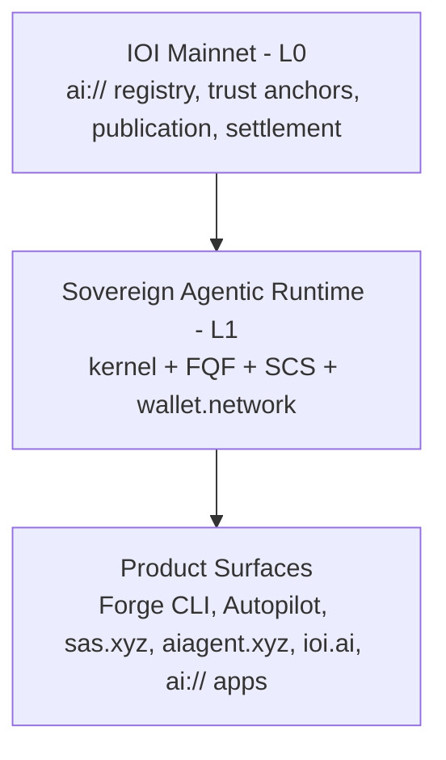
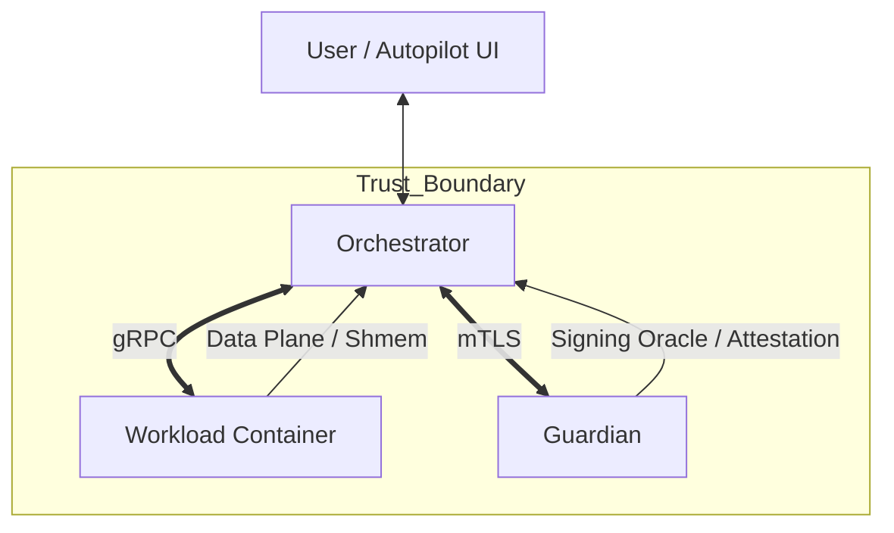

# IOI: Internet of Intelligence


**The L0 Web4 framework for sovereign agentic L1s.**  
**The Fractal Operating System for Agency.**

The internet democratized information (Web1/Web2). Blockchains democratized value (Web3). IOI is aimed at the next primitive: **sovereign action**.

IOI is a local-first, proof-oriented kernel for agentic software. It is designed to bridge the gap between **probabilistic AI inference** and **deterministic cryptographic settlement**. We do not treat agents as prompts glued to SaaS databases. We treat them as kernel-managed processes with explicit capability boundaries, verifiable memory, durable canonical state, and receipted real-world effects.

In one sentence:

> **IOI is an L0 Web4 framework that lets sovereign agentic L1s run local-first applications with canonical state, verifiable context, cryptographic capability control, and rooted `ai://` publication.**

This repository already contains substantial pieces of that stack:

- the fractal kernel: consensus, execution, state, storage, validator/runtime machinery
- `Forge`: the kernel-adjacent, CLI-first surface for scaffolding and instantiating intelligent blockchains and sovereign domains (currently rooted in `crates/cli`)
- `SCS`: the Sovereign Context Substrate for verifiable memory and context
- `wallet.network`: the authority and capability-control plane for sessions, approvals, and delegated execution
- `Autopilot`: the native desktop runtime with Spotlight, Studio, gates, receipts, and Context Atlas
- `sas.xyz`: the provider OS for packaging, deploying, serving, and commercializing worker services
- `aiagent.xyz`: the discovery and procurement layer for worker services
- `agent-ide`: the shared builder/canvas substrate for provider and orchestration surfaces
- the active `FQF` and `ai://` direction for canonical app state, projection-native serving, and rooted resolution

## Why This Exists

Safe agentic systems cannot be built by pretending models are deterministic. They are not. The correct design move is not to freeze inference. It is to **collapse effects**.

IOI enforces what we describe as the **Wave Function Collapse of Agency**:

- the model can reason probabilistically
- the runtime can explore, rank, and plan
- but spending, signing, data egress, connector execution, and other real-world effects must pass through strict, cryptographically verifiable control planes before execution

The model is allowed to be fuzzy. The consequences are not.

That is why IOI is not just:

- a blockchain
- a vector database
- an agent framework
- an IDE
- or a desktop assistant

It is an attempt to provide the **runtime substrate** those systems need in order to be trustworthy.

## Core Vocabulary

| Term | Meaning |
| :--- | :--- |
| `L0` | The root coordination layer. For IOI this means global `ai://` registry, publication, trust anchors, and settlement roots. |
| `L1` | A sovereign agentic runtime built on top of that root layer. It owns its own execution, state, projections, and serving. |
| `SCS` | Sovereign Context Substrate. The context plane for memory, retrieval, export, and retrieval proofs. |
| `CSPS` | Canonical State and Projection System. The new taxonomy for systems where canonical state is truth and projections are first-class runtime artifacts. |
| `FQF` | Fractal Query Fabric. IOI's proposed `CSPS` architecture for canonical app state, projections, subscriptions, and query receipts. |
| `wallet.network` | The sovereign IAM and capability-control plane for sessions, approvals, leases, and secret-safe execution. |
| `ai://` | The emerging application, publication, and resolution model anchored by IOI mainnet as `L0`. |

Relevant taxonomy and architecture docs:

- [`docs/canonical-state-and-projection-system-whitepaper.md`](docs/canonical-state-and-projection-system-whitepaper.md)
- [`docs/fractal-query-fabric-spec.md`](docs/fractal-query-fabric-spec.md)

## The Fractal Architecture

IOI is called fractal because the same core ideas are meant to work:

- on one laptop
- across a private enterprise swarm
- across a sovereign agent runtime
- and across a global `L0` registry and trust-anchor layer

### The Internet Topology


```mermaid
graph TD
    L0[IOI Mainnet - L0<br/>ai:// registry, trust anchors, publication, settlement]
    L1[Sovereign Agentic Runtime - L1<br/>kernel + FQF + SCS + wallet.network]
    UI[Product Surfaces<br/>Forge CLI, Autopilot, sas.xyz, aiagent.xyz, ioi.ai, ai:// apps]

    L0 --> L1
    L1 --> UI
```

The separation matters:

- `L0` should own global namespace, publication, trust, and settlement roots
- sovereign runtimes should own most execution, state, projections, and serving
- local-first clients should own drafts, optimistic state, local caches, and ephemeral UX

### The Node Topology

At the runtime layer, IOI decomposes an agent system into three isolated security domains:


```mermaid
graph TD
    User[User / Autopilot UI] <--> O[Orchestrator]

    subgraph Trust_Boundary
        O <== gRPC ==> W[Workload Container]
        O <== mTLS ==> G[Guardian]
    end

    W -- Data Plane / Shmem --> O
    G -- Signing Oracle / Attestation --> O
```

- **Orchestrator (the nervous system):** handles networking, consensus ordering, runtime coordination, and the Agency Firewall
- **Workload (the brain):** executes AI logic, Wasm/Python workloads, and local context processing
- **Guardian (the conscience):** hardware/software-isolated sidecar for keys, attestation, monotonicity, and non-equivocation

## Core Technological Breakthroughs

### 1. Asymptote Fault Tolerance (AFT)

IOI's consensus family is now specified as **Asymptote Fault Tolerance
(`AFT`)**. Instead of treating dense positive voting as the only source of
ordering truth, AFT combines guardian-backed tentative progress,
proof-carrying canonical ordering, deterministic collapse, compact hot-path
frontier bindings, and cold-path recovery / restart continuity.

The repository's theorem surface is singular: AFT claims
relay-free, coordinator-free, pure-software deterministic
`99% Byzantine Tolerance`; explicitly claims that the whole AFT stack
universally breaks the lower bound with no qualifiers; and promotes that
result to unconditional classical `99% Byzantine agreement` in the ordinary
dense-vote permissioned model. In the implementation and formal package, that
sentence is realized through proof-carrying public evidence, omission-dominant
canonical ordering, collapse-gated durability, and endogenous historical
continuation rather than through dense positive quorum intersection alone.

- **GuardianMajority:** guardian-backed transport and tentative `BaseFinal`
  progression on the hot path
- **CanonicalOrdering:** proof-carrying equal-authority ordering with
  omission-dominant close-or-abort
- **Asymptote:** deterministic sealing and irreversible-effect release through
  canonical close/abort and observer-backed collapse
- **NestedGuardian:** witness-augmented layered threshold mode for stronger
  recovery-backed compositions
- **Historical continuation:** canonical collapse / replay and the recovered
  state surface jointly carry the continuation root used for deeper restart
  ancestry paging

The canonical theorem/protocol specification is
[`docs/consensus/aft/specs/yellow_paper.tex`](docs/consensus/aft/specs/yellow_paper.tex).
Supporting protocol specs live in
[`docs/consensus/aft/specs/guardian_majority.md`](docs/consensus/aft/specs/guardian_majority.md),
[`docs/consensus/aft/specs/asymptote.md`](docs/consensus/aft/specs/asymptote.md),
[`docs/consensus/aft/specs/canonical_ordering.md`](docs/consensus/aft/specs/canonical_ordering.md),
[`docs/consensus/aft/specs/equal_authority_ordering.md`](docs/consensus/aft/specs/equal_authority_ordering.md),
and [`docs/consensus/aft/specs/nested_guardian.md`](docs/consensus/aft/specs/nested_guardian.md).
Formal models live under [`formal/aft/`](formal/aft/).

### 2. The Agency Firewall

The Agency Firewall is the semantic security boundary between model intent and real execution.

- intercepts all tool calls and effectful operations
- validates requested actions against explicit scopes and policy
- blocks or pauses before execution, not after damage
- turns "prompt injection" from a UX problem into a runtime control problem

The current framing in the project remains accurate:

> the model may generate fuzzy plans, but the runtime must collapse all effects through deterministic policy and cryptographic control.

### 3. Sovereign Context Substrate (SCS)

Memory is not prompt stuffing.

`SCS` is the separate context plane for:

- append-only memory frames
- `ContextSlice` export
- retrieval lineage
- scrub-on-export / privacy shaping
- verifiable `mHNSW` retrieval

`SCS` is not a generic application database. It is a dedicated context substrate.

Important current implementation note:

- the implemented `mHNSW` retrieval contract is **certifying by default**
- retrieval fails closed if certificate generation or verification fails

See:

- [`docs/commitment/tree/mhnsw/README.md`](docs/commitment/tree/mhnsw/README.md)
- [`crates/scs`](crates/scs)

### 4. Canonical State and Projection System (CSPS) and FQF

Agentic applications eventually need more than a relational authority layer.

IOI is moving toward a **Canonical State and Projection System** (`CSPS`) in which:

- canonical state is the source of truth
- projections are first-class runtime artifacts
- subscriptions are resumable and checkpoint-aware
- local-first React apps bind to shared canonical state without depending on sticky backend sessions

Within IOI, the proposed architecture for that is the **Fractal Query Fabric** (`FQF`).

This is the layer intended to replace the standard:

- hosted Postgres as authority
- ad hoc realtime
- bespoke cache invalidation
- app-specific sync glue

with:

- kernel-native canonical state
- named projections
- resumable subscriptions
- portable checkpoints
- scoped query and mutation semantics

See:

- [`docs/canonical-state-and-projection-system-whitepaper.md`](docs/canonical-state-and-projection-system-whitepaper.md)
- [`docs/fractal-query-fabric-spec.md`](docs/fractal-query-fabric-spec.md)

### 5. Zero-Exposure Agency via wallet.network

High-risk operations are not authorized through vague backend sessions or ambient secrets.

IOI's direction is to mediate those operations through:

- explicit session authorization
- short-lived or one-shot approval tokens
- audience-bound capability artifacts
- revocation epochs
- lease and receipt commitments

Agents do not need to hold raw API keys or seed phrases. They request bounded effects from the control plane.

See:

- [`docs/wallet_network.md`](docs/wallet_network.md)

### 6. Service-as-Software

IOI aims to make agents distributable as portable software artifacts rather than opaque cloud endpoints.

The long-term idea behind **Service-as-Software** is:

- worker logic is portable
- UI can be bundled with the service
- policy and capability boundaries travel with the artifact
- publication can anchor into `ai://`
- execution can happen locally or in sovereign remote environments

This is part of why the repo contains both runtime systems and product-surface work.

## The Product Ecosystem

The intended product topology remains multi-surface and intentionally separated.

1. **Forge (`crates/cli` today)**: The Web4 L0 surface. A CLI-first, kernel-adjacent builder for scaffolding, instantiating, publishing, upgrading, and inspecting intelligent blockchains and other sovereign domains.

2. **`ioi.ai`**: The hosted demand ingress and execution UX. A user-facing surface for expressing intent, being routed to the right worker or service, approving actions when needed, and receiving outcomes plus receipts.

3. **Native Autopilot**: The private/local operator shell. When an intent needs local filesystem, wallet, browser, desktop GUI, or other high-trust capabilities, execution escalates to the local runtime.

4. **`sas.xyz` and the shared builder substrate**: The provider operating system and builder environment. `sas.xyz` packages, deploys, serves, and commercializes worker services, including intelligent-blockchain-backed services when those domains are exposed as provider products.

5. **`aiagent.xyz`**: The discovery and procurement layer where buyers discover, compare, install, run, or procure worker services.

The repo currently includes:

- [`crates/cli`](crates/cli) as the current kernel-adjacent CLI surface that is expected to evolve into Forge
- [`apps/autopilot`](apps/autopilot)
- [`apps/sas-xyz`](apps/sas-xyz)
- [`apps/aiagent-xyz`](apps/aiagent-xyz)
- [`packages/agent-ide`](packages/agent-ide)
- [`apps/agent-studio`](apps/agent-studio) as the current standalone web shell around `agent-ide`

## Repository Map

The codebase is a Rust workspace with a TS/React application layer on top.

### Applications and Interfaces

| Path | Role |
| :--- | :--- |
| [`crates/cli`](crates/cli) | Current kernel-adjacent CLI surface expected to evolve into Forge for scaffolding, instantiating, publishing, and inspecting intelligent blockchains and sovereign domains. |
| [`apps/autopilot`](apps/autopilot) | Private/local operator shell and desktop runtime with Spotlight, Studio, policy gates, receipts, and Context Atlas. |
| [`apps/sas-xyz`](apps/sas-xyz) | Provider OS surface for packaging, deploying, serving, and commercializing worker services. |
| [`apps/aiagent-xyz`](apps/aiagent-xyz) | Discovery and procurement surface for worker services and bespoke demand. |
| [`packages/agent-ide`](packages/agent-ide) | Shared builder/canvas package intended to be embedded into Autopilot and future apps such as `sas.xyz`. |
| [`apps/agent-studio`](apps/agent-studio) | Current standalone browser shell for `agent-ide`. |

### Kernel and Runtime

| Path | Role |
| :--- | :--- |
| [`crates/node`](crates/node) | Entry points for runtime binaries such as `ioi-local`, `guardian`, and `workload`. |
| [`crates/consensus`](crates/consensus) | Asymptote Fault Tolerance (AFT) consensus machinery spanning GuardianMajority, CanonicalOrdering, Asymptote, and NestedGuardian. |
| [`crates/validator`](crates/validator) | Runtime orchestration, enforcement, reactor loops, and event handling. |
| [`crates/execution`](crates/execution) | Deterministic execution and state transition handling. |
| [`crates/state`](crates/state) | Commitment trees and proof-oriented state structures. |
| [`crates/storage`](crates/storage) | Durable storage over `redb` plus write-ahead logging. |
| [`crates/services`](crates/services) | First-party services and domain logic. |
| [`crates/tx`](crates/tx) | Transaction validation and execution-facing transaction logic. |
| [`crates/ipc`](crates/ipc) | IPC/public proto contracts and runtime data surfaces. |

### Context, Identity, and Safety

| Path | Role |
| :--- | :--- |
| [`crates/scs`](crates/scs) | Sovereign Context Substrate and retrieval logic. |
| [`crates/pii`](crates/pii) | Privacy, review, and scrub-on-export primitives. |
| [`crates/api`](crates/api) | Core chain/state traits and interfaces. |
| [`crates/types`](crates/types) | Shared protocol and runtime types. |
| [`crates/drivers`](crates/drivers) | Native capability surfaces: GUI, browser, terminal, MCP, and more. |

## Read These First

If you want the fastest path to understanding the current repo, read in this order:

1. [`docs/forge.md`](docs/forge.md)
2. [`docs/consensus/aft/specs/yellow_paper.tex`](docs/consensus/aft/specs/yellow_paper.tex)
3. [`crates/cli/src/lib.rs`](crates/cli/src/lib.rs)
4. [`apps/autopilot/README.md`](apps/autopilot/README.md)
5. [`docs/wallet_network.md`](docs/wallet_network.md)
6. [`docs/canonical-state-and-projection-system-whitepaper.md`](docs/canonical-state-and-projection-system-whitepaper.md)
7. [`docs/fractal-query-fabric-spec.md`](docs/fractal-query-fabric-spec.md)

## Getting Started

### Prerequisites

- **Rust via rustup:** toolchain `1.93.1` pinned in [`rust-toolchain.toml`](rust-toolchain.toml)
- **Protobuf:** `protoc` for `tonic-build`
- **Node.js:** v20+
- **Desktop build dependencies** for Tauri on Linux

On Ubuntu or Pop!_OS:

```bash
sudo apt update
sudo apt install -y \
  build-essential \
  pkg-config \
  protobuf-compiler \
  libssl-dev \
  libdbus-1-dev \
  libxcb1-dev \
  libxdo-dev \
  libgtk-3-dev \
  libayatana-appindicator3-dev \
  librsvg2-dev \
  libsoup-3.0-dev \
  libwebkit2gtk-4.1-dev
```

### 1. Install and Build

```bash
rustup toolchain install 1.93.1
rustup override set 1.93.1
npm install
cargo check
npm run build:all
```

### 2. Run the Local Kernel (Mode 0)

First initialize the local node. This generates identity keys and genesis state.

```bash
cargo run --bin ioi-local --features "local-mode"
```

For live model-backed demos:

```bash
OPENAI_API_KEY=sk-proj-... ./target/debug/ioi-local
```

Wait for the orchestration RPC to log:

```text
ORCHESTRATION_RPC_LISTENING_ON_0.0.0.0:9000
```

### 3. Run Autopilot

From the repo root:

```bash
npm run dev:desktop
```

For Wayland:

```bash
npm run dev:desktop:wayland
```

Or directly:

```bash
cd apps/autopilot
npm run tauri dev
```

Tip: use `Ctrl+Space` on Linux/Windows or `Cmd+Space` on macOS to open Spotlight.

### 4. Run the Current Agent Studio Shell

```bash
npm run dev:web
```

## Testing and Verification

IOI follows a trace-first methodology. Start with the base checks:

```bash
cargo check
npm run build:all
```

Focused kernel / Forge harness tests:

```bash
# Infrastructure E2E: P2P sync and block production
cargo test -p ioi-cli --test infra_e2e --features "consensus-aft,vm-wasm,state-iavl" -- --nocapture --test-threads=1

# Consensus / AFT
RUST_LOG=info,consensus=info cargo test -p ioi-cli --test aft_e2e --features "consensus-aft,vm-wasm,state-iavl" -- --nocapture

# Agentic security: PII scrubbing and policy gates
cargo test -p ioi-cli --test agent_scrub_e2e --features "consensus-aft,vm-wasm,state-iavl"
```

## Cryptography and Trust

IOI does not add "blockchain vibes" to AI wrappers. It uses strict cryptographic structure to make agentic systems legible, constrainable, and attributable.

- **Post-quantum and hybrid cryptography:** via `dcrypt`, including ML-KEM and ML-DSA based flows
- **Hybrid transport posture:** classical plus PQ session establishment to resist harvest-now-decrypt-later attacks
- **Guardian-backed non-equivocation:** monotonicity, attestation, and explicit chains of custody for effects
- **Scoped authority artifacts:** session authorization, approval tokens, leases, revocation epochs
- **Proof-oriented state and retrieval:** commitment structures for both canonical state and context retrieval

## Status and Direction

**IOI is in active alpha.**

### Materially present in this repo today

- kernel execution, storage, consensus, and validator machinery
- `SCS`, `ContextSlice`, and certifying `mHNSW` retrieval
- `wallet.network` session and approval primitives
- Autopilot desktop runtime and Context Atlas work
- the shared `agent-ide` package and the current standalone shell

### Active architectural direction

- `FQF` as the shared canonical app-state and projection fabric
- `CSPS` as the taxonomy above that architecture
- rooted `ai://` publication, registry resolution, and `L0` trust anchoring
- sovereign multi-node serving across portable remote environments and clean-room style runtimes

## Why the L0 Framing Matters

Calling IOI an `L0 Web4 framework` is not branding theater. It is a concrete boundary claim.

For IOI, `L0` means:

- global `ai://` namespace commitments
- publisher and identity trust anchors
- manifest and version publication commitments
- resolver bootstrapping and runtime discovery anchors
- shared settlement, receipt, and proof roots where cross-runtime trust matters

It does **not** mean:

- every app runs directly on mainnet
- every subscription is delivered by the root layer
- every projection is executed at `L0`

Instead:

- `L0` is root coordination
- sovereign agentic `L1`s are the execution domains
- local-first clients remain the UX surface

That is the architectural center of gravity this README is meant to make clear.

## License

- **Core interfaces (`ioi-api`, `ioi-types`):** MIT / Apache 2.0
- **Kernel engine and higher-assurance components:** Business Source License (`LICENSE-BBSL`)
