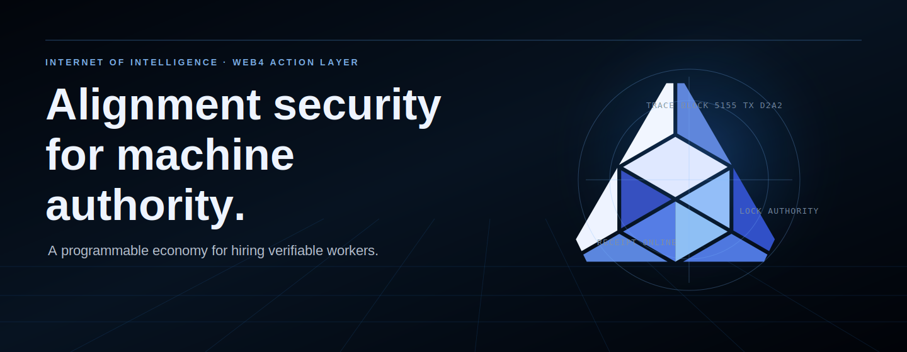

# Internet of Intelligence


<p align="center">
  
</p>

**Alignment security for machine authority.**

IOI is the Web4 execution substrate for autonomous software: a deterministic
action boundary where workers can act under scoped authority, emit receipts,
prove outcomes, and settle consequences.

> **A programmable economy for hiring verifiable workers.**

The internet learned to read, then write, then own. What it has never been able
to do safely is act. IOI builds the final primitive: sovereign action that can
be delegated, governed, verified, replayed, remediated, and settled.

```text
probabilistic reasoning
  -> bounded authority
  -> policy-gated execution
  -> cryptographic receipts
  -> canonical operational memory
  -> replayable proof
  -> settlement-grade recourse
```

The model can be fuzzy. The consequences cannot.

## The Autonomy Gap

Autonomous software is beginning to operate browsers, files, APIs, wallets,
credentials, models, tools, and other workers. Traditional cybersecurity
protects systems from malicious software. IOI protects systems from
authorized-but-unbounded autonomous software.

Most agent frameworks give a model tools. IOI gives autonomous work a
deterministic execution boundary: every consequential action is canonicalized,
policy-checked, authority-scoped, approval-gated when necessary, receipted,
replayable, and settleable.

| Not | Is |
|---|---|
| A chatbot | Execution-boundary alignment and verifiable bounded agency |
| A model marketplace | Worker routing through receipts and benchmarks |
| A wallet bolted to an LLM | Authority-scoped credentials and approvals |
| A workflow toy | Canonical operational state and replay |
| A chain with AI bolted on | Settlement for completed machine labor |

## Web4: The Action Layer

IOI is the reference implementation of canonical Web4:

> **Read + Write + Own + Act, with cryptographic determinism.**

<p align="center">
  
</p>

Web1 made information readable. Web2 made it writable. Web3 made it ownable.
Web4 makes authority executable.

Because unconstrained machine agency is structurally indistinguishable from
system failure or a cyberattack, Web4 is the alignment, containment, and
liability infrastructure that makes autonomous action safe.

Under this model, Act inherits the guarantees of Own. A worker may reason
creatively, but the moment it attempts to spend, sign, deploy, read private
data, mutate state, or invoke another worker, the runtime collapses that intent
into a deterministic action: allowed, denied, escalated, receipted, and
replayable.

## The Stack

The IOI stack is edge-in. Work starts near the user, device, data, and runtime
boundary, then projects only the commitments that need public trust into
settlement.

- The **IOI daemon** is the hypervisor and deterministic runtime boundary for
  workflows, tools, models, workers, connectors, and artifacts. It is consumed
  by separate product and adoption surfaces:
  - **Autopilot Workbench:** the native operator console and cockpit in the
    Electron / VS Code fork.
  - **IOI Authority Gateway, packaged as Autopilot Guard:** compatibility
    sidecar/adapters for third-party developer interfaces such as Cursor, VS
    Code, Claude Code, and CLI agents. It routes proposed actions through daemon
    policy, authority, receipts, and replay where integration points allow.
  The daemon is the trust substrate; Autopilot is the user-facing autonomous
  workbench.
- **wallet.network** authorizes identity, secrets, authority scopes, approvals,
  payments, data use, and decryption.
- **Agentgres** records canonical operational truth: accepted operations,
  object heads, projections, receipts, quality, lineage, and replay state.
- **Filecoin/CAS** stores payload bytes, packages, artifacts, sealed archives,
  traces, checkpoints, and evidence bundles by hash/CID.
- **IOI L1** settles public rights, registries, roots, bonds, disputes,
  governance, and economic commitments.
- **Clients** compose and inspect work: Autopilot, CLI/TUI, SDK, agent-ide,
  harnesses, benchmarks, and workflow canvases.

The doctrine is simple:

```text
The daemon executes.
wallet.network authorizes.
Agentgres remembers.
Filecoin/CAS preserves.
MoW routes.
IOI L1 settles.
Clients compose.
Evidence proves.
```

## Mixture of Workers

The Internet of Intelligence is not a single monolithic model. It is a routed
supply chain of specialized, bounded workers.

Mixture of Experts routes inference across model experts. Mixture of Workers
routes consequential labor across independently accountable workers.

```text
Intent
  -> task decomposition
  -> worker selection
  -> capability and policy check
  -> execution
  -> verification
  -> ContributionReceipts
  -> settlement
```

Models are mounted as cognition backends. Workers are installed as accountable
actors. Services are hired for defined outcomes. MoW is routed. Receipts pay
contributors.

## Worker Training

The first commercial leg of MoW is not "buy an agent marketplace." It is:

> **Train a specialist worker for a defined outcome.**

Autopilot Foundry turns workflows, traces, documents, examples, corrections,
data recipes, domain ontologies, quality gates, evaluations, and benchmark runs
into deployable workers.

Training is broader than fine-tuning. A worker can improve through prompt
optimization, retrieval curation, tool-policy hardening, workflow-graph
refinement, verifier gates, adapter training, distillation, or model
fine-tuning. Training improves capability; authority grants power.

## Product Surfaces

| Surface | Role |
|---|---|
| **Autopilot** | Local desktop workbench, operator shell, workflow composer, and Worker Training environment. |
| **ioi.ai** | Lightweight control plane for accounts, devices, restore, publishing, sync metadata, and remote-runtime access. |
| **aiagent.xyz** | Worker marketplace for manifests, benchmark profiles, Sparse Worker Categories, managed instances, installs, and routing. |
| **sas.xyz** | Outcome marketplace for Service-as-Software contracts, including Worker Training contracts and worker-composed services. |
| **developers.ioi.ai** | Developer surface for docs, SDKs, references, guides, and integration paths. |

Stop renting tools. Hire workers.

## Rules of the Runtime

- **Action-safe alignment.** IOI shifts alignment from filtering model text,
  which is breakable, to governing model consequences, which is deterministic.
- **One execution substrate.** No separate SDK, GUI, CLI, TUI, benchmark,
  harness, or workflow runtime owns consequential execution semantics.
- **Authority is explicit.** `prim:*` describes what the runtime may execute.
  `scope:*` describes what a wallet, provider, user, or tenant may authorize.
- **Tool calls are requests, not grants.** Raw model output is never authority
  for consequential action.
- **Credentials are never cognition.** Models request effects; wallet.network
  brokers secrets, approvals, payments, and scoped authority without handing raw
  keys to the worker.
- **Logs become receipts.** Runs emit legible events, receipts, traces,
  scorecards, stop reasons, delivery bundles, and replayable evidence.
- **State is operational.** Agentgres is not prompt stuffing. It is canonical
  state for worker-produced truth.
- **Data has meaning.** Domain Ontologies and Data Recipes turn source systems,
  connector payloads, traces, and documents into trainable, queryable,
  receipted domain truth.
- **Settlement is last, not first.** IOI L1 anchors the commitments that need
  public trust. The runtime stays edge-in.
- **AFT (Asymptote Fault Tolerance).** Explores omission-dominant ordering,
  deterministic collapse, and proof-carrying continuation to scale Byzantine
  agreement beyond classical thresholds under high-assurance profiles.

## Repository Map

| Path | Role |
|---|---|
| [`crates/`](crates) | Rust runtime, consensus, execution, state, storage, services, drivers, CLI, and IPC. |
| [`packages/agent-sdk`](packages/agent-sdk) | Developer SDK over the public runtime substrate. |
| [`packages/runtime-daemon`](packages/runtime-daemon) | TypeScript daemon-facing runtime API surface and validation harnesses. |
| [`packages/agent-ide`](packages/agent-ide) | Workbench and workflow-composition client over shared contracts. |
| [`packages/workspace-substrate`](packages/workspace-substrate) | Shared workspace substrate for app and workbench surfaces. |
| [`apps/autopilot`](apps/autopilot) | Local desktop operator shell (Electron-first / VS Code fork) for chat, workflows, artifacts, approvals, and runtime UX. |
| [`apps/aiagent-xyz`](apps/aiagent-xyz) | Marketplace for bounded workers, manifests, benchmark profiles, managed instances, and autonomous capabilities. |
| [`apps/sas-xyz`](apps/sas-xyz) | Marketplace for verified autonomous service outcomes and Worker Training contracts. |
| [`apps/developers-ioi-ai`](apps/developers-ioi-ai) | Developer-facing documentation and onboarding surface. |
| [`apps/benchmarks`](apps/benchmarks) | Benchmark and scorecard surfaces. |
| [`docs/architecture`](docs/architecture) | Canonical architecture authority. Start here when docs disagree. |
| [`docs/decisions`](docs/decisions) | Accepted architecture decisions and durable rationale. |

## Start Here

```bash
npm install
cargo check --workspace
npm run typecheck
```

Run the local desktop surface:

```bash
npm run dev:desktop
```

Build and test the SDK:

```bash
npm run build:agent-sdk
npm run test:agent-sdk
```

Rust uses the pinned toolchain in [`rust-toolchain.toml`](rust-toolchain.toml).
Desktop builds require the usual Electron system dependencies for your platform.

## Read Next

- [`docs/architecture/README.md`](docs/architecture/README.md) - architecture navigation and source-of-authority index.
- [`docs/architecture/foundations/web4-and-ioi-stack.md`](docs/architecture/foundations/web4-and-ioi-stack.md) - the canonical Web4 definition.
- [`docs/architecture/foundations/verifiable-bounded-agency.md`](docs/architecture/foundations/verifiable-bounded-agency.md) - bounded agency and execution-boundary alignment.
- [`docs/architecture/foundations/mixture-of-workers.md`](docs/architecture/foundations/mixture-of-workers.md) - MoW labor-routing doctrine.
- [`docs/architecture/foundations/worker-training-lifecycle.md`](docs/architecture/foundations/worker-training-lifecycle.md) - Worker Training lifecycle and Autopilot Foundry doctrine.
- [`docs/architecture/foundations/domain-ontologies-and-data-recipes.md`](docs/architecture/foundations/domain-ontologies-and-data-recipes.md) - semantic data plane.
- [`docs/architecture/components/daemon-runtime/doctrine.md`](docs/architecture/components/daemon-runtime/doctrine.md) - daemon, CLI/TUI, and operator-surface boundaries.
- [`docs/architecture/components/agentgres/doctrine.md`](docs/architecture/components/agentgres/doctrine.md) - Agentgres and canonical operational truth.
- [`docs/architecture/components/wallet-network/doctrine.md`](docs/architecture/components/wallet-network/doctrine.md) - wallet.network authority plane.
- [`docs/architecture/domains/aiagent/worker-marketplace.md`](docs/architecture/domains/aiagent/worker-marketplace.md) - aiagent.xyz worker marketplace.
- [`docs/architecture/domains/sas/service-marketplace.md`](docs/architecture/domains/sas/service-marketplace.md) - sas.xyz Service-as-Software marketplace.
- [`docs/conformance/agentic-runtime/CIRC.md`](docs/conformance/agentic-runtime/CIRC.md) - intent-resolution invariant.
- [`docs/conformance/agentic-runtime/CEC.md`](docs/conformance/agentic-runtime/CEC.md) - completion-evidence invariant.

## Status

IOI is active alpha research and engineering. Some surfaces are
production-shaped; others are research prototypes or environment-dependent.
The architecture is intentionally strict:

> **The daemon executes. wallet.network authorizes. Agentgres remembers. Filecoin/CAS preserves. MoW routes. IOI L1 settles. Clients compose. Evidence proves.**

## License

Kernel/runtime components are governed by [`LICENSE-BBSL`](LICENSE-BBSL) unless
a crate, package, or file declares otherwise. Some interface surfaces use
Apache-2.0 metadata; always check the package manifest for the exact boundary.
