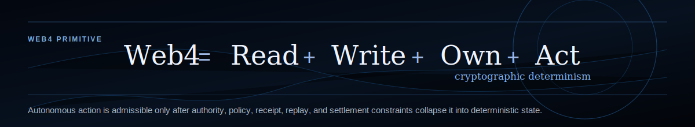
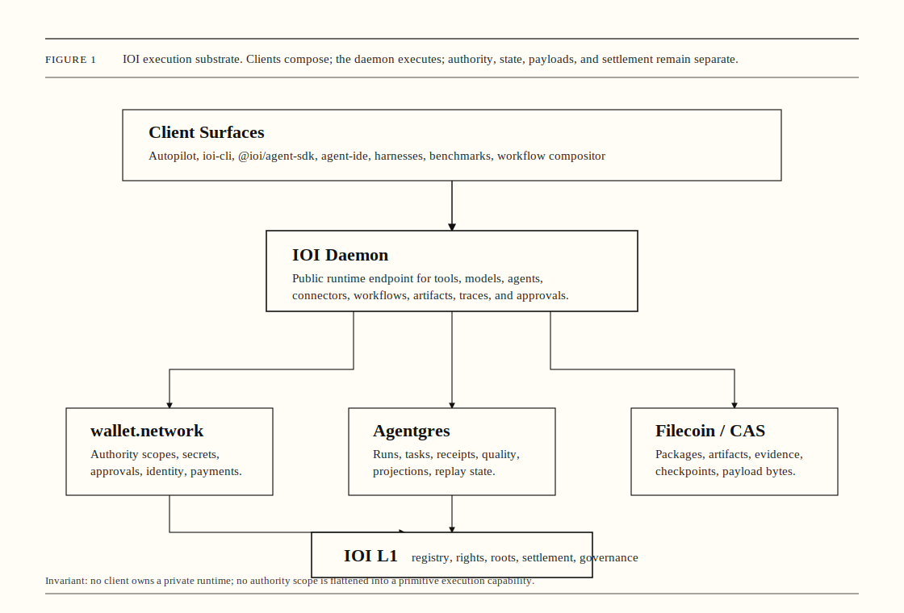

# Internet of Intelligence


**The runtime substrate for Web4: sovereign action bounded by cryptographic determinism.**

Web1 made information readable. Web2 made it writable. Web3 made it ownable.
IOI is building the next layer: **sovereign action that can be delegated,
governed, verified, replayed, and settled.**

Most agent systems give a model tools. IOI gives autonomous work a deterministic
execution boundary. Alignment is infrastructure here: recursive improvement,
model choice, tool use, spending, signing, data egress, and real-world effects
stay inside capability bounds, policy gates, approvals, receipts, replay, and
stop conditions. IOI lets intelligence remain probabilistic in thought while
collapsing consequential action into canonical, policy-checked, receipted
execution before it can touch the world.

```text
probabilistic reasoning
  -> bounded authority
  -> receipted execution
  -> canonical operational memory
  -> replayable proof
  -> settlement-grade recourse
```

That is the breakthrough: IOI does not force AI models to be deterministic; it
makes the economic consequences of their actions deterministic.

## What IOI Is

IOI is the reference implementation of canonical Web4:

> **Read + Write + Own + Act, with cryptographic determinism.**

<p align="center">
  
</p>

It is not a chatbot, a workflow toy, a wallet wrapper, or a chain with AI bolted
on. It is one substrate for intelligent applications where:

- the **daemon** executes workflows, tools, models, agents, connectors, and artifacts;
- **wallet.network** authorizes identity, secrets, authority scopes, approvals, and payments;
- **Agentgres** records canonical operational truth, projections, receipts, quality, and replay state;
- **IOI L1** settles public rights, registries, roots, bonds, disputes, and economic commitments;
- **Autopilot**, `ioi-cli`, `@ioi/agent-sdk`, `agent-ide`, harnesses, benchmarks, and workflow composers are clients over the same runtime substrate.

<p align="center">
  
</p>

## The Rules That Make It Different

- **One runtime substrate.** No separate SDK, GUI, CLI, benchmark, harness, or workflow runtime.
- **Authority is portable and explicit.** `prim:*` and `scope:*` turn ambient permission into delegated capabilities: what the runtime may execute, what the wallet/provider may authorize, and what evidence must exist before power crosses a trust boundary.
- **Tool calls are requests, not grants.** Raw model output is never the authority for consequential action.
- **Logs become receipts.** Runs emit externally legible events, receipts, traces, scorecards, stop reasons, and replayable evidence.
- **Memory is operational.** Agentgres is not prompt stuffing; it is canonical state for autonomous work.
- **AFT breaks the 40-year BFT ceiling.** IOI's Asymptote Fault Tolerance line uses omission-dominant ordering, deterministic collapse, and proof-carrying continuation to break the classical lower-bound shape that has constrained Byzantine agreement since the 1980s.

## Repository Map

| Path | Role |
|---|---|
| [`crates/`](crates) | Rust runtime, consensus, execution, state, storage, services, drivers, CLI, and IPC. |
| [`packages/agent-sdk`](packages/agent-sdk) | Developer SDK over the public runtime substrate. |
| [`packages/runtime-daemon`](packages/runtime-daemon) | TypeScript daemon-facing runtime API surface and validation harnesses. |
| [`packages/agent-ide`](packages/agent-ide) | Workbench and workflow-composition client over shared contracts. |
| [`packages/workspace-substrate`](packages/workspace-substrate) | Shared workspace substrate for app and workbench surfaces. |
| [`apps/autopilot`](apps/autopilot) | Local desktop operator shell for chat, workflows, artifacts, approvals, and runtime UX. |
| [`apps/aiagent-xyz`](apps/aiagent-xyz) | Marketplace for bounded agents and autonomous capabilities. |
| [`apps/sas-xyz`](apps/sas-xyz) | Marketplace for verified autonomous service outcomes. |
| [`apps/benchmarks`](apps/benchmarks) | Benchmark and scorecard surfaces. |
| [`docs/architecture`](docs/architecture) | Canonical architecture authority. Start here when docs disagree. |

## Start Here

```bash
npm install
cargo check --workspace
npm run typecheck
```

Run the local desktop surface:

```bash
npm run dev:desktop
```

Build and test the SDK:

```bash
npm run build:agent-sdk
npm run test:agent-sdk
```

Rust uses the pinned toolchain in [`rust-toolchain.toml`](rust-toolchain.toml).
Desktop builds require the usual Tauri system dependencies for your platform.

## Read Next

- [`docs/architecture/README.md`](docs/architecture/README.md) - architecture navigation and source-of-authority index.
- [`docs/architecture/foundations/web4-and-ioi-stack.md`](docs/architecture/foundations/web4-and-ioi-stack.md) - the canonical Web4 definition.
- [`docs/architecture/components/daemon-runtime/doctrine.md`](docs/architecture/components/daemon-runtime/doctrine.md) - daemon, CLI, and operator-surface boundaries.
- [`docs/architecture/components/daemon-runtime/api.md`](docs/architecture/components/daemon-runtime/api.md) - public runtime API.
- [`docs/architecture/components/agentgres/doctrine.md`](docs/architecture/components/agentgres/doctrine.md) - Agentgres and canonical operational truth.
- [`docs/architecture/components/wallet-network/doctrine.md`](docs/architecture/components/wallet-network/doctrine.md) - wallet.network authority plane.
- [`docs/conformance/agentic-runtime/CIRC.md`](docs/conformance/agentic-runtime/CIRC.md) - intent-resolution invariant.
- [`docs/conformance/agentic-runtime/CEC.md`](docs/conformance/agentic-runtime/CEC.md) - completion-evidence invariant.
- [`docs/architecture/protocols/aft/README.md`](docs/architecture/protocols/aft/README.md) - AFT consensus corpus.

## Status

IOI is active alpha research and engineering. Some surfaces are production-shaped;
others are research prototypes or environment-dependent. The architectural
direction is intentionally strict:

> **The daemon executes. wallet.network authorizes. Agentgres remembers. IOI L1 settles. Clients compose. Evidence proves.**

## License

Kernel/runtime components are governed by [`LICENSE-BBSL`](LICENSE-BBSL) unless
a crate, package, or file declares otherwise. Some interface surfaces use
Apache-2.0 metadata; always check the package manifest for the exact boundary.
