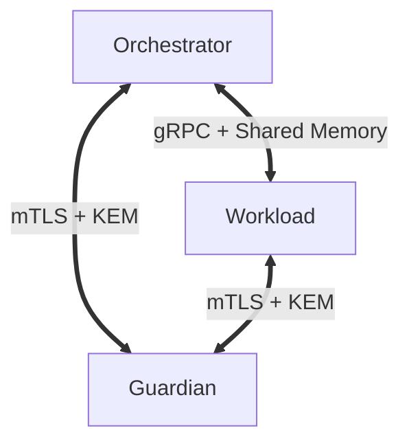

# IOI Validator Architecture

The `ioi-validator` crate implements the **Triadic Kernel**, a process-isolation architecture designed to separate concerns between network consensus, state execution, and key security.

Instead of a monolithic node binary, an IOI Validator runs as three distinct, co-dependent processes (Containers).

## The Triadic Architecture



### 1. Orchestrator (Control Plane)
*   **Role:** The "Brain" of the node.
*   **Responsibility:** Manages networking (libp2p), the transaction mempool, consensus logic (A-DMFT), and the Agency Firewall.
*   **Isolation:** It decides *what* to do, but cannot access the raw state database or the private signing keys.

### 2. Workload (Execution Plane)
*   **Role:** The "Muscle" of the node.
*   **Responsibility:** Executes transactions, runs the WASM VM, performs AI Inference, and manages the State Tree (IAVL/Jellyfish).
*   **Performance:** Uses a **Hybrid IPC** architecture. High-frequency signals are sent via gRPC, while bulk data (AI contexts, blocks) is transferred via Zero-Copy Shared Memory.

### 3. Guardian (Root of Trust)
*   **Role:** The "Conscience" or Hardware Security Module (HSM).
*   **Responsibility:** Holds encrypted identity keys, enforces binary integrity of the other containers, and provides Oracle-anchored signing to prevent equivocation.

## Container Trait

All components implement the `Container` trait, allowing them to be managed uniformly:

```rust
#[async_trait]
pub trait Container {
    /// Starts the container's main loop and networking.
    async fn start(&self, listen_addr: &str) -> Result<(), ValidatorError>;

    /// Gracefully stops the container.
    async fn stop(&self) -> Result<(), ValidatorError>;

    /// Returns the health/running status.
    fn is_running(&self) -> bool;
}
```

## Validator Roles

This crate supports different hardware profiles defined in `config/validator_role.rs`:

*   **Consensus Validator:** Optimized for high-throughput block ordering and verification. (CPU-bound).
*   **Compute Validator:** Specialized for the **DIM (Distributed Inference Mesh)**. Requires GPU acceleration and VRAM management.