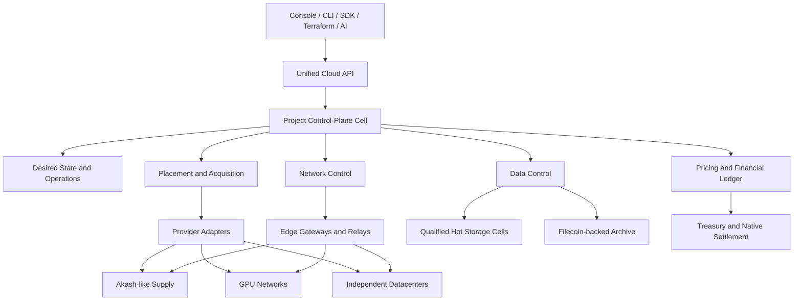
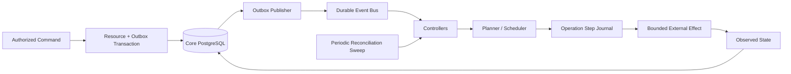
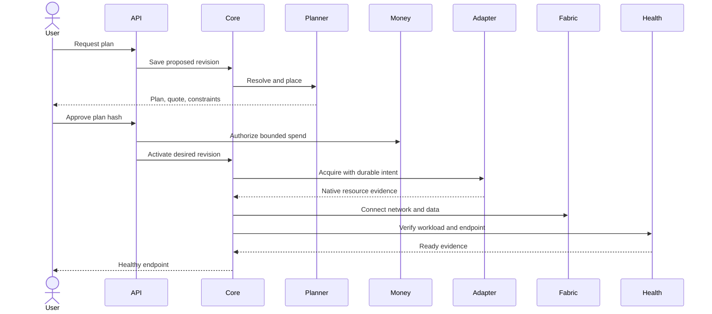
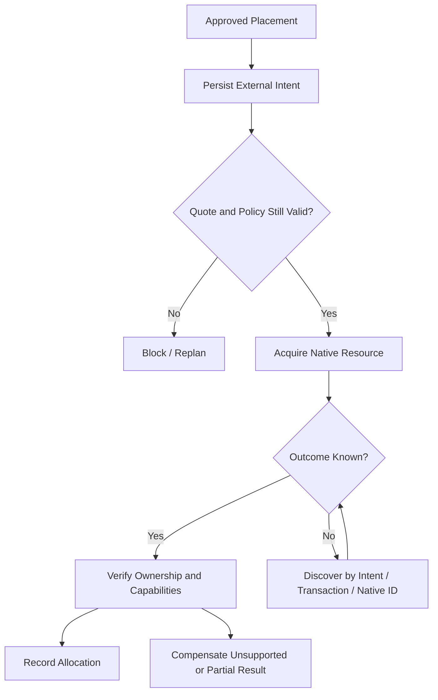
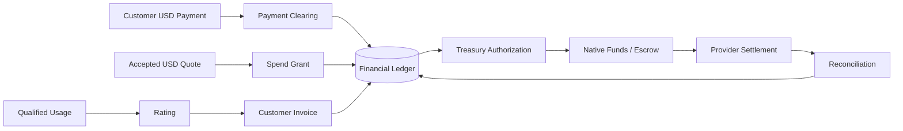
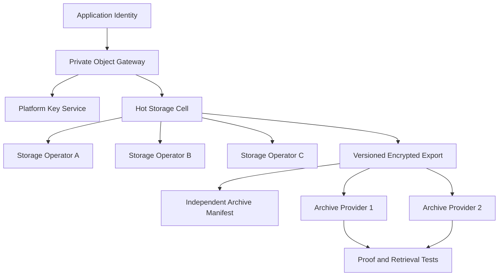
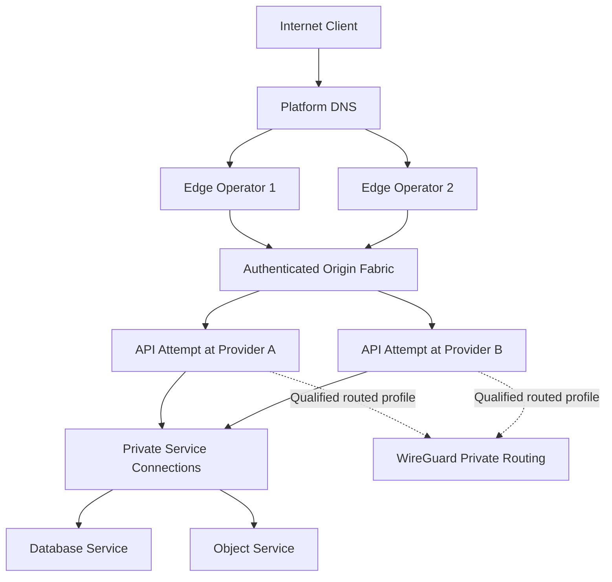
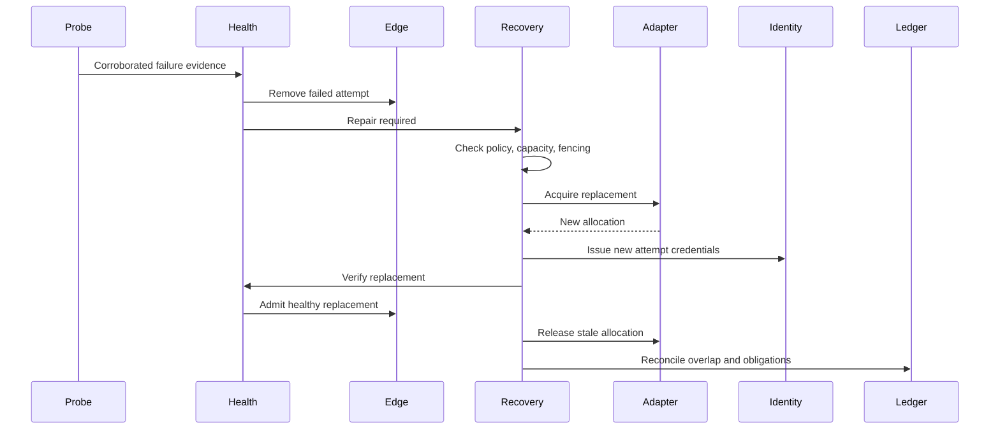
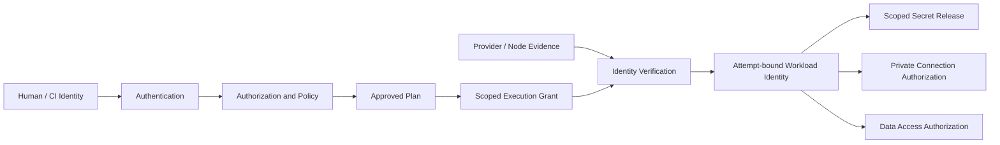
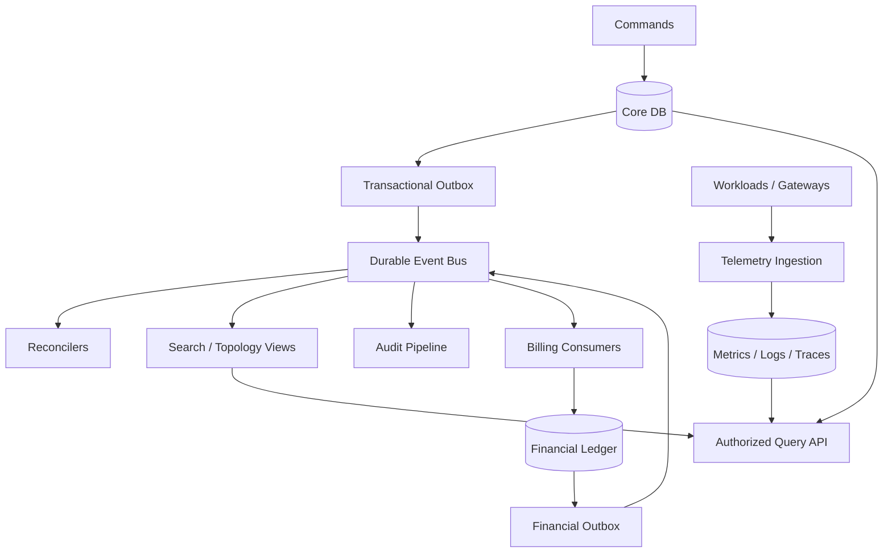

# 270 — Architecture diagrams

Status: adopted product specification (owner, 2026-09-08); design baseline September 7, 2026.
Canonical owner: this file for the architecture diagrams.
Doctrine status: canonical
Implementation status: planned (the selected architecture, adopted 2026-09-08; nothing here is a claim that the product exists — what the Hypervisor daemon implements today is in `../cloud.md`)

**Spec section:** 27. Mermaid sources; each is referenced from the document it
illustrates.

## 27.1 System topology

## 27.2 Control-plane architecture

## 27.3 Deployment sequence

## 27.4 Provider acquisition

## 27.5 Payment and settlement

## 27.6 Storage topology

## 27.7 Network topology

## 27.8 Failure and rescheduling

## 27.9 Identity and authentication

## 27.10 Data and event architecture

