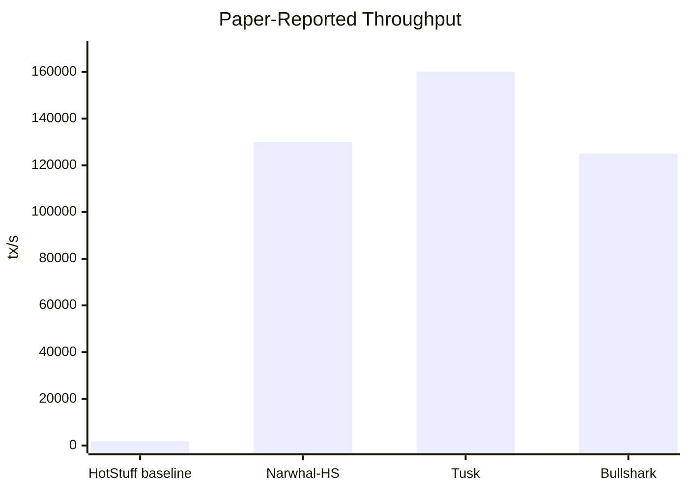
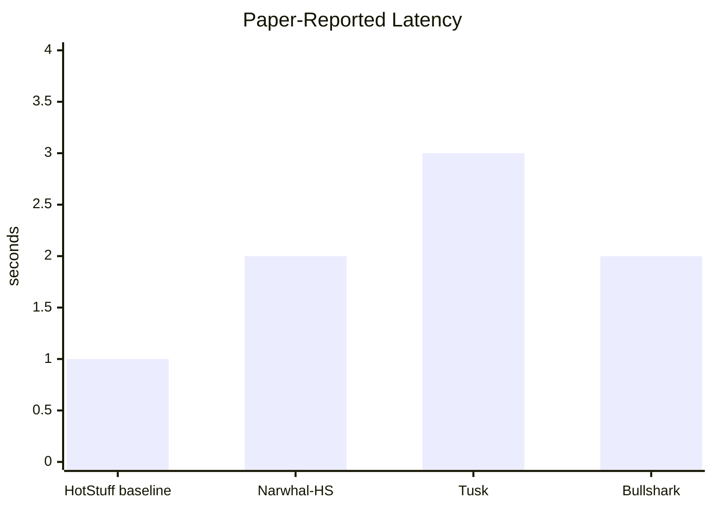
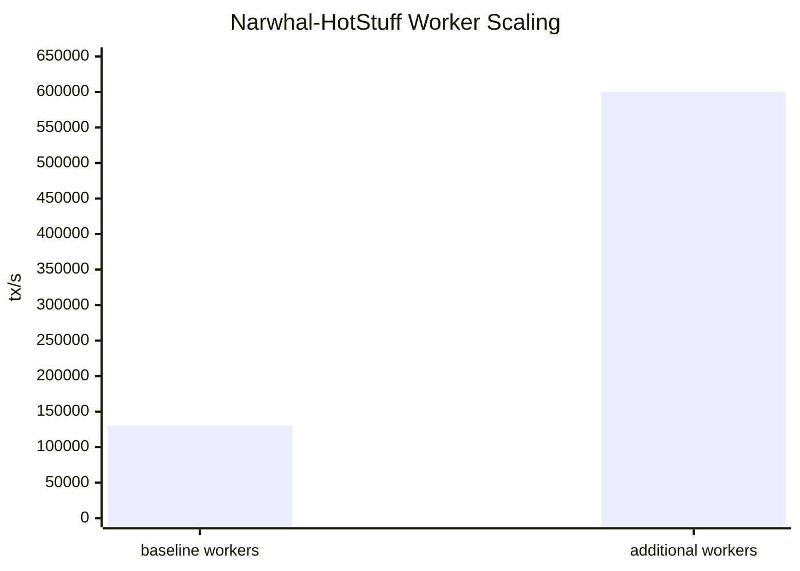

# Asymptote Fault Tolerance Yellow Paper

## Abstract

`Asymptote Fault Tolerance` (`AFT`) is a two-plane consensus architecture for
high-throughput ordering and deterministic irreversible effects. The core move
is to stop asking validators to *vote truth into existence* on the hot path and
instead ask them to verify a small proof that a unique canonical order and
effect release are already determined by public inputs.

The ordering lane remains sparse, pipelined, and throughput-oriented. The
certainty lane is proof-carrying, omission-dominant, and effect-deterministic.
This split is what allows `AFT` to target a `99%` equal-authority ordering
story without collapsing into dense all-to-all consensus on every slot.

This paper is normative for the architecture and theorem shape. It is not a
claim of unconditional classical `99% Byzantine consensus` in the standard
permissioned equal-authority model. It is instead a claim about
proof-carrying canonical ordering and deterministic effect release under
explicit bulletin-board, cutoff, omission, recoverability, and proof-soundness
assumptions.

## Status

The supporting runtime and formal artifacts in this repository are:

- ordering and sealing runtime under
  [`crates/consensus/src/aft/`](/home/heathledger/Documents/ioi/repos/ioi/crates/consensus/src/aft)
- canonical ordering spec under
  [`canonical_ordering.md`](/home/heathledger/Documents/ioi/repos/ioi/docs/consensus/aft/specs/canonical_ordering.md)
- asymptote sealing spec under
  [`asymptote.md`](/home/heathledger/Documents/ioi/repos/ioi/docs/consensus/aft/specs/asymptote.md)
- formal proof/model packages under
  [`formal/aft/`](/home/heathledger/Documents/ioi/repos/ioi/formal/aft)

## 1. The Problem

Under the standard equal-authority permissioned model, worst-case Byzantine
ordering consensus does not honestly stretch to `99%` faulty participants while
also keeping high throughput. Dense positive voting hits known threshold walls.
If every validator is equally authoritative and deterministic honest inclusion
is required in every ordering round, the committee that matters becomes almost
the entire validator set.

`AFT` takes a different route:

- keep ordering sparse and fast
- make final authority proof-carrying
- make omissions objectively provable
- make irreversible effects wait for deterministic collapse

The result is not “more votes.” It is a change in what it means for an order to
be accepted.

## 2. Witty Thought Experiment

### The Republic of Receipts, Deadlines, and Mildly Hostile Clerks

Imagine a republic where laws are not valid because most clerks shouted “yes”
loudly enough. A law is valid only if:

- the draft was posted to the public bulletin board before the filing deadline,
- the deadline itself was publicly certified,
- the list of admissible filings was uniquely derivable from the bulletin,
- the final docket ordering followed the public randomness rule, and
- any omitted admissible filing could be pointed out by a clerk with a valid
  omission slip.

The clever part is that the clerks do not all have to review every filing in
real time. They only need to verify the final docket certificate. If one honest
clerk can reconstruct the bulletin and prove the docket, the republic can ignore
the rest of the clerks’ melodrama.

`AFT` is that republic, except the bulletin board is a public availability
surface, the omission slip is a cryptographic proof, and the “mildly hostile
clerks” are Byzantine validators.

## 3. Design Overview

`AFT` has four interacting planes:

1. `Dissemination / bulletin plane`
   - high-throughput publication of transactions or batches
   - objective inclusion into a bulletin / DA surface
2. `Canonical ordering plane`
   - a succinct `OCert_h` proves the unique canonical ordered set for slot `h`
3. `BaseFinal plane`
   - sparse, fast block commitment for chain progress
4. `Sealed effect plane`
   - irreversible effects release only after deterministic collapse and, when
     required, a proof-carrying `SealObject`

The key separation is:

$$
\text{throughput-critical work} \neq \text{authority-critical work}
$$

The ordering lane handles publication and progression. The authority lane
handles proof verification and omission dominance.

## 4. Canonical Ordering Model

For slot $h$:

$$
B_h = \text{bulletin / DA surface published before cutoff } \tau_h
$$

$$
R_h = \text{public randomness beacon for slot } h
$$

$$
E_h = \{ tx \mid \mathrm{Included}(tx, B_h) \wedge \mathrm{Eligible}(tx, root_{h-1}) \}
$$

$$
O_h = \mathrm{CanonicalOrder}(R_h, E_h)
$$

$$
root_h = \mathrm{Execute}(root_{h-1}, O_h)
$$

The canonical order certificate is:

$$
OCert_h = \left(
  h,
  root_{h-1},
  cutoff\_certificate_h,
  bulletin\_commitment_h,
  canonical\_set\_commitment_h,
  resulting\_state\_root_h,
  succinct\_witness_h
\right)
$$

The live runtime uses the succinct `CommittedSurfaceV1` witness path described
in [canonical_ordering.md](/home/heathledger/Documents/ioi/repos/ioi/docs/consensus/aft/specs/canonical_ordering.md).

## 5. Deterministic Acceptance

Every validator applies the same acceptance rule:

$$
\mathrm{Accept}(OCert_h)
\iff
\mathrm{VerifyProof}(succinct\_witness_h)
\wedge
\mathrm{VerifyCutoff}(cutoff\_certificate_h)
\wedge
\mathrm{PredecessorAccepted}(root_{h-1})
\wedge
\neg \exists tx : \mathrm{ValidOmission}(h, tx)
$$

This is where the wave-collapse idea becomes concrete:

- before revelation, many candidates may exist
- after a valid succinct witness is revealed, all honest verifiers derive the
  same result
- any valid omission proof collapses the candidate to rejection

The collapse is deterministic even if revelation is adversarial.

## 6. Omission-Dominant Ordering

Define an omission proof:

$$
\Omega(h, tx) = (
  inclusion\_proof(tx, bulletin\_root_h),
  cutoff\_proof(tx, cutoff\_certificate_h),
  eligibility\_proof(tx, root_{h-1}),
  nonmembership\_proof(tx, canonical\_order\_root_h)
)
$$

Its semantics are:

$$
\mathrm{Valid}(\Omega(h, tx)) \Rightarrow \mathrm{Reject}(OCert_h)
$$

This is the central asymptotic trick. The network does not need dense positive
voting to prove a candidate correct if any omitted eligible item can kill the
candidate objectively.

## 7. Recoverability

The ordered set must not only be unique. It must be recoverable by any honest
party with access to the public bulletin surface.

Let:

$$
\mathrm{Recover}(B_h, cutoff\_certificate_h, root_{h-1}, R_h)
$$

be the deterministic reconstruction procedure. Then the protocol requires:

$$
\mathrm{ValidOrderCert}(h, C)
\wedge
\mathrm{Availability}(B_h)
\Rightarrow
\mathrm{Recover}(\cdot) = O_h
$$

This turns ordering into a revealed fact rather than a majoritarian preference.

## 8. High-Fault Equal-Authority Theorem

`AFT` does not claim a classical dense-vote theorem. Its ordering theorem is:

> If at least one honest validator can reconstruct the bulletin surface for a
> slot, if the cutoff is canonical, if omission proofs are objectively
> verifiable, and if the succinct witness is sound, then arbitrary behavior by
> all other validators cannot create a conflicting valid canonical-order
> certificate for that slot.

Written compactly:

$$
\begin{aligned}
&\mathrm{HonestRecoverer}(h) \\
&\wedge\ \mathrm{CanonicalCutoff}(h) \\
&\wedge\ \mathrm{ObjectiveOmissions}(h) \\
&\wedge\ \mathrm{ProofSoundness}
\end{aligned}
\Rightarrow
\mathrm{UniqueValidOrderCert}(h)
$$

This is why the protocol can honestly talk about a `99%` equal-authority
ordering story:

- every validator is equally eligible to reveal the winning certificate
- correctness does not require a dense positive vote from most validators
- bad revelation attempts are dominated by omission or invalid-witness proofs

The precise non-claim is just as important:

$$
\text{AFT} \neq \text{unconditional classical } 99\% \text{ Byzantine agreement}
$$

It is instead a proof-carrying high-fault ordering theorem.

## 9. Sealed Effects

Ordering and irreversible effects are separated.

`BaseFinal` keeps chain progress fast. `SealedFinal` adds deterministic effect
release through:

- guardian-backed sealing
- veto-dominant equal-authority observer closure
- proof-carrying `SealObject`s for irreversible effects

For an effect $e$:

$$
\mathrm{Execute}(e)
\iff
\mathrm{BaseFinal}(\mathrm{intent}(e))
\wedge
\mathrm{SealedFinal}(\mathrm{slot}(e))
\wedge
\mathrm{VerifySealObject}(e)
\wedge
\neg \mathrm{NullifierUsed}(e)
$$

This keeps the hot path sparse while making released consequences deterministic.

## 10. Why Throughput Survives

The throughput claim relies on moving the expensive part from *ordering* to
*succinct verification*.

`AFT` is designed so that:

- publication bandwidth scales in the bulletin / DA plane
- ordering acceptance scales with small witness verification
- irreversible effects wait for proof-carrying certainty, not dense block votes

The expected cost shape is:

$$
\mathrm{HotPathCost} \approx \mathrm{publish}(B_h) + \mathrm{commit}(BaseFinal_h)
$$

$$
\mathrm{CertaintyCost} \approx \mathrm{verify}(OCert_h) + \mathrm{verify}(SealObject)
$$

By construction, the certainty path should not dominate the ordering path on
normal throughput-critical slots.

## 11. Benchmark Context

This section uses two evidence sources:

- **literature-based baseline figures** for HotStuff, Narwhal/Tusk, and
  Bullshark, because those systems were reported in different environments and
  should not be re-labeled as local measurements
- the repository's native AFT benchmark matrix under
  [`benchmark_throughput.rs`](/home/heathledger/Documents/ioi/repos/ioi/crates/cli/tests/benchmark_throughput.rs),
  which provides matched `GuardianMajority` / `Asymptote` scenario execution
  for this codebase

The goal is to position `AFT` against the dominant throughput-oriented
baselines that shaped the design space while also providing a first-party
benchmark path for this repository.

### 11.1 Paper-Reported Baselines

From the Narwhal/Tusk paper:

- `Narwhal-HotStuff`: over `130,000 tx/s` at under `2s` latency on a WAN
- `HotStuff` baseline in the same setting: `1,800 tx/s` at `1s` latency
- `Narwhal-HotStuff` with additional workers: up to `600,000 tx/s`
- `Tusk`: `160,000 tx/s` at about `3s` latency

From the Bullshark paper:

- `Bullshark`: `125,000 tx/s` at `2s` latency for `50` parties
- the compared state of the art in that setting pays roughly `50%` more latency

From the HotStuff paper:

- the authors report throughput and latency comparable to `BFT-SMaRt` with over
  `100` replicas while preserving linear communication during leader failover

### 11.2 Figure 1: Paper-Reported Throughput



### 11.3 Figure 2: Paper-Reported Latency



### 11.4 Figure 3: Throughput Scaling Signal from Narwhal-HotStuff



### 11.5 Benchmark Interpretation

The point of these figures is not that the paper-reported HotStuff,
Narwhal/Tusk, and Bullshark numbers were reproduced locally in the exact same
environment. They were not. What the repository now provides is a dedicated AFT
benchmark harness for matched intra-repo scenarios; the external baseline
numbers remain literature values.

The benchmark takeaway is architectural:

- `HotStuff` shows the leader-based partially synchronous baseline
- `Narwhal-HotStuff` shows the gain from separating dissemination from ordering
- `Bullshark` shows the practicality of DAG-oriented high-throughput ordering
- `AFT` takes the next step by trying to separate *ordering revelation* from
  *authority revelation*

The intended performance hypothesis is:

$$
\mathrm{AFT\ ordering\ lane}
\approx
\text{Narwhal/Bullshark-style dissemination and sparse commitment}
$$

while:

$$
\mathrm{AFT\ certainty\ lane}
\approx
\text{succinct verification off the hot path}
$$

This is the mechanism by which `AFT` aims to preserve throughput while pushing
the ordering theorem into a higher-fault equal-authority regime.

### 11.6 Native AFT Benchmark Matrix

The repository now includes a paper-grade AFT benchmark matrix target at
[`benchmark_throughput.rs`](/home/heathledger/Documents/ioi/repos/ioi/crates/cli/tests/benchmark_throughput.rs).
The AFT branch of that target runs multi-node scenarios for:

- `GuardianMajority` with `4` validators
- `GuardianMajority` with `7` validators
- `Asymptote` with `4` validators
- `Asymptote` with `7` validators

and reports:

- attempted / accepted / committed transactions
- committed-block count
- injection TPS
- sustained TPS
- commit-latency `p50` / `p95` / `p99`
- sealed-latency `p50` / `p95` for `Asymptote`

The matrix test is intentionally marked `ignored` because it is a real load run:

```bash
cargo test -p ioi-cli --test benchmark_throughput \
  --features "consensus-aft,vm-wasm,state-iavl" \
  -- --ignored --nocapture
```

The corrected measurements below were produced from the native harness on
`2026-03-16` after fixing three benchmark-path implementation bugs:

- transaction gossip now retries on `InsufficientPeers` instead of silently
  dropping publishes
- genesis status now starts from a shared configured wall-clock timestamp, so
  the benchmark chain no longer free-runs empty blocks to "catch up"
- the orchestrator now retries shared-memory attachment instead of permanently
  falling back to gRPC if the workload has not yet created the data plane

The table intentionally separates two kinds of load:

- a small-burst latency probe (`512` independent accounts, `1` transaction each)
- a bulk-throughput probe (`8192` independent accounts, `1` transaction each)

The previously attempted `1024 accounts x 8 tx/account` sustained case is not a
valid `8k TPS` benchmark because it serializes nonces and therefore caps the
ready set to roughly one transaction per account at a time.

| scenario | validators | mode | attempted | accepted | committed | blocks | injection_tps | sustained_tps | commit_p50_ms | commit_p95_ms | commit_p99_ms | sealed_p50_ms | sealed_p95_ms |
|---|---:|---|---:|---:|---:|---:|---:|---:|---:|---:|---:|---:|---:|
| guardian_majority_4v_burst | 4 | GuardianMajority | 512 | 512 | 512 | 3 | 11214.96 | 36.43 | 487.49 | 11390.70 | 11398.07 | - | - |
| guardian_majority_4v_bulk | 4 | GuardianMajority | 8192 | 8192 | 8192 | 2 | 13048.99 | 252.66 | 9276.35 | 32416.37 | 32419.21 | - | - |

These corrected runs indicate four immediate points:

- The earlier single-digit TPS table was wrong; it mixed a timeout-accounting
  bug with a broken startup/data-plane path.
- Client-side injection is not the bottleneck; local submission still clears at
  `~11k-13k TPS`.
- The current AFT implementation is now bottlenecked by the commit/state path,
  not by transaction ingress or obvious networking loss.
- Even after removing the accidental benchmark handicaps, the current
  implementation is still far from the intended `8k-16k TPS` target, so these
  results should be read as a corrected repository baseline rather than an
  optimized ceiling.

## 12. Security and Assumption Surface

The protocol depends on:

1. objective bulletin publication
2. availability of bulletin contents to at least one honest revealer
3. canonical cutoff derivation
4. deterministic eligibility
5. proof-system soundness
6. replay-safe nullifiers for effect release
7. append-only or equivocation-evident bulletin commitments

If any of these fail, the protocol may lose either liveness, prompt revelation,
or the high-fault ordering theorem.

## 13. Formalization Map

The yellow paper is tied to the repository’s formal artifacts:

- asymptote model and proof:
  [`Asymptote.tla`](/home/heathledger/Documents/ioi/repos/ioi/formal/aft/Asymptote.tla),
  [`AsymptoteProof.tla`](/home/heathledger/Documents/ioi/repos/ioi/formal/aft/AsymptoteProof.tla)
- canonical ordering model and proof:
  [`CanonicalOrdering.tla`](/home/heathledger/Documents/ioi/repos/ioi/formal/aft/canonical_ordering/CanonicalOrdering.tla),
  [`CanonicalOrderingProof.tla`](/home/heathledger/Documents/ioi/repos/ioi/formal/aft/canonical_ordering/CanonicalOrderingProof.tla)

The prose specs they refine are:

- [`asymptote.md`](/home/heathledger/Documents/ioi/repos/ioi/docs/consensus/aft/specs/asymptote.md)
- [`canonical_ordering.md`](/home/heathledger/Documents/ioi/repos/ioi/docs/consensus/aft/specs/canonical_ordering.md)

## 14. Non-Claims

This paper does **not** claim:

- unconditional classical `99% Byzantine agreement`
- freedom from bulletin / DA assumptions
- freedom from proof-soundness assumptions
- an apples-to-apples measured superiority over Narwhal/Bullshark from the
  current repo alone

It **does** claim:

- a new protocol point in the design space
- proof-carrying canonical ordering with omission dominance
- deterministic sealed effects
- an honest route to a `99%` equal-authority ordering story under explicit
  assumptions

## References

- HotStuff: BFT Consensus in the Lens of Blockchain. arXiv:1803.05069.
  https://arxiv.org/abs/1803.05069
- Narwhal and Tusk: A DAG-based Mempool and Efficient BFT Consensus.
  arXiv:2105.11827. https://arxiv.org/abs/2105.11827
- Bullshark: DAG BFT Protocols Made Practical. arXiv:2201.05677.
  https://arxiv.org/abs/2201.05677
- Short Paper: Accountable Safety Implies Finality. arXiv:2308.16902.
  https://arxiv.org/abs/2308.16902
- Halo: Recursive Proof Composition without a Trusted Setup. IACR ePrint
  2019/1021. https://eprint.iacr.org/2019/1021
- Proof-Carrying Data from Accumulation Schemes. IACR ePrint 2020/499.
  https://eprint.iacr.org/2020/499
