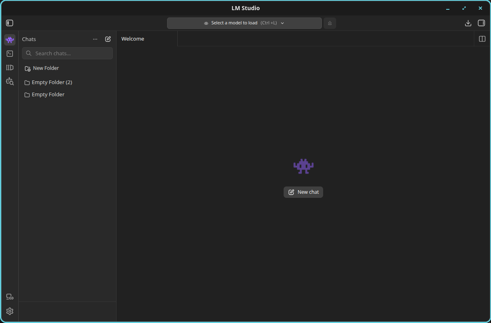
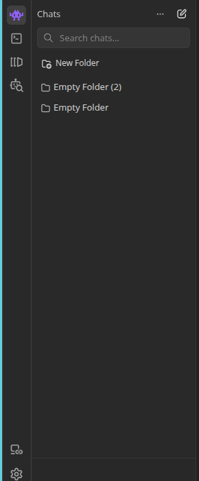

# LM Studio Model Mounting Master Guide

Status: reference crawl, implementation guide, current completion ledger, and parity gap audit
Audit date: 2026-05-05
Reference app: locally installed LM Studio AppImage, observed as `0.4.12+1`
Reference scope: UX ergonomics, local server contract, model lifecycle, MCP, API tokens, TTL/auto-evict, CLI, and local runtime state

## Executive Verdict

LM Studio is the right ergonomic reference for Autopilot's model mounting
surface, but it should not become Autopilot's model architecture or exclusive
runtime dependency.

The useful LM Studio pattern is:

```text
developer opens a local model surface
selects/downloads/loads a model
starts a local server
uses REST or OpenAI-compatible endpoints
optionally adds MCP servers and API tokens
models are unloaded manually or by idle TTL / auto-evict
```

The Autopilot target is:

```text
LM Studio-like UX
-> Autopilot Model Registry
-> Model Router
-> wallet.network permission/capability layer
-> IOI daemon runtime
-> Agentgres receipts/state
-> workflow canvas and harness nodes
```

In other words, Autopilot should borrow the developer experience: model picker,
local server, loaded models, download/load/unload lifecycle, permission tokens,
MCP configuration, logs, and TTL controls. Internally, the core abstraction must
be provider-neutral model capability routing, not a single "loaded local model"
slot.

The product direction is stronger than "integrate LM Studio":

```text
support LM Studio as one provider
and make Autopilot itself an LM Studio-class model mounting workbench
```

That means Autopilot must eventually provide the same developer primitives
without requiring LM Studio:

- local model catalog and import/download lifecycle;
- local server and OpenAI-compatible endpoints;
- model load/unload/TTL/auto-evict controls;
- provider health and routing;
- scoped API tokens;
- MCP configuration and per-request tools;
- dense desktop UI, CLI, logs, and receipts.

LM Studio remains valuable in two roles:

1. Reference UX and API ergonomics.
2. A first-class provider driver for users who already have LM Studio managing
   local GGUF models.

Autopilot owns the registry, router, permission model, receipts, workflow
bindings, and durable state. When an LM Studio endpoint is selected, Autopilot
may delegate physical model load/inference to public LM Studio surfaces
(`lms` and `/v1`), but LM Studio is not the core mounting abstraction.

## Current Implementation Status

Updated: 2026-05-05

### Canonical Completion Ledger

The deterministic Autopilot-native model mounting target path is implemented
and validated end to end. This means Autopilot can operate as its own
LM Studio-class IOI-native model mounting workbench without requiring LM
Studio for the validated local path. LM Studio remains supported as one
provider driver and ergonomic reference, not the underlying architecture.

Canonical validation command:

```text
npm run validate:model-mounting:e2e
```

Latest deterministic evidence bundle:

```text
docs/evidence/model-mounting-e2e/2026-05-05T08-37-20Z/result.json
```

That bundle passed the following acceptance steps:

- fresh daemon startup with isolated model mounting state;
- fail-closed missing, denied, expired, and revoked token behavior;
- provider/backend discovery for fixture, native-local, LM Studio,
  OpenAI-compatible, llama.cpp, Ollama, vLLM, hosted/BYOK profiles, custom
  HTTP, and DePIN/TEE profile boundaries;
- runtime engine inventory and redacted hardware survey across the Autopilot
  backend registry plus public LM Studio `lms runtime ls/survey` when present;
- deterministic native-local artifact import, mount, load, and invocation;
- native `/api/v1/chat` and `/api/v1/responses`;
- OpenAI-compatible `/v1/chat/completions` and `/v1/embeddings`;
- deterministic download cancel and completion lifecycle;
- persistent `mcp.json` import and governed MCP tool invocation;
- per-request ephemeral MCP integration linked into model invocation receipts;
- route policy creation/test and workflow node execution;
- Receipt Gate blocked mismatch and passed valid linked receipts;
- CLI agreement with the same daemon state for server, backends, runtime survey,
  models, routes, MCP, tokens, receipts, and replay;
- daemon restart with Agentgres-style projection/replay continuity;
- Mounts desktop GUI screenshot bundle with eight real window captures;
- secret/token/vault-ref redaction scan across persisted state and evidence.

The current GUI evidence nested under that E2E bundle is:

```text
docs/evidence/model-mounting-e2e/2026-05-05T08-37-20Z/gui/2026-05-05T08-37-39Z/result.json
```

It captured all Mounts tabs as desktop window screenshots:

- Local Server;
- Backends;
- Models;
- Providers;
- Downloads;
- Tokens & MCP;
- Routing Policies;
- Logs / Receipts.

Treat the deterministic path as complete unless a future change breaks the
canonical command above. Remaining items are live-provider activation,
production hardening, or richer product UX around the validated path.

Live-only validation gates are executable but opt-in. They write evidence under
`docs/evidence/model-mounting-live/*` and must not be treated as CI blockers
unless the corresponding environment flag is explicitly set:

```text
IOI_LIVE_LM_STUDIO=1 npm run test:lm-studio-live
IOI_LIVE_MODEL_BACKENDS=1 npm run test:model-backends:live
IOI_REMOTE_WALLET=1 npm run test:wallet-live
IOI_REMOTE_AGENTGRES=1 npm run test:agentgres-live
```

If a live dependency is not configured or is stopped, provider gates record a
truthful `skipped` or `blocked` result instead of pretending live validation
occurred. The wallet.network and Agentgres gates also include deterministic
fake-remote mode when real URLs are absent, so the adapter-boundary,
fail-closed, replay, and redaction contracts can still be validated locally.

### Completed In Repo

The current implementation has moved beyond the original blank Mounts scaffold.
These areas are implemented and covered by focused tests:

- Mounts activity bar entry and live Mounts workbench UI.
- Provider-neutral runtime model mounting subsystem in the JS IOI daemon.
- Shared TypeScript contracts for model artifacts, endpoints, instances,
  providers, routes, tokens, downloads, receipts, and workflow bindings.
- `ModelProviderDriver`-style port with drivers for:
  - deterministic fixture provider;
  - Autopilot native-local provider;
  - LM Studio provider;
  - generic OpenAI-compatible provider.
- Autopilot-owned native-local deterministic serving path that mounts, loads,
  invokes, logs, and receipts a local model artifact without LM Studio.
- IOI state model artifact root with deterministic native-local fixture
  artifact and local-path import support.
- Minimal GGUF-style metadata extraction for family, quantization, format,
  size, checksum, and context where present.
- LM Studio discovery through guarded public commands:
  - `lms server status`;
  - `lms ls`;
  - `lms ps`.
- LM Studio lifecycle delegation through public commands:
  - `lms load <model_id>`;
  - `lms unload <model_id>`;
  - provider start/stop hooks for `lms server start|stop`.
- LM Studio inference delegation through its local OpenAI-compatible `/v1`
  server when an LM Studio endpoint is explicitly selected.
- `/v1/responses` fallback to chat completions for LM Studio-compatible servers
  that do not expose Responses, with `compatTranslation:
  chat_completions` recorded in the model receipt.
- Native API surface for server status, model registry, mount/load/unload,
  provider model/loaded state, import/download/cancel/status, providers,
  routes, chat/responses/embeddings/rerank, tokens, MCP, projections, workflow
  node execution, Receipt Gate, and receipts.
- OpenAI-compatible API surface for models, responses, chat completions,
  embeddings, and completions.
- Capability token enforcement for native and OpenAI-compatible calls,
  including missing, denied, expired, and revoked token behavior.
- Agentgres-shaped model mounting store boundary backed by repo-local durable
  state and operation-log receipts.
- wallet.network-shaped authority boundary backed by Agentgres-style grant
  records, revocation epoch, vault refs, last-used tracking, redacted public
  surfaces, and audit operations.
- `mcp.json` import, remote MCP registration, `allowed_tools` narrowing,
  governed MCP invocation, secret redaction, and tool receipts.
- Per-request ephemeral MCP integrations in native chat/responses payloads,
  compiled into the same governed MCP/tool receipt path and linked from model
  invocation receipts.
- Route selection receipts and model invocation receipts across native,
  compatibility, and workflow execution paths.
- Canonical model mounting projection and receipt replay API for artifacts,
  endpoints, instances, routes, providers, downloads, grants, MCP records,
  workflow bindings, lifecycle receipts, route receipts, invocation receipts,
  and tool receipts.
- Workflow execution contract endpoints:
  - `POST /api/v1/workflows/nodes/execute`;
  - `POST /api/v1/workflows/receipt-gate`.
- Receipt inspection:
  - `GET /api/v1/receipts`;
  - `GET /api/v1/receipts/:id`;
  - `GET /api/v1/receipts/:id/replay`.
- CLI families:
  - `ioi models`;
  - `ioi routes`;
  - `ioi server`;
  - `ioi tokens`;
  - `ioi mcp`;
  - `ioi receipts`.
- Agent IDE workflow node schema and registry defaults include model mounting
  fields for `model_id`, `route_id`, `model_policy`, capability,
  `receipt_required`, selected endpoint, and receipt/tool receipt references.
- Mounts UI contract proving live daemon routes, session-only token handling,
  no token storage, native-local provider controls, download controls,
  ephemeral MCP probe, workflow probe, MCP fixture import, route test, and
  receipt visibility.
- Mounts health operations for provider/vault/backend probes:
  - latest provider and vault health receipt lookup;
  - grouped provider/vault health lanes in Logs / Receipts;
  - Local Server health summary strip derived from receipts;
  - `Run health sweep` action that fans out across vault, providers, and
    backends before refreshing the projection.
- Dedicated Mounts desktop GUI validation harness with real window screenshot
  capture and secret scan.
- Canonical deterministic end-to-end validation harness covering API, CLI, GUI,
  workflow, MCP, tokens, receipts, replay, and redaction in one command:
  `npm run validate:model-mounting:e2e`.
- Opt-in live-provider validation gate entrypoints for LM Studio, model
  backends, remote wallet.network, and remote Agentgres. Wallet and Agentgres
  gates now have deterministic fake-remote coverage when real URLs are absent.
  These are evidence gates, not deterministic CI prerequisites.

Validation that passed during the implementation pass:

```text
npm run validate:model-mounting:e2e
npm run validate:model-mounting:e2e -- --skip-gui
npm run test:model-mounting
npm run test:daemon-runtime-api
npm test --workspace=@ioi/agent-sdk
npm run test:model-backends
npm run test:model-mounting-workflows
npm run test:model-mounting-gui
npm run validate:model-mounts-gui:run
AUTOPILOT_LOCAL_GPU_DEV=1 npm run validate:autopilot-gui-harness:run -- --window-timeout-ms 300000
IOI_LIVE_LM_STUDIO=1 npm run test:lm-studio-live
OLLAMA_HOST=http://127.0.0.1:11434 IOI_LIVE_MODEL_BACKENDS=1 npm run test:model-backends:live
IOI_REMOTE_WALLET=1 npm run test:wallet-live
IOI_REMOTE_AGENTGRES=1 npm run test:agentgres-live
npx tsc -p apps/autopilot/tsconfig.json --noEmit
npm run build --workspace=apps/autopilot
cargo check -p ioi-cli --bin cli
cargo build -p ioi-cli --bin cli
npm run build --workspace=@ioi/agent-ide
npm run check:runtime-layout
git diff --check
```

Latest evidence paths:

```text
Canonical E2E:
docs/evidence/model-mounting-e2e/2026-05-05T01-52-16Z/result.json

Mounts GUI nested under canonical E2E:
docs/evidence/model-mounting-e2e/2026-05-05T01-52-16Z/gui/2026-05-05T01-52-18Z/result.json

Standalone Mounts GUI with live provider summary:
docs/evidence/model-mounts-gui-validation/2026-05-05T01-30-54Z/result.json

Broad Autopilot GUI harness:
docs/evidence/autopilot-gui-harness-validation/2026-05-05T01-40-43-545Z/result.json

LM Studio live:
docs/evidence/model-mounting-live/lm-studio/2026-05-05T01-18-17Z/result.json

Ollama live backend:
docs/evidence/model-mounting-live/model-backends/2026-05-05T01-26-51Z/result.json

wallet.network deterministic fake-remote:
docs/evidence/model-mounting-live/wallet/2026-05-05T01-51-23Z/result.json

Agentgres deterministic fake-remote:
docs/evidence/model-mounting-live/agentgres/2026-05-05T01-51-23Z/result.json
```

Live local provider evidence on 2026-05-05 UTC:

- LM Studio live gate passed through public `lms` plus `/v1` using
  `qwen/qwen3.5-9b`, with a model invocation receipt.
- Ollama live backend gate passed with `OLLAMA_HOST=http://127.0.0.1:11434`,
  listing six provider models, mounting/loading `qwen3.5:9b`, invoking chat,
  invoking `nomic-embed-text:latest` embeddings, and verifying receipts.
- wallet.network live gate passed in deterministic fake-remote mode, validating
  `WalletAuthorityPort` configuration, denied-scope fail-closed behavior, MCP
  plaintext-secret rejection, and secret scans.
- Agentgres live gate passed in deterministic fake-remote mode, validating
  `AgentgresModelMountingStorePort` configuration, projection watermark,
  receipt replay, download persistence, and secret scans.

### Commit Ledger

Feature work is frozen at the current green evidence state. The implementation
has been split into these reviewable commits:

1. `3012db8e8 runtime: add model mounting daemon core`
   - `packages/runtime-daemon/src/model-mounting.mjs`;
   - `packages/runtime-daemon/src/index.mjs`.

2. `f0dd8a4ea autopilot: add Mounts workbench UI`
   - Mounts activity bar icon and shell routing;
   - `MissionControlMountsView.tsx`;
   - `MissionControlMountsView.css`;
   - Mounts command palette and shortcut integration.

3. `8339aeb9f model mounting: add SDK CLI and validation contracts`
   - model mounting SDK contracts and daemon client types;
   - CLI commands for backends, models, routes, server, tokens, MCP, and
     receipts;
   - Agent IDE workflow node model mounting fields;
   - deterministic daemon/UI/e2e/live-gate validation scripts.

The remaining commit for this evidence pass should contain only:

- this master guide;
- `docs/lm-studio-model-mounting-autonomy-prompt.md`;
- `docs/assets/lm-studio-crawl/`;
- latest referenced `docs/evidence/model-mounting-e2e/...` bundle only;
- latest referenced `docs/evidence/model-mounting-live/...` bundles only;
- latest referenced `docs/evidence/model-mounts-gui-validation/...` bundle
  only;
- `docs/evidence/autopilot-gui-harness-validation/2026-05-05T01-40-43-545Z/`.

Do not stage older failed/blocked evidence attempts unless preserving the full
audit trail is explicitly desired.

Review note: the worktree also contains broader conformance/changelog files
from adjacent runtime work (`docs/conformance/agentic-runtime/*`,
`docs/architecture/_meta/changelog/*`, and
`docs/evidence/architectural-improvements-broad/checklist.json`). Keep those in
a separate review slice unless intentionally bundling the runtime conformance
changes with model mounting.

### Completed With Deterministic Local Fixture Coverage

These seams are implemented against deterministic local fixtures when live
external dependencies are unavailable. They are valid execution paths for CI,
offline demos, and local development evidence, but they intentionally do not
claim real third-party inference unless a configured provider is selected:

- Native-local serving uses a deterministic Autopilot backend fixture instead
  of llama.cpp/vLLM/Ollama binaries when those binaries are unavailable.
- Download/import lifecycle supports queued, running, completed, failed,
  canceled, progress, byte counts, checksum, cleanup, and receipts through a
  deterministic local fixture path rather than live model hub downloads.
- Agentgres persistence is an IOI daemon adapter with canonical projections
  and replay APIs, not a remote production Agentgres deployment.
- wallet.network is represented by an Agentgres-backed authority adapter, not a
  remote wallet.network vault/grant service.
- Workflow canvas integration is wired into real Agent IDE node contracts and
  daemon execution endpoints; richer visual node forms remain product work.
- TTL/idle eviction is implemented for local runtime instances, but memory
  pressure eviction, hardware guardrails, context/gpu estimates, and backend
  scheduling remain shallow.
- Generic OpenAI-compatible provider calls work for configured compatible
  endpoints, but BYOK OpenAI/Anthropic/Gemini native adapters and secret
  resolution are not production-complete.

### Local LM Studio Trace, 2026-05-05

The local LM Studio instance was traced through public `lms` and `/v1`
surfaces. This trace updates the parity target and supersedes the older
appendix snapshot where the server was stopped.

Observed public CLI/API state:

- `$HOME/.local/bin/lm-studio.AppImage`, `$HOME/.local/bin/lm-studio`, and
  `$HOME/.lmstudio/bin/lms` are executable.
- `lms server status` reports the local server is running on port `1234`.
- `lms ls` reports two installed models:
  - `qwen/qwen3.5-9b`, 9B, `qwen35`, 6.55 GB, local, loaded;
  - `text-embedding-nomic-embed-text-v1.5`, Nomic BERT, 84.11 MB, local.
- `lms ps` reports `qwen/qwen3.5-9b` loaded with:
  - status `IDLE`;
  - context `4096`;
  - parallel `4`;
  - device `Local`;
  - no TTL value currently shown.
- `lms runtime ls` reports installed llama.cpp runtime packs for AVX2, CUDA,
  CUDA12, and Vulkan, with
  `llama.cpp-linux-x86_64-nvidia-cuda12-avx2@2.13.0` selected.
- `lms runtime survey` reports:
  - NVIDIA GeForce RTX 5070 Laptop GPU, CUDA, discrete, 7.53 GiB VRAM;
  - CPU `x86_64` with AVX2/AVX;
  - RAM `93.73 GiB`.
- `GET /v1/models` returns both installed model identifiers.
- `POST /v1/chat/completions` succeeds against `qwen/qwen3.5-9b`.
- `POST /v1/responses` succeeds against `qwen/qwen3.5-9b`; the older
  fallback-to-chat behavior remains necessary for compatible providers that do
  not expose Responses, but this local LM Studio instance does expose it.
- `POST /v1/embeddings` succeeds against
  `text-embedding-nomic-embed-text-v1.5`.
- LM Studio server management remains exposed through `lms server
  start|stop|status`, not through an observed `/api/v1/server/status` HTTP
  endpoint.

This trace identifies concrete parity gaps that are more specific than the
generic hardening list:

- Autopilot now has a user-facing runtime engine inventory and hardware survey
  comparable to `lms runtime ls` and `lms runtime survey` for deterministic
  backends and public LM Studio CLI discovery. Remaining parity is runtime
  selection/update/removal plus richer load scheduling controls.
- Autopilot load controls need visible parity with `lms load` options:
  `--gpu`, `--context-length`, `--parallel`, `--ttl`, `--identifier`, and
  `--estimate-only`.
- Autopilot model catalog/download UX needs parity with `lms get`, including
  search, direct Hugging Face URL handling, GGUF/MLX filtering where relevant,
  variant selection, and scripted approval.
- Autopilot import UX needs parity with `lms import`, including move/copy,
  hard-link, symbolic-link, dry-run, and explicit `user/repo` classification.
- Autopilot Logs needs streaming request/response logs comparable to
  `lms log stream`, while preserving IOI redaction and receipts.

### Remaining Production / Live-Only Gaps

The target end state is now validated for the deterministic Autopilot-native
path and fake LM Studio/OpenAI-compatible provider paths. Remaining work is
production hardening or live-provider activation. These are not blockers for
the deterministic completion gate and should stay behind explicit live/config
gates:

1. Real local inference engines:
   - replace deterministic native-local fixture inference with llama.cpp,
     Ollama, vLLM, or another configured local backend;
   - add hardware probes, memory pressure eviction, GPU/context scheduling,
     selected runtime engine management, and real process supervision.
2. Live catalog/download integrations:
   - Hugging Face or other model hub catalog search;
   - resumable network downloads behind an explicit non-CI gate;
   - GGUF/MLX-compatible variant filtering where relevant;
   - direct model URL import/download;
   - richer benchmark and compatibility metadata.
3. Remote wallet.network and vault integration:
   - remote wallet.network grants;
   - provider-key vault resolution;
   - MCP header vault resolution;
   - cross-device revocation and audit propagation.
4. Production Agentgres deployment:
   - workflow run linkage;
   - settlement/audit pack integration;
   - remote projection sync.
5. Product-complete workflow/canvas UI:
   - richer node forms for model mounting fields;
   - visual Receipt Gate configuration and replay;
   - replay and validation inside the harness runtime.
6. MCP production lifecycle:
   - stdio MCP process lifecycle;
   - remote OAuth-capable MCP;
   - tool schema discovery and model tool exposure.
7. Product-complete Mounts UI:
   - always-reachable model picker / loader control;
   - runtime engine and hardware survey panel;
   - load option editor for GPU offload, context, parallelism, TTL,
     identifier, and estimate-only;
   - server start/stop/restart controls in the Local Server tab;
   - provider-specific controls;
   - download queue;
   - model detail drawers;
   - streaming logs and request/response log filters;
   - benchmark/results view;
   - token scope editor;
   - route editor;
   - degraded/error/denied states for every action.
8. Provider expansion:
   - Ollama;
   - vLLM;
   - OpenAI BYOK;
   - Anthropic BYOK;
   - Gemini BYOK;
   - custom HTTP auth profiles;
   - future DePIN/TEE attested runtime endpoints.

### Parity Gap Matrix: Autopilot Mounts vs LM Studio

This table is the current source of truth for remaining model-integration
parity. "Complete" means covered by deterministic CI and focused validation.
"Partial" means the shared Autopilot architecture exists but lacks one or more
LM Studio-class live/product affordances. "Gap" means the capability is not yet
implemented as a product surface.

| Area | LM Studio observed primitive | Autopilot status | Remaining closeout |
| --- | --- | --- | --- |
| Dedicated model surface | Left rail app surface with compact model controls | Complete | Keep Mounts separate from Capabilities while improving product polish |
| Global model picker / loader | Top model picker invites select/load without exposing topology | Partial | Add always-reachable Mounts-aware picker that can choose artifact, endpoint, route, provider, and loaded instance |
| Installed models | `lms ls` shows model family, params, arch, size, device, loaded marker | Partial | Add richer model detail panel with family/params/arch/device/source/variant and linked receipts |
| Loaded models | `lms ps` shows identifier, model, status, size, context, parallel, device, TTL | Partial | Expand Loaded Now UI/API/CLI with context, parallelism, device/backend, TTL remaining, identifier, unload action, and receipt links |
| Model search/download | `lms get`, direct Hugging Face URL, GGUF/MLX filters, variant select | Gap | Add live catalog/search/download adapter with gated network access, variant selection, scripted approval, checksum, resume, and receipts |
| Model import | `lms import` supports move/copy/hard-link/symlink/dry-run/user-repo | Partial | Add import mode options, dry-run, classification, duplicate handling, and model storage cleanup |
| Runtime engines | `lms runtime ls/select/get/update/remove` | Partial | Runtime engine list is exposed through API, CLI, receipts, E2E, and Mounts Backends panel; add select/get/update/remove controls and selected-runtime persistence |
| Hardware survey | `lms runtime survey` reports GPU/VRAM, CPU features, RAM | Complete for deterministic/public CLI path | Keep redacted survey receipts in projection/replay; add scheduling hints and live runtime preference recommendations |
| Load options | `lms load --gpu --context-length --parallel --ttl --identifier --estimate-only` | Partial | Add load option editor and CLI/API fields for GPU offload, context, parallelism, identifier, estimate-only, and load receipts |
| Local server | `lms server start|stop|status` and local port `1234` | Partial | Add Local Server start/stop/restart controls in Mounts and CLI parity where safe |
| OpenAI-compatible API | `/v1/models`, chat completions, Responses, embeddings | Complete for daemon path | Add streaming parity, richer OpenAI error shape, tool-output submission, and advanced Responses state |
| Native model API | LM Studio has public local primitives plus OpenAI-compatible surface | Complete, Autopilot-specific | Keep IOI-native routes authoritative and prevent `/v1/*` policy bypass |
| Request/response logs | `lms log stream` | Partial | Add redacted streaming log panes and CLI tailing across server, provider, backend, route, MCP, and receipts |
| API tokens | LM Studio local API tokens/auth toggle | Complete plus stronger IOI policy | Add product-grade token scope editor and session/expiry/revocation affordances |
| MCP config | Cursor/LM Studio-style `mcp.json` plus API integrations | Partial | Complete stdio lifecycle, OAuth, schema discovery, and model tool exposure through governed receipts |
| Provider support | LM Studio owns local GGUF runtime; external providers are not core | Partial | Keep LM Studio first-class while adding real Ollama/vLLM/llama.cpp/BYOK/custom HTTP adapters behind the same router |
| Workflow integration | Not a core LM Studio primitive | Autopilot ahead, partial product UX | Build visual node forms, Receipt Gate configuration, replay, and harness run inspection |
| Receipts/audit | Not an LM Studio primitive | Autopilot ahead | Finish production Agentgres sync, settlement/audit packs, and remote replay |
| Secret storage | LM Studio local config/API token ergonomics | Partial, stronger boundary | Wire production wallet.network/vault and cross-device revocation; keep plaintext rejected |
| Headless/background mode | `lms server` and background service ergonomics | Partial | Package IOI daemon service/headless mode, health checks, logs, and restart policy |
| Model cleanup/storage | LM Studio models folder and import management | Gap | Add artifact delete/uninstall, orphan cleanup, storage quota, and receipt-backed destructive confirmations |
| Benchmarks/evals | LM Studio exposes model metadata and developer feedback loops | Gap | Add benchmark runs, route-quality telemetry, latency/cost feedback, and route recommendation receipts |
| Attested remote runtime | Outside current LM Studio local focus | Boundary only | Implement DePIN/TEE attestation verification, fail-closed routing, and attestation receipts |

### Priority Closeout Order For Parity

1. Runtime selection and load-option parity:
   - add selected runtime engine controls;
   - add runtime update/removal affordances where backend supports them;
   - add `estimate-only`, GPU offload, context, parallelism, TTL, and
     identifier fields to API, CLI, and Mounts.
2. Catalog/import/download parity:
   - live model catalog/search;
   - Hugging Face URL download;
   - GGUF/MLX filters where applicable;
   - import mode controls and dry-run;
   - artifact delete/uninstall and cleanup receipts.
3. Server/log parity:
   - Local Server start/stop/restart controls;
   - redacted streaming logs equivalent to `lms log stream`;
   - per-provider/backend/request filters.
4. Product UI parity:
   - global model picker/loader;
   - model detail drawer;
   - loaded-model inspector;
   - route editor, token editor, benchmark panel, and degraded/denied states.
5. Live backend parity:
   - real llama.cpp runner;
   - live Ollama lifecycle;
   - live vLLM/OpenAI-compatible lifecycle;
   - native BYOK OpenAI/Anthropic/Gemini adapters through vault refs.
6. Production IOI hardening beyond LM Studio:
   - production wallet.network grants/vaults;
   - production Agentgres projection sync and settlement packs;
   - stdio/OAuth MCP lifecycle;
   - visual workflow run replay and Receipt Gate configuration;
   - DePIN/TEE attested remote runtimes.

## Screenshot Evidence

### Autopilot Mounts GUI Evidence

Autopilot Mounts desktop evidence is now captured by the canonical deterministic
E2E gate:

```text
npm run validate:model-mounting:e2e
```

Latest passing bundle:

```text
docs/evidence/model-mounting-e2e/2026-05-05T01-52-16Z/result.json
```

Nested GUI bundle:

```text
docs/evidence/model-mounting-e2e/2026-05-05T01-52-16Z/gui/2026-05-05T01-52-18Z/result.json
```

The GUI bundle captured eight desktop window screenshots for the Mounts tabs
and verified the seeded daemon projection exposed:

- 7 backends;
- 12 providers;
- 6 artifacts;
- 9 receipts;
- no plaintext token or vault-ref findings.

The screenshots are stored next to the nested GUI result:

- `mounts-server.png`;
- `mounts-backends.png`;
- `mounts-models.png`;
- `mounts-providers.png`;
- `mounts-downloads.png`;
- `mounts-tokens.png`;
- `mounts-routing.png`;
- `mounts-logs.png`.

### LM Studio Reference Screenshots

The screenshots below were captured from the installed LM Studio AppImage on
2026-05-04. Wayland input automation limited deeper click-through crawling, so
the guide combines local screenshots, CLI/config crawl, AppImage/runtime
inspection, and official LM Studio docs.

#### App Window



Observed primitives:

- a compact native desktop shell;
- left rail mode navigation;
- global top model picker / loader control;
- chat as the default work surface;
- import/download and panel controls in the top-right area;
- settings and local/device controls in the lower-left rail.

#### Model Picker / Loader Control


This is the key ergonomic primitive to reproduce: an always-reachable model
picker that invites "select a model to load" without making the user understand
the full runtime topology first.

#### Navigation And Chat List



The Mounts surface should follow the same density: a left rail entry opens a
purpose-built work area, not a marketing page. Model mounting belongs in a
workbench-style view with status, tables, logs, and controls.

## Source Corpus

### Local Evidence

| Evidence | Result |
| --- | --- |
| Installer resolution | `test -x "$HOME/.local/bin/lm-studio.AppImage" || test -x "$HOME/.local/bin/lm-studio"` passed |
| Wrapper | `$HOME/.local/bin/lm-studio` execs `$HOME/.local/bin/lm-studio.AppImage` |
| Running app | AppImage mounted at `/tmp/.mount_lm-stu*/`; process metadata shows LM Studio `0.4.12+1` |
| App data root | `$HOME/.lmstudio` |
| Local server status | `lms server status` reported the server was not running |
| Local models | `lms ls` reported Qwen3.5 9B and Nomic Embed Text v1.5, 6.63 GB total |
| Loaded models | `lms ps` reported no models currently loaded |
| MCP config | `$HOME/.lmstudio/mcp.json` contains `{ "mcpServers": {} }` |
| Settings | local service enabled; JIT TTL enabled for 3600 seconds; auto-evict previous JIT model enabled |
| Runtime engines | llama.cpp CPU, Vulkan, and CUDA extension packs installed; preferred GGUF backend is CUDA 12 llama.cpp `2.13.0` |
| Bundled app workers | `llmworker`, `embeddingworker`, `mcpbridgeworker`, `mcpoauthworker`, retrieval/image workers, Node, Deno, esbuild, and bundled RAG/code-sandbox plugins |

### Official LM Studio References

| Topic | Reference |
| --- | --- |
| REST API overview | https://lmstudio.ai/docs/developer/rest |
| Local server | https://lmstudio.ai/docs/developer/core/server |
| OpenAI-compatible endpoints | https://lmstudio.ai/docs/developer/openai-compat |
| CLI | https://lmstudio.ai/docs/cli |
| CLI load/unload | https://lmstudio.ai/docs/cli/local-models/load |
| Authentication/API tokens | https://lmstudio.ai/docs/developer/core/authentication |
| Stateful chats | https://lmstudio.ai/docs/developer/rest/stateful-chats |
| Chat endpoint and MCP request shape | https://lmstudio.ai/docs/developer/rest/chat |
| MCP app configuration | https://lmstudio.ai/docs/app/mcp |
| MCP via API | https://lmstudio.ai/docs/developer/core/mcp |
| TTL and auto-evict | https://lmstudio.ai/docs/developer/core/ttl-and-auto-evict |
| Headless/service mode | https://lmstudio.ai/docs/developer/core/headless |
| Model list endpoint | https://lmstudio.ai/docs/developer/rest/list |
| Model load endpoint | https://lmstudio.ai/docs/developer/rest/load |
| Model download endpoint | https://lmstudio.ai/docs/developer/rest/download |
| Model unload endpoint | https://lmstudio.ai/docs/developer/rest/unload |
| Download status endpoint | https://lmstudio.ai/docs/developer/rest/download-status |

## LM Studio Crawl Findings

### UX Primitives To Copy

| LM Studio primitive | Autopilot analogue |
| --- | --- |
| Top model picker | Global Mounts-aware model selector, scoped by current project/lens/workflow |
| Local server toggle/status | IOI daemon local API status with route health and provider health |
| Downloaded models | Model Registry installed artifacts |
| Loaded models | Runtime `ModelInstance` records, not the top-level abstraction |
| Load/unload/download controls | Registry/runtime lifecycle actions with receipts |
| API tokens | wallet.network-backed capability tokens |
| `mcp.json` | Tool Registry import source, policy-bound and receipted |
| Per-request MCP integrations | Ephemeral tool capability requests |
| TTL and auto-evict | load policy: manual, on-demand, keep-warm, idle-evict, memory-pressure-evict |
| CLI | `ioi models`, `ioi server`, `ioi routes`, `ioi mcp`, and `ioi receipts` command families |
| Headless mode | IOI daemon runtime and local server mode |

### Local Install Shape

The local LM Studio install separates:

- the desktop executable under `$HOME/.local/bin`;
- app state under `$HOME/.lmstudio`;
- model artifacts under `$HOME/.lmstudio/models`;
- local settings under `$HOME/.lmstudio/settings.json`;
- MCP declarations under `$HOME/.lmstudio/mcp.json`;
- runtime extension packs under `$HOME/.lmstudio/extensions`;
- internal caches and model indexes under `$HOME/.lmstudio/.internal`;
- server logs under `$HOME/.lmstudio/server-logs`.

Autopilot should preserve this separation conceptually:

```text
~/.ioi/
  models/              downloaded or imported model artifacts
  mounts/              mounted endpoint declarations
  providers/           provider profiles, no plaintext secrets
  mcp/                 imported MCP declarations and generated registry views
  receipts/            local receipts before Agentgres sync
  logs/                local server and router logs
  runtime/             daemon/runtime state, locks, pid files
```

Do not reuse LM Studio's private internal formats. Treat them as a UX and
behavior reference only.

### Local Settings Observed

The redacted local settings show the exact primitives Autopilot needs:

```yaml
downloads_folder: ~/.lmstudio/models
enable_local_service: true
developer:
  unload_previous_jit_model_on_load: true
  jit_model_ttl:
    enabled: true
    ttl_seconds: 3600
  separate_reasoning_content_in_api: true
  api_prediction_history_eviction:
    type: time
    ttl_days: 30
model_loading_guardrails:
  mode: high
  custom_threshold_bytes: 4294967296
```

Autopilot version:

```yaml
local_server:
  enabled: true
  bind_host: 127.0.0.1
  port: 1977
router:
  jit_loading: true
  unload_previous_on_jit_load: policy_controlled
  default_idle_ttl_seconds: 3600
  memory_pressure_evict: true
  expose_reasoning_content: policy_controlled
history:
  retention_policy: project_or_wallet_policy
guardrails:
  memory_threshold_bytes: hardware_profile_default
  allow_override: capability_grant_required
```

### Local Models Observed

`lms ls` reported:

| Model | Type | Local shape |
| --- | --- | --- |
| `qwen/qwen3.5-9b` | LLM | GGUF Q4_K_M, 9B, local, roughly 6.55 GB |
| `text-embedding-nomic-embed-text-v1.5` | embedding | bundled Nomic BERT embedding model, roughly 84 MB |

The internal model index also recorded Qwen aliases such as
`qwen/qwen3.5-9b@q4_k_m` and `qwen3.5-9b`, with `trainedForToolUse: true`,
`arch: qwen35`, `format: gguf`, and a large advertised context length.

Autopilot should capture the same information, but normalize it:

```yaml
ModelArtifact:
  id: artifact.local.qwen3_5_9b_q4_k_m
  source: lmstudio_hub | huggingface | local_file | imported_folder
  family: qwen3.5
  parameter_count: 9B
  format: gguf
  quantization: Q4_K_M
  size_bytes: 6548927017
  max_context_tokens: 262144
  trained_for_tool_use: true
  modalities:
    input: [text]
    output: [text]
  privacy_class: local
```

Then the runtime can mount that artifact as one or more endpoints or instances.

### CLI Surface Observed

The installed `lms` CLI exposes these command groups:

| Group | Commands |
| --- | --- |
| Local models | `chat`, `get`, `load`, `unload`, `ls`, `ps`, `import` |
| Serve | `server`, `log` |
| Remote instances | `link` |
| Runtime | `runtime` |
| Develop/publish | `clone`, `push`, `dev`, `login`, `logout`, `whoami` |

`lms load` supports the critical lifecycle flags:

```text
--gpu
--context-length
--parallel
--ttl
--identifier
--estimate-only
--yes
```

Autopilot CLI should mirror the muscle memory while speaking IOI concepts:

```text
ioi models ls
ioi models get <catalog-id|hf-url|local-path>
ioi models import <path>
ioi models mount <artifact-or-endpoint>
ioi models load <model-or-route> --ttl 3600 --context-length 8192
ioi models unload <instance-id|--all>
ioi models ps
ioi routes ls
ioi routes test <route-id>
ioi server start|stop|status
ioi mcp ls|import|validate
ioi tokens create|revoke|ls
```

### Runtime Engine Shape Observed

The AppImage and app data include:

- `llmworker.js`;
- `embeddingworker.js`;
- `mcpbridgeworker.js`;
- `mcpoauthworker.js`;
- retrieval and image-processing workers;
- bundled RAG and JavaScript code sandbox plugins;
- Node, Deno, esbuild, and SQLite vector support;
- llama.cpp engine extension packs for CPU, Vulkan, and NVIDIA CUDA variants;
- a backend preference pointing GGUF loads at CUDA 12 llama.cpp `2.13.0`.

Autopilot implication:

```text
Model Registry stores artifacts.
Runtime Engine Registry stores executable backends.
Model Router chooses an endpoint/provider/runtime.
Daemon owns process lifecycle and health.
Receipts bind each invocation to selected route, backend, and policy.
```

Do not hide backend selection. Developers need enough visibility to understand
why a model loaded on CPU, CUDA, Vulkan, Ollama, vLLM, LM Studio, or a hosted
provider.

## Official LM Studio API Contract

### Native REST API

LM Studio's official docs state that the native v1 API lives under
`/api/v1/*` and includes:

```http
POST /api/v1/chat
GET  /api/v1/models
POST /api/v1/models/load
POST /api/v1/models/unload
POST /api/v1/models/download
GET  /api/v1/models/download/status/:job_id
```

Important features for Autopilot:

- stateful chat through `response_id` and `previous_response_id`;
- model auto-load/JIT behavior;
- model load events and prompt-processing events in streaming mode;
- MCP integrations through the chat request body;
- rich model metadata in model list responses;
- separate load/download/unload management endpoints.

### OpenAI-Compatible API

LM Studio also exposes OpenAI-compatible endpoints:

```http
GET  /v1/models
POST /v1/responses
POST /v1/chat/completions
POST /v1/embeddings
POST /v1/completions
```

Autopilot should provide the same compatibility lane because it unlocks
existing clients immediately. It must still route through Autopilot policy,
wallet capabilities, and receipts rather than bypassing the runtime substrate.

### Local Server

The docs describe running the server from the Developer tab or via:

```sh
lms server start
```

Autopilot should expose both:

- GUI: Mounts > Local Server > Start/Stop/Restart;
- CLI: `ioi server start|stop|status`;
- API: `GET /api/v1/server/status`, `POST /api/v1/server/start`,
  `POST /api/v1/server/stop`.

### Authentication And Tokens

LM Studio supports API tokens and optional authentication enforcement for API
requests. Tokens can be created and permissioned in the Developer page.

Autopilot should use the UX pattern, but replace the security model:

```text
LM Studio: token can call local API
Autopilot: token can call specific model/tool/MCP/connector capabilities
```

Autopilot tokens must be wallet.network capability grants. They should be
revocable, scoped, auditable, and backed by receipts.

### MCP

LM Studio supports MCP in two ergonomic forms:

- persistent MCP servers in `mcp.json`;
- per-request ephemeral MCP integrations in `/api/v1/chat`.

The official chat shape supports plugin integrations and ephemeral MCP
integrations with fields such as `type`, `id`, `server_label`, `server_url`,
`allowed_tools`, and optional `headers`.

Autopilot should keep this request ergonomics but route it through:

```text
mcp.json or API integration
-> Tool Registry
-> Capability Request
-> wallet.network approval if needed
-> RuntimeToolContract
-> tool call receipt
-> model invocation receipt
```

### TTL, JIT Loading, And Auto-Evict

LM Studio documents:

- JIT loading for first request;
- idle TTL for auto-unloading unused models;
- per-request TTL in API payloads;
- `lms load --ttl`;
- auto-evict for previous JIT-loaded models.

Autopilot should support a superset:

```yaml
load_policy:
  mode: manual | on_demand | keep_warm | idle_evict | workflow_scoped | agent_scoped
  idle_ttl_seconds: 900
  memory_pressure_evict: true
  evict_on_route_switch: policy_controlled
  max_loaded_instances: hardware_profile_default
```

### Headless / Service Mode

LM Studio supports running as a background/headless service through `llmster`
or desktop headless mode. The key Autopilot takeaway is not the implementation,
but the operating mode:

```text
desktop UI optional
local server can run continuously
models can load on demand
external clients can call local endpoints
```

For Autopilot, this is the IOI daemon runtime:

```text
Autopilot shell
  talks to
IOI daemon
  owns
Model Registry, Router, Tool Registry, local server, receipts, and Agentgres sync
```

## Autopilot Target Model

### Core Rule

Do not make "loaded model" the top-level abstraction.

LM Studio centers:

```text
local server -> loaded model -> API call
```

Autopilot centers:

```text
model capability -> route -> endpoint/provider/runtime -> invocation receipt
```

Loaded instances still matter, but they are runtime state, not the developer's
primary contract.

### Core Objects

```yaml
ModelArtifact:
  id: artifact.local.qwen3_5_9b_q4_k_m
  source: huggingface | lmstudio_hub | ollama | local_file | custom
  format: gguf | safetensors | mlx | onnx | provider_virtual
  quantization: Q4_K_M
  size_bytes: 6548927017
  checksum: optional
  metadata:
    architecture: qwen35
    params: 9B
    max_context_tokens: 262144
    trained_for_tool_use: true

ModelEndpoint:
  id: local.qwen3_5_9b
  provider: lmstudio | ollama | openai | anthropic | gemini | vllm | custom | ioi_local
  api_format: openai_compatible | native | anthropic | gemini | ioi_native
  base_url: http://localhost:1234/v1
  model_id: qwen/qwen3.5-9b
  artifact_id: artifact.local.qwen3_5_9b_q4_k_m
  capabilities:
    - chat
    - code
    - structured_output
    - tool_use
  privacy_class: local
  load_policy:
    mode: idle_evict
    idle_ttl_seconds: 900

ModelInstance:
  id: instance.local.qwen3_5_9b.20260504T0031
  endpoint_id: local.qwen3_5_9b
  runtime_backend: llama.cpp.cuda12
  status: loaded | loading | unloading | failed | evicted
  context_length: 8192
  gpu_offload: max
  loaded_at: 2026-05-04T00:31:00-04:00

ModelRoute:
  id: route.verifier.high
  role: verifier
  policy:
    privacy: local_or_enterprise
    quality: high
    max_cost_usd: 0.25
  candidates:
    - local.qwen3_5_9b
    - byok.openai.gpt_4_1
  fallback:
    - byok.anthropic.claude

PermissionToken:
  audience: autopilot-local-server
  allowed:
    - model.chat:local.qwen3_5_9b
    - mcp.call:huggingface.model_search
  denied:
    - connector.gmail.send
    - filesystem.write
  expiry: 24h
  wallet_grant_id: grant_...
  revocation_epoch: 12

ModelInvocationReceipt:
  route_id: route.verifier.high
  selected_endpoint: local.qwen3_5_9b
  selected_instance: instance.local.qwen3_5_9b.20260504T0031
  provider: ioi_local
  input_hash: sha256:...
  output_hash: sha256:...
  policy_hash: sha256:...
  capability_grant_id: grant_...
  latency_ms: 1420
  input_tokens: 1200
  output_tokens: 300
  cost_usd: 0
```

### Lifecycle State Machine

```text
unknown
  -> discovered
  -> available_remote
  -> downloading
  -> downloaded
  -> mounted
  -> loading
  -> loaded
  -> serving
  -> idle
  -> evicting
  -> unloaded
```

Error states:

```text
download_failed
load_failed
health_failed
permission_denied
policy_blocked
runtime_unavailable
memory_guardrail_blocked
```

Receipts should record transitions that matter to reproducibility:

- download started/completed/failed;
- mount created/updated/deleted;
- load started/completed/failed;
- route selected/fallback selected;
- invocation completed/failed/cancelled;
- tool/MCP call allowed/denied/executed;
- idle eviction/manual unload/memory pressure eviction.

## Autopilot Mounts UI Target

The activity bar icon now opens a Mounts workbench. The current UI is useful
for daemon snapshots and basic actions, but it should continue evolving into a
full LM Studio-class local model workbench with these top-level tabs.

### Local Server

Controls:

- status: stopped, starting, running, degraded;
- bind host and port;
- OpenAI-compatible base URL;
- native IOI API base URL;
- start, stop, restart;
- require token toggle;
- server logs;
- route health;
- runtime backend health.

Primary rows:

```text
Server           Running on 127.0.0.1:1977
OpenAI API       http://127.0.0.1:1977/v1
Native API       http://127.0.0.1:1977/api/v1
Auth             Required
Receipts         Enabled
Router           Healthy
```

### Models

Subsections:

- Installed;
- Available;
- Mounted Endpoints;
- Loaded Now;
- Downloads;
- Benchmarks.

Columns:

```text
Name
Provider
Type
Capabilities
Format
Quantization
Size
Context
Privacy
Load policy
Status
Actions
```

Actions:

- download;
- import;
- mount;
- load;
- unload;
- route test;
- benchmark;
- reveal receipts;
- remove mount;
- delete local artifact.

### Providers

Provider profiles:

- Local folder;
- LM Studio endpoint;
- Ollama endpoint;
- vLLM endpoint;
- OpenAI-compatible endpoint;
- OpenAI BYOK;
- Anthropic BYOK;
- Gemini BYOK;
- Custom HTTP;
- future DePIN / TEE runtime.

Every provider profile needs:

- health probe;
- auth mode;
- base URL;
- supported API format;
- model discovery strategy;
- secret storage strategy;
- privacy class;
- receipt strategy;
- fallback eligibility.

### Tokens And MCP

Token section:

- create capability token;
- list active tokens;
- revoke token;
- show scopes, expiry, audience, last used;
- export local-only dev token when policy permits.

MCP section:

- import `mcp.json`;
- add remote MCP;
- add stdio MCP;
- validate tool contracts;
- assign risk class;
- scope allowed tools;
- bind headers/secrets through wallet vault;
- test call;
- show MCP receipts.

### Routing Policies

Routing policies should be first-class because workflows should not hardcode
model IDs unless the user explicitly wants that.

Example:

```yaml
model_policy:
  role: verifier
  privacy: local_or_enterprise
  quality: high
  max_cost_usd: 0.25
  fallback:
    - local.qwen3_5_9b
    - byok.openai.gpt_4_1
```

The UI should show:

- policy name;
- role;
- privacy class;
- cost ceiling;
- latency preference;
- candidate routes;
- fallback route;
- last selected model;
- last invocation receipt;
- failure behavior.

## REST API Plan

Autopilot should implement both a native API and compatibility APIs.

### Native API

```http
GET  /api/v1/server/status
POST /api/v1/server/start
POST /api/v1/server/stop

GET  /api/v1/models
GET  /api/v1/models/:id
POST /api/v1/models/download
GET  /api/v1/models/download/status/:job_id
POST /api/v1/models/import
POST /api/v1/models/mount
POST /api/v1/models/unmount
POST /api/v1/models/load
POST /api/v1/models/unload
GET  /api/v1/models/loaded

GET  /api/v1/providers
POST /api/v1/providers
PATCH /api/v1/providers/:id
POST /api/v1/providers/:id/health
GET  /api/v1/providers/:id/models
GET  /api/v1/providers/:id/loaded
POST /api/v1/providers/:id/start
POST /api/v1/providers/:id/stop

GET  /api/v1/routes
POST /api/v1/routes
POST /api/v1/routes/:id/test

POST /api/v1/chat
POST /api/v1/responses
POST /api/v1/embeddings
POST /api/v1/rerank

GET  /api/v1/mcp
POST /api/v1/mcp/import
POST /api/v1/mcp/invoke

POST /api/v1/workflows/nodes/execute
POST /api/v1/workflows/receipt-gate

GET  /api/v1/tokens
POST /api/v1/tokens
DELETE /api/v1/tokens/:id

GET  /api/v1/receipts
GET  /api/v1/receipts/:id
```

### OpenAI-Compatible API

```http
GET  /v1/models
POST /v1/responses
POST /v1/chat/completions
POST /v1/embeddings
POST /v1/completions
```

Compatibility endpoints should:

- accept OpenAI-compatible clients;
- route through the Model Router;
- apply wallet capability enforcement;
- emit IOI receipts;
- expose compatibility errors without leaking internal policy details;
- support JIT loading where policy allows.

### Anthropic-Compatible API

Autopilot can add this after OpenAI compatibility:

```http
POST /v1/messages
```

This should be lower priority than native and OpenAI-compatible APIs unless a
workflow/provider requires it.

## Permission And Secret Model

LM Studio's local API token feature is a good developer primitive. Autopilot
needs stronger authority semantics.

### Rules

1. Provider API keys must not live as plaintext model config.
2. MCP headers and connector secrets must bind to wallet.network vault entries.
3. Local dev tokens may be generated, but every token has an audience, expiry,
   scope, and revocation epoch.
4. Tokens authorize capabilities, not UI sections.
5. Tokens and capability grants must be referenced by receipt IDs.
6. Compatibility endpoints must enforce the same grants as native endpoints.

### Token Example

```yaml
PermissionToken:
  id: token.local.dev.20260504
  audience: autopilot-local-server
  allowed:
    - model.chat:route.chat.local_default
    - model.embed:local.nomic_embed
    - mcp.call:huggingface.model_search
  denied:
    - connector.gmail.send
    - filesystem.write
    - shell.exec
  expiry: 2026-05-05T00:00:00-04:00
  wallet_grant_id: grant.wallet.local_models_dev
  revocation_epoch: 12
```

## MCP Mapping

LM Studio currently follows Cursor-style `mcp.json` notation. Autopilot should
accept that shape as an import format, then compile it into the Tool Registry.

Input:

```json
{
  "mcpServers": {
    "hf-mcp-server": {
      "url": "https://huggingface.co/mcp",
      "headers": {
        "Authorization": "Bearer <vault:wallet/hf-readonly>"
      }
    }
  }
}
```

Compiled Autopilot view:

```yaml
ToolProvider:
  id: mcp/hf-mcp-server
  type: remote_mcp
  server_url: https://huggingface.co/mcp
  risk_class: external_network
  secret_refs:
    Authorization: vault:wallet/hf-readonly
  allowed_tools_default:
    - model_search
  receipts_required: true
```

Per-request API shape:

```json
{
  "model": "route.research.local_first",
  "input": "Find the latest Qwen models",
  "integrations": [
    {
      "type": "ephemeral_mcp",
      "server_label": "huggingface",
      "server_url": "https://huggingface.co/mcp",
      "allowed_tools": ["model_search"]
    }
  ]
}
```

Runtime flow:

```text
request
-> parse integrations
-> resolve MCP server
-> evaluate capability grant
-> expose allowed tool definitions to selected model
-> execute tool call through RuntimeToolContract
-> write tool receipt
-> write model invocation receipt
```

## Workflow Canvas Integration

Model mounts become useful when the workflow canvas can consume them without
hardcoding providers.

Required nodes:

| Node | Uses |
| --- | --- |
| Model Call | general chat/completion/response |
| Structured Output | JSON schema, constrained output |
| Verifier | policy-selected high-quality verification model |
| Planner | planning model role |
| Embedding | document/vector ingestion |
| Reranker | retrieval ranking |
| Vision | image/document interpretation |
| Local Tool/MCP | MCP and tool invocation |
| Model Router | route/policy selection node |
| Receipt Gate | validates invocation/tool receipts before downstream use |

Every node should support:

- `model_id` for explicit selection;
- `model_policy` for routed selection;
- `capability_requirement`;
- privacy and cost constraints;
- receipt emission;
- replay behavior.

## Receipts And Agentgres

Every model call that matters should produce a receipt.

Minimum fields:

```yaml
ModelInvocationReceipt:
  receipt_id: receipt.model.01HX...
  route_id: route.chat.local_default
  selected_endpoint: local.qwen3_5_9b
  selected_instance: instance.local.qwen3_5_9b.20260504T0031
  provider: ioi_local
  api_format: openai_compatible
  runtime_backend: llama.cpp.cuda12
  privacy_class: local
  capability_grant_id: grant.wallet.local_models_dev
  policy_hash: sha256:...
  request_hash: sha256:...
  response_hash: sha256:...
  tool_receipt_ids:
    - receipt.tool.01HY...
  input_tokens: 1200
  output_tokens: 300
  latency_ms: 1420
  cost_usd: 0
  started_at: 2026-05-04T00:00:00-04:00
  completed_at: 2026-05-04T00:00:01-04:00
```

Agentgres should persist:

- model artifacts;
- endpoints;
- provider profiles;
- routes;
- instances;
- lifecycle events;
- download jobs;
- capability grants;
- invocation receipts;
- tool receipts;
- workflow node bindings.

## Implementation Order

### Phase 0: Activity And Shell Entry

Status: complete

- Mounts activity bar icon exists.
- Mounts opens independently from Capabilities.
- Capabilities remains separate.

### Phase 1: Read-Only Registry

Status: complete for fixture, native-local, and LM Studio discovery/import
paths; live remote catalog search remains production work.

Completed:

- Model registry projection exists in the daemon.
- Provider-neutral model metadata exists.
- LM Studio endpoint discovery is one provider profile.
- LM Studio installed models are discovered through public `lms ls`.
- Mounts UI renders registry/provider/route/receipt state.
- Autopilot-native fixture artifact is created under IOI state with checksum
  and GGUF-style metadata.
- Local-path import records artifact path hash, checksum, format, quantization,
  family, and context where present.

Remaining:

- Real remote/catalog search and download metadata.
- Rich model detail pages and benchmark metadata.

### Phase 2: Local Server Status And Logs

Status: complete for daemon status and provider probes; streaming logs remain
production work.

Completed:

- `GET /api/v1/server/status`.
- Native and OpenAI-compatible base URL display.
- CLI `ioi server status`.
- Provider health route and provider model/loaded routes.
- Native-local backend logs are written to daemon state.

Remaining:

- Real server log streaming.
- Per-provider log panes.
- Live process supervision for real llama.cpp/vLLM/Ollama binaries.

### Phase 3: Mount And Load Lifecycle

Status: complete for deterministic lifecycle and provider delegation; live
model hub downloads and hardware scheduling remain production work.

Completed:

- mount/unmount;
- load/unload;
- deterministic download/import jobs with queued/running/completed/failed/
  canceled states;
- progress, byte counts, checksum, target path, cancellation, cleanup, and
  lifecycle receipts;
- idle TTL/auto-evict tests;
- lifecycle receipts;
- LM Studio `lms load` and `lms unload` delegation for selected LM Studio
  endpoints.

Remaining:

- live network download jobs;
- memory pressure eviction;
- GPU/context/backend guardrails;
- model delete/cleanup lifecycle.

### Phase 4: OpenAI-Compatible API

Status: complete for current daemon/router path

Completed:

- `/v1/models`;
- `/v1/chat/completions`;
- `/v1/responses`;
- `/v1/embeddings`;
- `/v1/completions`;
- compatibility calls route through capability checks and receipts;
- LM Studio `/v1/responses` fallback to chat completions is receipted.

Remaining:

- streaming parity;
- richer OpenAI error compatibility;
- advanced Responses features such as stateful continuation and tool output
  submission.

### Phase 5: Capability Tokens

Status: complete for local adapter boundary and deterministic fake-remote
wallet.network gate; production wallet.network deployment pending

Completed:

- scoped token creation;
- allowed/denied scopes;
- expiry;
- revoke;
- endpoint enforcement;
- native and compatibility APIs share enforcement;
- token/grant receipts and audit operation-log events.
- last-used tracking;
- vault refs redacted from public token/receipt/MCP surfaces.
- deterministic fake-remote wallet.network gate proving configured adapter
  detection, denied-scope fail-closed behavior, MCP plaintext-secret rejection,
  and token/secret scan redaction.

Remaining:

- production remote wallet.network grant service;
- remote vault-backed provider key resolution;
- revocation propagation across devices.

### Phase 6: MCP

Status: complete for governed import, invoke, and per-request ephemeral MCP
fixture path; stdio/OAuth live lifecycle remains production work.

Completed:

- `mcp.json` import;
- remote MCP registration;
- `allowed_tools` narrowing;
- vault-style secret refs and redaction;
- governed MCP invocation;
- tool receipts.
- per-request ephemeral MCP in chat/response payloads, with linked tool receipt
  IDs in model invocation receipts.

Remaining:

- stdio MCP process lifecycle;
- MCP OAuth;
- tool schema discovery and model tool exposure;
- richer RuntimeToolContract execution beyond the deterministic local path.

### Phase 7: Routing Policies

Status: complete for daemon policy tests and dense Mounts UI controls; richer
benchmarks remain production work.

Completed:

- route schema;
- local-first route;
- hosted fallback blocking by privacy/cost policy;
- route test API/CLI;
- route selection receipts;
- workflow execution endpoint can target policy.
- Mounts UI exposes route test and workflow probe controls.

Remaining:

- provider scoring/benchmarks;
- latency/cost telemetry feedback;
- deeper fallback explanations in the UI.

### Phase 8: Agentgres Persistence

Status: complete for local Agentgres adapter projection/replay and
deterministic fake-remote Agentgres gate; production Agentgres sync pending

Completed:

- `AgentgresModelMountingStore` boundary;
- durable repo-local records;
- operation-log receipts;
- receipt lookup by id;
- model/route/tool/workflow receipt emission.
- canonical model mounting projection;
- receipt replay by id;
- restart continuity tests for receipt lookup and projection replay.
- deterministic fake-remote Agentgres gate proving configured adapter
  detection, projection watermark, receipt replay, download persistence, and
  token/URL secret scans.

Remaining:

- workflow run joins;
- settlement/audit pack integration.

### Phase 9: Remote Runtime Providers

Status: scaffolded only

Completed:

- provider profiles for LM Studio, local folder, Ollama, vLLM,
  OpenAI-compatible, OpenAI, Anthropic, Gemini, Custom HTTP, and future
  DePIN/TEE.
- generic OpenAI-compatible driver path.

Remaining:

- BYOK provider keys via wallet vault;
- native OpenAI/Anthropic/Gemini adapters;
- vLLM/Ollama health and lifecycle adapters;
- DePIN/TEE runtime endpoint profile;
- remote attestation and settlement receipts.

### Phase 10: Autopilot-Native Local Inference

Status: complete for deterministic Autopilot-native serving path; real
llama.cpp/vLLM/Ollama inference engines remain live-provider work.

This is the key phase required for "make Autopilot basically an LM Studio."

Implemented:

- local model artifact root under IOI state;
- local model import/download with checksums;
- GGUF metadata extraction;
- backend registry for llama.cpp/Ollama/vLLM/native runners;
- deterministic native-local backend lifecycle abstraction;
- resource estimate fixture and backend logs;
- OpenAI-compatible serving from Autopilot without LM Studio;
- lifecycle and invocation receipts with native backend evidence.

Validation:

- Autopilot can load and serve a deterministic local test model without LM
  Studio;
- LM Studio can still be used as an alternate provider;
- fixture, LM Studio, and native local providers all produce the same route and
  receipt shape.

## Non-Goals

Do not:

- copy LM Studio's private app state formats;
- treat LM Studio as the model layer;
- stop at being an LM Studio wrapper; Autopilot must grow its own local
  model serving path;
- put provider secrets in model endpoint YAML;
- make loaded model instances the primary workflow contract;
- let OpenAI-compatible endpoints bypass wallet capability policy;
- make MCP tools available without risk classification and receipts;
- hide route selection from receipts;
- merge this with Capabilities UI. Mounts and Capabilities are adjacent, not the
  same section.

## Open Decisions

| Decision | Default recommendation |
| --- | --- |
| Default local API port | Use an IOI-specific port; show compatibility base URLs clearly |
| Native endpoint prefix | Keep `/api/v1/*` for local server parity |
| Model route vs model endpoint naming | Route is policy; endpoint is provider/runtime target |
| Secrets storage | wallet.network vault only |
| Local dev token | Allow, but scoped, expiring, revocable |
| MCP import | Accept Cursor/LM Studio-style `mcp.json`, compile to Tool Registry |
| Receipts default | Enabled for all non-trivial model and tool invocations |
| Headless mode | IOI daemon owns it; desktop is optional |

## Validation Checklist

Current status:

- Complete: canonical deterministic E2E gate passes with API, CLI, GUI,
  workflow, MCP, token, receipt, replay, and redaction evidence:
  `npm run validate:model-mounting:e2e`.
- Complete: Mounts activity opens independently from Capabilities.
- Complete: Local Server tab shows daemon status and base URLs.
- Complete: Installed model list includes fixture and LM Studio discovery.
- Complete: Mounted endpoints include provider-neutral records.
- Complete: Loaded Now reflects runtime instances.
- Complete: load/unload/import/download fixture actions produce lifecycle
  receipts.
- Complete: TTL and auto-evict behavior are testable.
- Complete: OpenAI-compatible endpoints route through policy and receipts.
- Complete: native endpoints return provider-neutral objects.
- Complete: tokens enforce model/tool/MCP capability scopes.
- Complete: `mcp.json` import does not expose secrets.
- Complete: per-request ephemeral MCP in chat/responses links governed tool
  receipts to model invocation receipts.
- Complete: workflow execution contract can target model policies.
- Complete: Agent IDE node contracts expose model mounting fields for the
  canvas/harness layer.
- Complete: canonical local Agentgres projection and receipt replay survive
  daemon restart.
- Complete: CLI agrees with the same daemon state for server, backends, models,
  loaded instances, routes, MCP, tokens, receipts, and receipt replay.
- Complete: Mounts desktop GUI is validated by screenshots through the
  canonical E2E gate and dedicated GUI harness.
- Complete: provider, vault, and backend health receipts are visible through
  health lookup APIs, grouped Logs / Receipts lanes, the Local Server health
  summary strip, and the Mounts `Run health sweep` action.
- Complete: runtime engine inventory and hardware survey are visible through
  `/api/v1/runtime/engines`, `/api/v1/runtime/survey`, `ioi backends survey`,
  runtime survey receipts, projection/replay, and the Mounts Backends panel.
- Complete: receipts show route, selected endpoint, selected instance, backend,
  policy hash, grant id, token counts, latency, and tool receipt IDs where
  applicable.
- Complete: deterministic Autopilot-native local serving path operates without
  LM Studio.
- Complete: deterministic download/import lifecycle includes progress, failure,
  cancel, cleanup, and receipts.
- Production hardening: replace deterministic native-local fixture with real
  local inference binaries when configured.
- Production hardening: wire production wallet.network and Agentgres services;
  deterministic fake-remote boundary gates now pass locally.
- Production hardening: provider-native BYOK adapters and attested remote
  runtime profiles.

## Immediate Backlog

The deterministic target path is complete. The immediate backlog is now the
parity closeout order from the matrix above:

1. Runtime selection and load-option parity.
2. Catalog/import/download parity.
3. Server/log parity.
4. Product UI parity.
5. Live backend/provider parity.
6. Production IOI hardening beyond LM Studio.

Keep each backlog item behind the validated daemon/router/capability/receipt
path. The deterministic fixture remains the CI baseline, and live provider
activation remains opt-in until explicitly configured.

## Appendix: Local Command Evidence

Local model list:

```text
You have 2 models, taking up 6.63 GB of disk space.

LLM                            PARAMS    ARCH      SIZE       DEVICE
qwen/qwen3.5-9b (1 variant)    9B        qwen35    6.55 GB    Local

EMBEDDING                               PARAMS    ARCH          SIZE        DEVICE
text-embedding-nomic-embed-text-v1.5              Nomic BERT    84.11 MB    Local
```

Loaded model list:

```text
IDENTIFIER         MODEL              STATUS    SIZE       CONTEXT    PARALLEL    DEVICE    TTL
qwen/qwen3.5-9b    qwen/qwen3.5-9b    IDLE      6.55 GB    4096       4           Local
```

Server status:

```text
The server is running on port 1234.
```

Runtime engine list:

```text
LLM ENGINE                                          SELECTED    MODEL FORMAT
llama.cpp-linux-x86_64-avx2@2.13.0                                  GGUF
llama.cpp-linux-x86_64-avx2@2.10.0                                  GGUF
llama.cpp-linux-x86_64-nvidia-cuda-avx2@2.13.0                      GGUF
llama.cpp-linux-x86_64-nvidia-cuda-avx2@2.10.0                      GGUF
llama.cpp-linux-x86_64-nvidia-cuda12-avx2@2.13.0       yes          GGUF
llama.cpp-linux-x86_64-nvidia-cuda12-avx2@2.12.0                    GGUF
llama.cpp-linux-x86_64-vulkan-avx2@2.13.0                           GGUF
llama.cpp-linux-x86_64-vulkan-avx2@2.10.0                           GGUF
```

Runtime survey:

```text
Survey by llama.cpp-linux-x86_64-nvidia-cuda12-avx2 (2.13.0)
GPU/ACCELERATORS                                      VRAM
NVIDIA GeForce RTX 5070 Laptop GPU (CUDA, Discrete)   7.53 GiB

CPU: x86_64 (AVX2, AVX)
RAM: 93.73 GiB
```

OpenAI-compatible model list:

```json
{
  "data": [
    {
      "id": "qwen/qwen3.5-9b",
      "object": "model",
      "owned_by": "organization_owner"
    },
    {
      "id": "text-embedding-nomic-embed-text-v1.5",
      "object": "model",
      "owned_by": "organization_owner"
    }
  ],
  "object": "list"
}
```

Redacted MCP config:

```json
{
  "mcpServers": {}
}
```

Relevant local files:

```text
~/.lmstudio/settings.json
~/.lmstudio/mcp.json
~/.lmstudio/models/lmstudio-community/Qwen3.5-9B-GGUF/Qwen3.5-9B-Q4_K_M.gguf
~/.lmstudio/models/lmstudio-community/Qwen3.5-9B-GGUF/mmproj-Qwen3.5-9B-BF16.gguf
~/.lmstudio/.internal/model-index-cache.json
~/.lmstudio/.internal/backend-preferences-v1.json
~/.lmstudio/server-logs/2026-05/2026-05-04.1.log
```

The `.internal` files above are observational evidence only. Autopilot must not
depend on private LM Studio state formats as stable contracts.
