# QUV member journal — schema 9

Status: production implementation under R1 remediation. Focused unit checks pass; full M16Q R2 and fresh independent M17Q review remain outstanding. No whole R1 critical/high finding is closed by this component.

Current profile (2026-09-06, R1 remediation toward the R2 candidate): policy root `ioi/aft/quv-policy/v8-push-admission`; member store schema 9 (journal records `AFTQJ001`, anchors `AFTQJA01`); handoff store schema 3; PQ outbox logical schema v2 inside `AFTPQI04` reserved envelopes with `AFTPQI05` indices and `AFTPQA01` payload arenas; consequence receipt envelope `AFTCR001`. This header is the single authoritative version statement for this document: dated sections below are retained history, and wherever one of them says a root, schema or format is "now" or "current", this header supersedes it. The single closure index is [the R1 fault/property matrix](query_unanimity_fault_property_matrix.md); no whole R1 finding is closed until the exact R2 candidate passes clean full M16Q and fresh independent review.

The member store now retains an immutable authenticated record for each candidate insertion, preparation reservation and accepted-head advancement. The configured member-state path is a directory, including when its existing configured name ends in `.scale`. Handoff state remains the separate schema-3 store.

## Commit and recovery boundary

```mermaid
flowchart LR
    V[Validate live operation and prepare delta] --> E[Encode delta and check byte headroom]
    E --> F[Final caller continuation check]
    F --> R[Record durable]
    R --> A[External anchor durable]
    A --> M[Apply memory]
    M --> O[Expose reply or retained head]
    R --> C[Crash or uncertain write]
    A --> C
    C --> H[Authenticate whole retained chain]
    H --> S[Replay semantics into private memory]
    S --> P[Advance valid pending anchor]
    P --> M
```

A refused final continuation check leaves disk and healthy memory unchanged. Any uncertain record or anchor write quarantines the instance until authenticated reopening. Memory is applied only after both durable writes. An unexpected memory-apply failure also quarantines the instance. The exposed retained head is not an online authorization.

| Delta | Required live checks remain with the caller | Shared state/replay checks |
| --- | --- | --- |
| InsertCandidate | Rooted candidate authentication, configured scope and expected predecessor | Exact enrolled coordinate, no duplicate record, bounded retained slot/candidate counts |
| ReservePreparation | Exact rooted policy and its per-slot attempt limit | Candidate already retained at the exact next coordinate, owned singleton rule, counter advances by exactly one |
| AcceptHead | This executor's own live grant and final expiry check | Exact retained candidate hash, derived next predecessor, next-slot advancement, retirement of that slot's preparation counter |

Recovery does not manufacture a live grant or re-run an external effect. It authenticates all records and the independently supplied bootstrap before semantic replay. A semantically invalid pending transition cannot advance the anchor. Restored acceptance bytes are retained history only; another executor must still complete its own live PUSHQUERY operation.

Record MAC verification precedes SCALE decoding. Each record binds a distinct record-MAC domain, schema, provisioning scope, generation, previous record head and payload. The external anchor has its own MAC domain. The scope commits the provisioning root and journal limits; the independently constructed bootstrap is matched byte-for-byte, including the complete enrolled domain map. Changed provisioning cannot reset retained knowledge.

The bootstrap anchor is persisted before record zero. Interrupted creation can recover only that exact independently provisioned initial record. New parent-directory links are synced through their complete ancestry before the first anchor write; record creation/rename and directory-entry syncing precede acknowledgment. Recovery accepts at most one valid generation beyond the retained anchor. An unacknowledged next temporary record is removed only after complete authentication and successful private replay.

Assumes: the correct member protects its custody key; the anchor has independently retained nonrollback custody; configured path ancestry is trustworthy; and the filesystem honors the stated file/directory `fsync` and atomic-rename durability semantics. A copied directory plus a copied anchor does not establish nonrollback custody. Syscall traces verify issued sync ordering, not physical power-loss behavior or those custody assumptions.

## Rooted preparation replay

`ReservePreparation` now carries the exact bootstrap, preparation rule, owner,
decision interval, continuation interval, all-operation service bound and finite
slot horizon. Replay
recomputes the policy commitment using the independently enrolled domain and
authority mode. It checks a strictly consecutive counter and the committed
`max_attempts_per_slot` before any record/anchor write or memory publication.
The same prepared transition is used by live commits and authenticated reopen.
Deployment measurement assertions are not included in this policy preimage.

This establishes a retained per-slot attempt cap, including after reopen. It
does not authenticate a live candidate signature during replay, create a grant,
refund failed work, or establish aggregate admission/service bounds. Accepted
head advancement retires the counter only together with the head transition.

## Bounds and costs

The current format uses a 512 MiB limit on encoded journal file contents and on one encoded record, and a 4,194,304-record limit including bootstrap. These deterministic limits are authenticated in the local journal scope. They are not the complete rooted per-domain/per-principal byte, rate, slot, lifetime or service profile required by R1-006. File allocation, directory metadata, inode costs and memory overhead must be included in that profile; encoded file length is not allocated disk space.

Live commit prepares against borrowed state, computes exact logical SCALE growth from a cached byte count, serializes only the delta, writes only a new record and the anchor, then applies the delta. It does not clone or serialize all retained history. Candidate lookup and complete reply snapshots still have per-slot costs. Opening scans canonical filenames with constant auxiliary metadata, authenticates the complete chain, then rereads and reauthenticates one record at a time for private semantic replay. The second pass must end at the same authenticated head before anchor advancement or publication. Auxiliary replay buffers are bounded by record/bootstrap size rather than total retained payload bytes; reconstructed member state still requires its own retained-state memory. This doubles linear record reads and authentication relative to buffered recovery; safe retention/compaction, aggregate recovery bounds, fair admission and sustained flooding qualification remain outstanding. Capacity refusal is not inclusion or effect liveness.

## Format break and evidence

Authenticated schema-6 member snapshots and schema-7/8 journal bootstraps are refused without conversion or mutation. Schema 8 added the rooted preparation-policy preimage; schema 9 binds the first-two conflict representation and refuses older bootstraps; the journal envelope remains version 1. There is no production snapshot decoder or migration fallback. Do not erase an old store or choose a fresh path to reset the same authority's conflict knowledge. A safe migration/handoff procedure and its admission evidence remain release work.

The focused regressions retain their directory-wide non-mutation, per-record corruption, pending-recovery and missing-candidate assertions. Synthetic re-authenticated journal sequences exercise semantic refusal independently of MAC refusal. A 65-slot component case verifies exact cached logical sizes across SCALE prefix boundaries and equal record lengths for each transition kind at the first and 65th positions. The ordinary bootstrap regression still passes when ancestry syncing is removed; the separate syscall-order checker rejects that trace, making this durability obligation explicit.

[Historical schema-7 production integration evidence](../evidence/m17q-r1-journal-production-2026-09-05/README.md) retains intermediate fixture failures, final source bindings, checks and the scoped process campaign. [Earlier component evidence](../evidence/m17q-r1-journal-replay-2026-09-05/README.md) applies to the preceding source revisions and does not qualify the production format switch.

M12a remains the fixed offline impossibility result. M12b remains the separate interactive construction with known end-to-end timing and every correct member timely reachable and fully processed. `portable_final_receipt=false`. Journal records, audit transcripts and restart probes never independently authorize an effect. M16Q R2, independent review and M18Q admission are not established by these scoped checks.

Historical schema-8 scoped evidence: [rooted replay and preparation admission](../evidence/m17q-r1-rooted-replay-2026-09-05/README.md). The rooted cap holds under policy-hash collision resistance, exact independently provisioned bootstrap comparison, authenticated journal replay and nonrollback anchor custody. It does not identify a correct participant or establish a wall-clock service bound.

## First-two conflict state

Schema 9 stores at most two distinct candidates per conflict slot. Further valid requests receive fresh signed summaries without growing the journal. Owned conflict remains absorbing; the unowned first winner never changes. A third candidate is not silently dropped from verifier participation: its request receives a valid two-entry observation which produces typed conflict rejection. The first-two increment used `v4-conflict-summary`; current policy roots use `v5-outbox-budget` so the changed reply-validity semantics cannot share the preceding rooted profile. Old stores are refused intact, not truncated or migrated. This bounds per-slot retained candidate count; domain/authority lifetime, total allocated resources and service/fairness limits still require their complete rooted profile.

## Finite encoded lifetime profile (R1 remediation)

Schema 9 additionally enrolls `authority_slots = H` and the preparation cap `A`
in each Fixed domain history. The production enrollment factory computes the
policy root and these limits from the same configuration. `H` is mandatory,
positive, at most 1,000,000 and cannot wrap the initial slot. Head advancement
stops after H accepted slots. Historical queries within that horizon remain
available; exhaustion does not erase conflict knowledge or authorize a new
configuration. This slot horizon does not establish wall-clock authority expiry.

A Fixed domain retains at most `H * (A + 3)` transition records: two distinct
candidate insertions, A consecutive preparation reservations and one head
advancement per slot. A one-shot Handoff domain retains at most two insertions.
Candidate encoding is capped at 4,096 bytes before candidate authentication;
a prepared member delta is capped at `8,192 - 256` encoded bytes, leaving
256 bytes for its record envelope. These representation limits and the
512 MiB total encoded budget are committed in the v4 policy root.

Let G be the sum of those per-domain transition counts. Before creating the
journal, enrollment requires at least `1 + G` record slots and encoded byte
headroom `bootstrap_encoded_bytes + 256 + 8192 * (G + 1)`; the extra record
allows one pending temporary file. The per-record limit must also accommodate
8,192 bytes. Arithmetic overflow or insufficient headroom refuses enrollment
without creating journal or anchor files. Replay checks the rooted preparation
cap against the independently enrolled cap.

`QuvLifetimeBudgetProof.tla` proves the abstract cumulative record-byte bound
for arbitrary positive H, A and record budget, assuming each modeled transition
event is charged only once. Its mandatory negative model removes that assumption
and violates the charge invariant. `QuvConflictSummaryProof.tla` separately
proves the first-two representation preserves owned uniformity and unowned first
selection for an arbitrary distinct logical history. These proofs do not yet
establish the full production transition mapping.

This is encoded accounting, not filesystem preallocation. Physical blocks,
inodes, directory entries, memory, concurrent transport/authentication work,
recovery duration, retention across configurations and fair rate/service bounds
remain integrated R1-006 obligations. No capacity refusal counts as admitted
operation progress. No compaction or old-schema migration is authorized by this
profile, and no whole finding is closed by these component results.

The current v5 policy root also commits the shared transport outbox's class
counts and byte budgets. Member schema remains 9; v4-rooted stored enrollment
is not silently converted or reset. These transport limits do not establish
physical member-store allocation or complete shared service bounds.

## Startup reservation of future member records

Production now derives the complete record count from independently provisioned
H/A domains and reserves every future generation before returning a member
handle. The sibling `<journal>.reserve` directory contains an authenticated
scope/limit root and canonical empty `000...g.rsv` files. The record byte bound
is 8192; the bootstrap remains separately bounded. Linux KEEP_SIZE allocation
reserves data blocks without changing a future file's zero logical length.
Allocation is issued first, then every inode and the pool/ancestor directories
are synced before admission. Already allocated empty files need no new allocation,
but still receive the startup durability check.

Live preflight opens the next existing reservation, checks emptiness, unique
link ownership, capacity and allocated-block charge before the final continuation
check. The writer then writes the same authenticated record bytes, syncs the
file, renames that inode to its canonical `.quv` name, syncs both directories,
and commits the independent anchor before applying memory or replying. There is
no production unreserved-record fallback. Raw unreserved journal construction
remains compiled only for format/corruption fixtures.

Recovery still authenticates and semantically replays the canonical journal in
two bounded passes. Pool bytes never enter that replay. Only afterward may
startup clear/reallocate partial unacknowledged reservation files; a corrupt
pool root is refused before clearing pending bytes or advancing the anchor.
A record already renamed into the journal remains a retained transition and
requires the same successful semantic replay before pending anchor repair.
No record, pool root or recovered state creates a live grant.

The storage profile charges `ceil(bytes/4096)*4096` data bytes per file and
refuses files reporting more allocated blocks. This is an explicit accepted
profile limit, not an assertion that every Linux filesystem has 4096-byte
allocation units. Generation zero is charged from its independently encoded
bootstrap; every other retained/reserved record is charged from 8192. With G
rooted transitions, their combined data charge is bounded by G*8192, plus the
bootstrap, pool root and any retained old-format startup scratch file. This does
not reserve directory/extents/journal metadata, handoff/consequence state or RAM.
The following anchor increment reserves its update data separately.

## Reserved active/inactive anchor data

After full authenticated semantic replay and record-reservation validation,
startup reserves two 4096-byte allocations holding the existing fixed 114-byte
raw HMAC anchor format. It initializes the inactive `.tmp` copy from the
**authenticated active anchor**, syncs it and the parent, tests atomic exchange
with identical images, and syncs the parent again before returning a live handle.
An invalid active anchor never falls back to the inactive copy. Nonrollback
custody remains required; two copies do not supply it.

Live append preflights both anchor files and the next record before the final
continuation check. It writes/syncs the reserved record and renames/syncs both
record directories, writes/syncs the inactive anchor without truncating it,
exchanges the anchor names atomically, and syncs their parent before publishing
memory or replying. The same two anchor inodes and allocations are reused for
the complete rooted record lifetime. Any uncertain commit quarantines the
handle. Authenticated restart may recover the retained next record; it creates
no live authorization. Unsupported allocation/exchange profiles refuse startup.

`QuvAnchoredReservationProof.tla` is a conditional record/anchor/reply ordering
kernel: 10 TLAPS obligations and a 36-state positive model, with early-anchor
and early-reply negative models. It assumes honored durable record and directory
sync, atomic exchange, exclusive custody and complete authenticated semantic
replay. It does not prove those filesystem primitives or complete protocol
refinement. Production boundary tests cover all three anchor commit phases,
capacity refusal before continuation, active-anchor corruption with a valid
inactive copy, and retained record/anchor inode allocation. The syscall checker
pairs record-directory sync, inactive-anchor sync and exchange order and rejects
removed-sync/truncation traces. Evidence is retained in
`../evidence/m17q-r1-anchor-reservation-2026-09-06/`; check that campaign's result
and source manifest before treating any gate as passed. Metadata, handoff,
consequence, RAM, retention/service and full R2/review remain open.

### Exact handoff preparation before live authorization

Schema-3 handoff installation now prepares capacity from the already validated
exact envelope before the successor begins QUV. The state reservation charges
`ceil(encoded_install_bytes/4096)*4096`, bounded by the existing store cap; it
reserves exactly one pending install per handle identity. Two fixed raw HMAC
anchor images each reserve 4096 data bytes. Preparation itself never permits
activation and a different identity cannot reuse the handle's reservation.
Install preflights exact size/identity/allocation before the final live expiry
check, writes/syncs/renames the reserved state inode, then exchanges/syncs the
anchor before publishing memory. An uncertain result quarantines until full
authenticated recovery; recovered state never supplies a live grant.

The state budget includes the old uninstalled raw file plus its reserved install
until rename; afterward the installed inode is retained. Only uncommitted staging
may be reset after active-state authentication. This does not erase installed
handoff knowledge or authorize cross-configuration compaction. The existing
record/anchor primitive ordering lemmas and continuation kernel remain conditional
on exact live QUV, authenticated semantic recovery, exclusive nonrollback custody
and honored filesystem primitives. They do not close complete transition refinement.

`evidence/m17q-r1-handoff-reservation-2026-09-06/` retains 84 core/21 runtime checks,
CLI, focused formal and state/anchor syscall evidence, with exact source and
runner-follow-up bindings. No whole finding or M16Q R2/M17Q/M18Q gate closes.
Metadata, RAM, consequence resources, aggregate fair service, recovery and
cross-configuration retention remain mandatory integrated obligations.
