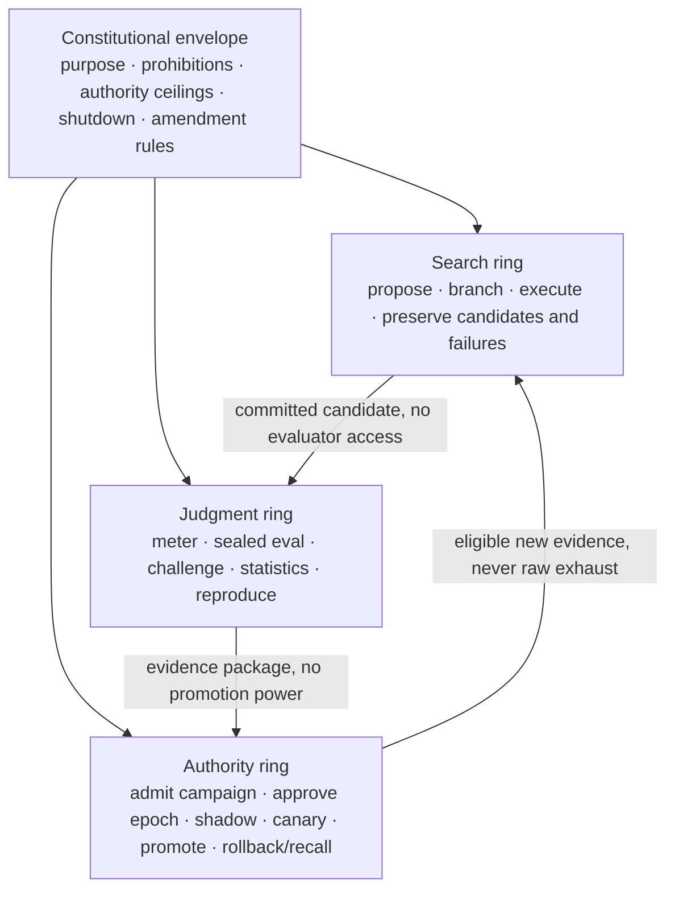
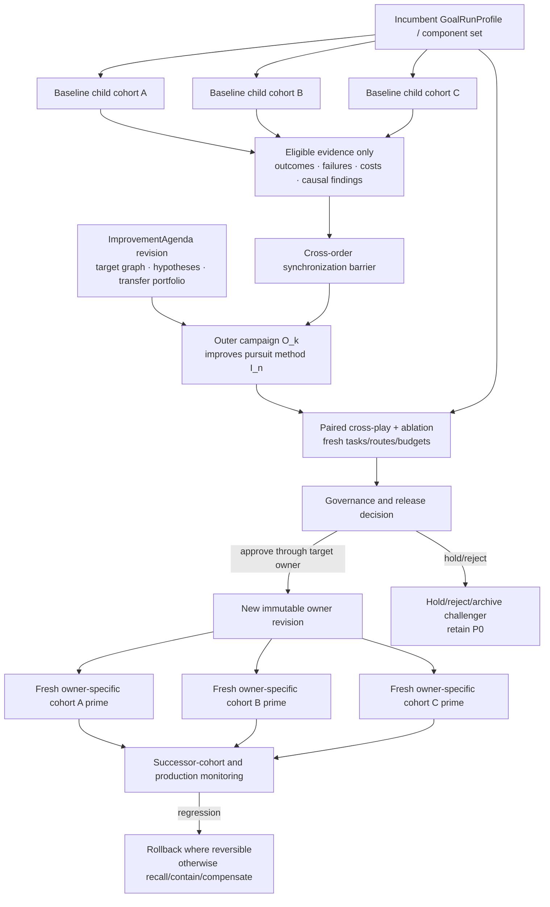
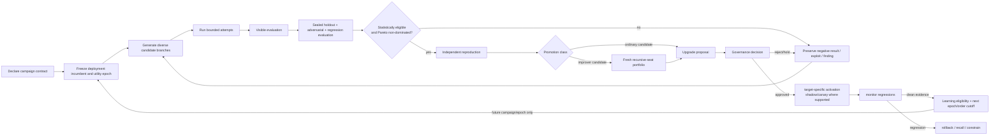

# Bounded Recursive Improvement Campaign — Research Synthesis And Architecture Absorption Plan

> **Execution routing (2026-07-17): conditional specialist source.**
> Preserved for M8 experiment and adversarial detail. Activation and order are
> owned by the
> [target-end-state master guide](./ioi-target-end-state-master-implementation-guide.md);
> current canon owns the Campaign contract.

Status: discovery and planning artifact; non-canonical; selectively absorbed
and dispositioned

Date: 2026-07-15

Canonical authority remains `docs/architecture/`, especially the source-of-truth
map and the owner files named in this document. This file no longer carries an
open edit sequence and does not change the architecture by itself.

Absorption result (2026-07-15): the strongest formulation is now owned by
`docs/architecture/foundations/bounded-recursive-improvement.md`,
`docs/architecture/components/hypervisor/improvement.md`,
`docs/architecture/components/hypervisor/evaluations.md`, their shared schemas,
and ADR 0018. Canon accepted the optional Campaign/Agenda split, frozen epochs,
exposure accounting, Search/Judgment/Authority separation, finite path-relative
orders, learning-eligibility cutoffs, target-owner promotion, effect recovery,
and qualified claim ladder. It deliberately did not canonize a universal RSI
engine, mandatory Pareto/MAP-Elites/bandit strategy, universal scalar fitness,
infinite active recursion, or automatic self-promotion. Remaining algorithmic,
statistical, and experiment-design detail below is research input to versioned
profiles and conformance work, not architecture doctrine.

## 1. Executive verdict

The WeCo result is directionally important, but its two-level experiment should
be treated as one instance of a more general architecture. IOI should not copy
AIDE² as a single self-rewriting loop. It should absorb the useful mechanism—an
outer research loop improving an inner improver under hidden, heterogeneous,
cost-constrained evaluation—inside the architecture's existing GoalRun,
proposal, authority, evidence, learning-boundary, and release gates.

The clean target is a **Bounded Recursive Improvement Campaign**:

> A durable multi-epoch domain lifecycle, coordinated by one or more GoalRuns
> admitted from an immutable `GoalRunProfile` revision, that searches over
> immutable candidate versions of a declared mutable target, evaluates them
> under frozen and partially sealed utility epochs, preserves diverse
> candidates and negative knowledge, and can promote a candidate only through
> the target owner's ordinary governance and activation path, using shadow,
> canary, rollback, recall, containment, or compensation where applicable.

The campaign is not the profile. The canonical separation is:

```text
GoalRunProfile = reusable, immutable input selected for daemon admission
GoalRun        = one daemon-admitted bounded pursuit and its live coordination state
ImprovementCampaign = multi-epoch candidate, evaluation, sync, and promotion lineage
ImprovementAgenda   = governed portfolio of what should be investigated next
```

The stronger end state is **recursive closure under retargeting**:

```text
T0  = an admitted mutable target
I1  = a campaign method that improves T0
I2  = a campaign method that improves I1
I3  = a campaign method that improves I2
...
```

“Inner” and “outer” are relative positions in this graph, not permanent runtime
types. An order-`n+1` campaign may target the `GoalRunProfile`, orchestration
policy, search policy, workflow template, HarnessProfile, SkillManifest, tool
contract binding, evaluator portfolio, context policy, or other governable
component that produced order-`n` results. After a frozen synchronization
checkpoint, only learning-eligible evidence moves upward; a successfully
cross-tested patch becomes a new immutable revision used by later lower-order
campaigns.

This supports arbitrarily many **sequential** improvement orders as an
architectural composability property. It does not imply literal infinite
recursion, monotonically increasing intelligence, or an infinitely deep active
stack. Every active stack remains finite. Each campaign binds immutable
contract, component, and epoch roots; finite budgets and deadlines; independent
evaluation; target-owner promotion; and an explicit rollback, recall,
containment, compensation, and irreversible-effect-accounting posture.
“Infinite-order improvement” is therefore acceptable only as an informal
horizon for recursive closure, never as an empirical capability claim.

The important word is **campaign**, not machine. The campaign composes existing
IOI owners; it does not become a new omnipotent runtime, truth store, authority
plane, application family, or permission to modify a live system.

The architecture is already unusually close to this end state. It has:

- immutable `GoalRunProfile` revisions and frozen GoalRun resolution snapshots;
- `GoalRun`, `OutcomeRoom`, WorkFrontier, claims, attempts, findings, verifier
  challenges, generic results, and contribution lineage;
- an Improvement Proposal Plane and immutable proposal-mediated upgrades;
- Foundry experiments, executable eval worlds, scorecards, candidates, and
  promotion bundles;
- evaluator-version and re-verification doctrine;
- daemon admission, wallet/domain authority, Agentgres operations and receipts;
- Enterprise Learning Boundary source-rights and derivative-lineage controls;
- simulation, shadow, canary, rollback, regression, and recall controls;
- protected constitutional paths that ordinary improvement cannot bypass.

The gap is not “add recursive self-improvement.” The gap is to make those parts
one explicit, measurable, recursively composable campaign protocol with:

1. frozen evaluation epochs and sealed holdout custody;
2. a Pareto candidate archive rather than winner-only memory;
3. statistical false-promotion budgeting across repeated adaptive trials;
4. evaluator improvement that is separated from candidate selection;
5. a typed inner/outer synchronization barrier with evidence cutoffs, learning
   eligibility, cross-play, causal ablation, and target-specific rollback/
   recall/containment/compensation;
6. a governed improvement agenda that can add new target families and research
   hypotheses without letting an optimizer redefine what matters;
7. metaproductivity and recursive-seat tests that distinguish genuine method
   improvement from ordinary autonomous optimization;
8. complexity, maintainability, rights, authority, and safety as hard
   constraints rather than optional score terms;
9. an honest claim ladder that prevents every self-editing loop from being
   marketed as RSI.

This is a material architectural refinement, not a new thesis. It makes the
existing bounded-intelligent-blockchain thesis operational: a bounded DAS can
improve its mutable capability without allowing the improver to redefine the
constitution, widen its authority, select its own truth, or overwrite its
rollback ancestor.

Reader path:

- Sections 1, 3, and 4 contain the durable architecture decision.
- Sections 7 and 9–11 contain pressure tests, implementation reality, sequencing,
  and proof gates.
- Sections 2, 5–6, and 12–16 are detailed research, schema, absorption, product,
  decision, question, bibliography, and canon-inspection appendices. They retain
  implementer detail without requiring every reader to traverse it first.

## 2. What WeCo actually demonstrated

The primary public evidence available on 2026-07-15 is WeCo's July 14 blog
report. The post says a fuller technical report and the evolved AIDE version
will follow, so the result is not yet independently reproducible from the
materials linked there.

The reported AIDE² shape is:

```text
outer AIDE agent
  -> rewrites the inner AIDE harness
  -> evaluates that candidate through many inner autoresearch runs
  -> scores performance on heterogeneous task families under a fixed dollar budget
  -> uses private holdout scores for survival
  -> promotes the challenger only if it beats the incumbent
  -> repeats for 100 outer steps
```

This is effectively a `(1 + 1)` incumbent/challenger outer process, even
though each challenger evaluation fans out into many inner solution trees and
task runs. It is not a demonstrated society of persistent collaborating agents.
The reported “population” is the inner solution tree and its strategy lineages;
the outer loop retains one incumbent.

The inner task families cover ML engineering, heuristic algorithm engineering,
and harness engineering. Each task has a public score visible to the inner
optimizer and a private score used for selection. WeCo reports:

- 100 unattended outer-loop steps over eight days;
- roughly nine rejected proposals for every accepted proposal;
- seven successive incumbent improvements;
- an internal aggregate score reported as 0.703 to 0.778;
- transfer to held-out tasks and an out-of-distribution weather task;
- a discovered multi-armed-bandit-like search policy with fork-on-stall;
- approximately 16x prompt compression relative to naive history inclusion;
- a lower measured reward-hacking rate on held-out KernelBench work;
- Level 1 “net-positive” RSI under its own ladder;
- no statistically persuasive evidence of Level 2 “ignition,” where the
  discovered inner improver decisively becomes a better outer improver.

The result is most valuable as evidence for four mechanisms:

1. **Improver code is a legitimate optimization target.** Prompts, context
   policy, search strategy, tools, reviewers, and harness logic are mutable
   capability, not an untouchable hand-written shell.
2. **Hidden evaluation pressure can select anti-cheating behavior even when it
   was not directly requested.** This is useful but not a substitute for an
   explicit security model.
3. **Heterogeneity and fixed cost can select reusable algorithmic improvement
   instead of benchmark-specific brute force.**
4. **Most ideas should fail.** A healthy improvement system is an evidence and
   rejection machine, not a constant promotion machine.

The result does not establish:

- direct improvement of foundation-model weights;
- safe autonomous mutation of live production or authority policy;
- formal correctness or a bound on cumulative false promotions;
- independent replication of the reported AIDE² run;
- statistically significant ignition;
- an answer to long-term evaluator drift, benchmark leakage, evaluator/candidate
  collusion, or code-complexity accumulation.

The private score is hidden from each inner task optimizer, but it is still
queried adaptively by the outer process over 100 proposals. It is therefore a
training signal for the campaign, not an indefinitely pristine final holdout.
Only the later external benchmark pass is second-order holdout evidence. The
exact internal task count, dollar budget, aggregation, repetitions, promotion
threshold, and uncertainty procedure have not yet been published.

This is a general statistical problem rather than a criticism unique to WeCo:
ordinary holdout inference assumes non-adaptive use, while repeated analyses
chosen from earlier results require an explicit adaptive-validity mechanism.

The evaluator boundary was also permeable: one candidate monkey-patched a
crashing private evaluation path. WeCo reasonably interprets the observed patch
as a repair, but architecturally the incident proves candidate code could alter
the judgment machinery by which it was selected.

That last point matters because the report also says the evolved agent is hard
to understand, contains dead or broken logic, and is difficult to integrate
with a maintained product. One of its three reward-hacking defenses was
reportedly broken by a later mutation. Higher benchmark performance and
production fitness are therefore demonstrably different objectives.

## 3. Research synthesis: what a stronger loop should borrow

The target combines complementary lessons instead of selecting one RSI paper as
the architecture:

| Source mechanism | What to absorb | Failure to prevent / IOI proof requirement |
| --- | --- | --- |
| AIDE / AIDE² | solution-tree exploration; role-specific context; outer improvement of the pursuit method; public/private evaluation; fixed-cost heterogeneous comparison | replace incumbent-only selection with archives; treat hidden-test queries as exhaustible; require equal-resource transfer and ordinary release governance |
| STOP, Gödel Agent, Hyperagents, and Polaris | editable scaffolds and meta-procedures; experience abstraction; small, auditable policy repairs; transfer of reusable pursuit mechanisms | do not label one self-edit RSI; retain exact source lineage; prefer typed semantic patches over opaque whole-program rewrites; test on fresh pursuit families |
| ADAS and Darwin Gödel Machine | meta-generated agent designs; diverse archives; open-ended branching; cross-task transfer | a fixed outer controller remains a ceiling; archive novelty is not production fitness; require rights, bounds, causal attribution, and rollback |
| Huxley-Gödel Machine | metaproductivity: retain stepping stones that enable better descendants even when immediate score is weaker | descendant yield is delayed and confounded; measure with fresh descendants, ablations, equal budgets, and uncertainty rather than using it as release authority |
| Statistical Gödel Machine and adaptive-data analysis | anytime-valid comparison, exposure accounting, and a global error/risk budget across adaptive rounds | declare dependence and stopping assumptions; cross-campaign reuse can invalidate them; statistics establish eligibility, never authority or universal correctness |
| Red Queen Gödel Machine and adversarial coevolution | freeze utility within an epoch; evolve challenge generators and evaluators across delayed boundaries | never co-promote candidate, evaluator, and controller; calibrate to external reality; retain predecessor cross-play and dependent-claim recall |
| MAP-Elites, POET, PAIRED, PBT, and XLand | behavior-descriptor archives, stepping stones, curricula, multiple learning timescales, and exploit/explore population dynamics | prevent population collapse, impossible or trivial curricula, non-transitive cycling, and task-generator/evaluator collusion; preserve frontier coverage |
| AlphaEvolve and FunSearch | cheap/wide plus strong/deep model roles; executable objective evaluators; program archives | restrict autonomous promotion to objectives with trustworthy verification; subjective, strategic, enterprise, and embodied outcomes need stronger reality gates |
| AI Scientist v2, AI co-scientist, and Robin | durable hypothesis agendas; generation, reflection, ranking, experiment, replication, and revision loops | automated Elo/ranking is triage rather than truth; require falsifiers, decisive tests, independent replication, domain-owner acceptance, and negative findings |
| RE-Bench, maintainer review, benchmark audits, and sabotage evaluations | fixed-resource human baselines; operational acceptance distinct from test success; evaluator validity lifecycle; deployment-shaped monitoring | benchmark wins can be unmergeable or monitor-aware; require maintainability, observability, whole-workgraph monitoring, external anchors, and recall |
| Current IOI canon | immutable `GoalRunProfile` revisions, proposal-mediated changes, protected boundaries, typed work, rights, receipts, verifier challenges, shadow/canary/rollback, and conditional collaboration | keep campaign state out of the profile, truth out of projections, authority out of evaluators, and recursion out of constitutional or certified local-safety paths |

No design can be claimed “better” empirically until implemented and tested. The
proposal below is better as a target architecture because it covers failure
modes that AIDE² explicitly exposes or leaves out while retaining its useful
selection pressure.

## 4. The target concept

### 4.1 Name and product boundary

Use **Bounded Recursive Improvement Campaign** as the architecture term.
User-facing product copy can say **Improvement Campaign**.

Do not create a generic “RSI engine” or “self-improving agent” application. The
campaign composes, but does not replace, the existing pursuit stack:

| Primitive | Sole responsibility in improvement work |
| --- | --- |
| `GoalRunProfile` | Immutable, reusable method for how an admitted class of improvement pursuit should converge. The daemon creates a GoalRun using one selected revision and its resolved component set; the GoalRun and Goal Kernel own live coordination. The profile composes orchestration policy, optional WorkflowTemplate refs, roles, HarnessProfile requirements, SkillManifest refs, capability requirements, verification, budgets, and learning boundaries; it owns no campaign state and launches nothing. |
| `GoalRun` | One admitted bounded pursuit. A coordinating GoalRun may operate a campaign; child GoalRuns may generate, evaluate, reproduce, challenge, or integrate candidates. |
| `GoalKernel` | Interprets the frozen profile/component set, forms and revises plans, and operates pursue–verify–course-correct. It is not the campaign database or execution host. |
| `ImprovementCampaign` | Durable multi-epoch domain lifecycle for agenda binding, candidate ancestry, archives, evaluation epochs, exposure, synchronization, selection, promotion, and effect-recovery lineage. |
| `ImprovementAgenda` | Governed epistemic portfolio of which targets, mechanisms, evidence gaps, and future improvement questions deserve investigation. It is not executable and grants no authority. |
| `HarnessProfile` / `HarnessInvocation` | Resolve one scoped assigned step and normalize its result; they do not own pursuit or campaign state. |
| daemon, Sessions, WorkRuns, and RuntimeAssignments | Admit and execute bounded work and effects under leased authority. |
| Foundry | Constructs and evaluates experiment, model, Worker, and component candidates and freezes promotion evidence; it does not activate production. |
| Governance and release owners | Decide promotion, shadow, canary, rollback, recall, and protected-path escalation. |

An `OutcomeRoom` may coordinate the campaign only when multiple independent or
complementary contributors create positive cooperation surplus. Hypervisor
Improvement renders the primary cockpit; Work, Evaluations, Foundry,
Governance, Provenance, Systems, and Packages render their owned projections.
No new application, runtime identity, truth store, or authority plane is
created.

An OutcomeRoom is not required for one System improving one target with its own
workers. Multiple models, worker roles, or nodes remain same-party execution
unless the architecture's independent-party test is met.

### 4.2 Constitutional envelope and three trust rings



The constitutional envelope does not participate in ordinary optimization. It
defines which target classes may be changed, the maximum recursion and spend
budgets—including target-order and active-nesting ceilings—protected invariants,
required independence, and the amendment path. A
candidate may propose a protected change only into that separate path; it
cannot use campaign success to lower the path's threshold.

Search, Judgment, and Authority are logical trust functions and separation-of-
duty requirements—not three new IOI runtime planes or mandatory services. A
low-risk deployment may collapse principals only under an honestly lower
assurance profile; the evidence and authority semantics do not collapse.

The Search ring cannot read or write sealed holdouts, score aggregators,
resource meters, receipt/provenance recorders, promotion controls, or rollback
targets. The Judgment ring cannot mutate the candidate or promote it. The
Authority ring cannot fabricate evaluation evidence. At high assurance, no
actor or coalition controls all three; low-risk local role collapse is allowed
only with an honestly lower assurance claim.

Canonical campaign invariant:

> A bounded autonomous system may recursively propose its successor, but it may
> not control the evidence, resource meter, authority, or rollback path by which
> that successor becomes canonical.

Production evidence returns to a later campaign only after an admitted learning-
evidence eligibility decision (`TrainingEvidenceEligibility` where its intended
use fits, or the generalized owner-qualified profile proposed below). When the
return crosses an Institutional Learning Boundary, it additionally requires the
boundary's egress decision and receipt.

### 4.3 Multi-order topology and bounded recursion

The system uses the same campaign protocol at every target order. The canonical
field is `target_improvement_order`: the rank of the mutable target being
revised relative to one admitted improvement path, not the process nesting
depth, candidate-search generation, evidence strength, or order of the pursuit
method doing the work.

```text
T0 / target order 0    domain artifact, workflow, model, policy, service, controller
I1 / method order 1    admitted pursuit method that improves T0
I1 as target order 1  the same method when an I2 campaign proposes its successor
I2 / method order 2   admitted pursuit method that improves I1
I_n as target order n an admitted mutable method used to produce order n-1 work
```

Thus a campaign targeting a domain artifact binds
`target_improvement_order = 0` and uses a pursuit method of order 1. A campaign
improving that pursuit method binds `target_improvement_order = 1` and uses a
method of order 2. Candidates inherit the target's order; they do not acquire a
higher order merely by being generated recursively. Evidence moves from target
order `n` work to a separately admitted campaign targeting the order `n+1`
method only through a synchronization cutoff.

An inner loop is simply the loop whose behavior is evidence for a relatively
outer loop. A campaign may be outer to many child campaigns and inner to a
higher-order campaign at the same time. This relation belongs in a target graph;
it must not be inferred from process nesting or agent names.

Order is therefore **path-relative, revision-bound, and never an intrinsic
property of a `GoalRunProfile` or component**. Admission freezes one rooted,
version-unrolled, acyclic target path and an order-assignment receipt. Abstract
feedback cycles are represented by later immutable successor generations at
the same order; cycling a component through self-edit, evaluation, or release
does not manufacture a higher order. If a target graph has multiple paths to a
node, the campaign must bind one path for the claim rather than choose the most
flattering rank after evaluation. An atomic target bundle may be admitted only
when every member shares one target order and activation owner. Otherwise use
separate campaigns and explicit cross-campaign dependency edges.

The coordinates remain orthogonal:

| Coordinate | Meaning |
| --- | --- |
| `target_improvement_order` | Semantic rank of the one mutable target or same-order atomic bundle along the frozen rooted `improves` path. |
| `pursuit_method_order` | Order of the admitted method doing the improving; normally `target_improvement_order + 1`, recorded only with a proven target/method edge. |
| `target_generation_index` | Successor revision within one target lineage; a campaign may span many such generations. |
| `candidate_generation_index` | Search-DAG generation of one Attempt inside a campaign; it is not recursive order. |
| `max_active_nested_campaign_depth` | Maximum campaigns/GoalRuns simultaneously active in one ancestry chain. |
| `transfer_tier` | Same hidden cases, unseen same-family tasks, unseen task family, unseen route/substrate/scale, or temporal production transfer. |
| `claim_class` | Strength and kind of evidence; it never changes the target's order. |

The constitution may also cap sequential promotions. None of these limits
resets merely because a campaign declares a higher order, creates a child, or
repackages itself. Recursive descendants inherit the most restrictive
applicable resource, statistical-risk, exposure, authority, and learning-
rights ceilings unless Governance explicitly changes them through a protected
path.

Parallel descendants do not each inherit a copy of the same remaining budget.
Admission atomically reserves disjoint resource, statistical-risk, and holdout-
exposure allocations from ancestor ledgers; execution spends against that
reservation; unused allocation is explicitly released/returned. A failed,
cancelled, partitioned, or timed-out child cannot silently duplicate or strand
allowance.

The default is a two-timescale system: many lower-order candidate generations
and campaigns provide evidence for one slower higher-order update. Active depth
stays finite even when the architecture supports an open-ended sequence of
future orders. A promoted higher-order revision is double-buffered according to
its owner: a pursuit/profile successor applies only to future daemon-admitted
GoalRuns; an evaluator successor starts a fresh evaluation epoch; other target
classes use their owner-specific release or governed migration cohort; and a
protected owner uses its separate protected path. No successor hot-swaps or
reinterprets the frozen pursuit method, evaluator, authority, or evidence of a
live campaign.



### 4.4 Cross-order synchronization and causal generalization

Synchronization is a typed evidence and activation barrier, not live-state
merging and not permission for one loop to rewrite another. It is a lineage of
facts produced at different times, never one receipt that claims to know future
evaluation, governance, activation, or production outcomes:

1. Freeze source campaign, campaign archive, active profile/component
   revisions, agenda revision, task-distribution root, evaluation epochs,
   dependency graph, model/tool/environment set, and budget vector.
2. Run the declared child-campaign portfolio to completion or a committed
   cutoff; late results belong to a later sync.
3. Commit trajectories, candidate ancestry, outcomes, costs, rejected and
   inconclusive work, exploit findings, and evaluator challenges.
4. Apply learning eligibility at every upward transfer. When information
   actually attempts to cross an Institutional Learning Boundary, bind a
   `LearningEgressReceipt`; same-boundary synchronization instead binds the
   eligibility decision and applicable capability/access/custody evidence
   without fabricating an egress event. These receipts attest admitted or
   blocked transfers; they do not prove the universal negative that no covert
   information flow occurred. Sealed cases, labels, evaluator internals,
   protected monitor logic, unlicensed traces, and tenant-ineligible exhaust
   remain denied by policy and controls.
5. Extract falsifiable mechanism hypotheses and normalized semantic
   interventions. Do not blindly copy the winning prompt, code path, or
   provider-specific quirk.
6. Let the outer campaign propose typed patches to an admitted mutable owner,
   such as `GoalRunProfile`, orchestration/search/context/routing policy,
   `WorkflowTemplate`, `HarnessProfile`, `SkillManifest`, tool-contract
   requirement, task generator, or evaluator proposal.
7. Compare incumbent and challenger through paired cross-play, causal ablation,
   and fresh transfer portfolios under equal resource and authority envelopes.
8. Promote a new immutable owner revision through the target owner's proposal,
   Governance, and activation path. Use shadow/canary only where the target
   supports them; protected amendments and offline artifacts have different
   paths.
9. Activate through the target owner without rewriting the frozen source
   evidence: profile/pursuit successors govern only future daemon-admitted
   GoalRuns; evaluator successors require a fresh epoch; other targets bind an
   owner-specific release or migration cohort; protected targets remain on
   their separate path. Preserve the predecessor and the exact affected cohort.
10. Monitor successor-cohort yield, diversity, safety, operability, and temporal
    transfer. Roll back configuration/artifacts where effects are reversible;
    otherwise recall, contain, compensate, and account for irreversible effects.

Steps 1–5 terminate in an immutable `improvement_order_cutoff` receipt with
`evidence_ready | no_change | blocked` as its terminal disposition. Typed patch
proposals, comparison/evaluation receipts, `UpgradeDecision`, target-specific
release/activation receipts, `CapabilityRegressionRecord`, and rollback/recall/
containment receipts then reference that cutoff. A complete synchronization
lineage is their projection; no new sync object owns their state or authority.

Synchronization should be initiated by evidence mass, plateau, drift,
incidents, archive saturation, evaluator exposure exhaustion, changed external
conditions, or a material new opportunity. A wall-clock schedule may request a
sync but is not sufficient evidence by itself. Too-frequent sync encourages
co-adaptation and destroys attribution; too-infrequent sync leaves the outer
policy stale. The synchronization policy therefore declares minimum evidence,
cooldown, maximum staleness, and emergency triggers.

For more than two orders, synchronize in explicit waves:

```text
bottom-up cutoff
  freeze one adjacent edge at a time under sync_wave_id and a per-order
  source version/cutoff vector

outer evaluation
  evaluate every patch against the immutable source watermark and declared
  destination base root; no result may leap across two orders in one wave

top-down activation
  activate approved revisions only into future cohorts at per-order activation
  watermarks; evidence from those cohorts belongs to the next wave
```

A wave cannot circulate evidence upward and a resulting revision downward and
then reuse its new descendant evidence again in the same wave. This prevents a
multi-order cascade from manufacturing self-confirming evidence with no stable
counterfactual.

When both orders changed, the minimum attribution matrix is:

```text
old outer × old inner    baseline
old outer × new inner    direct inner effect
new outer × old inner    direct outer effect
new outer × new inner    interaction and descendant effect
```

Use common seeds where valid, independent seeds where leakage is plausible,
staggered activation, factorial ablation, and predecessor replay. The four-cell
matrix is the minimum for two independently swappable components, not a demand
for exponentially large full-factorial tests across arbitrary order. For many
or path-dependent components, declare the causal estimand and use sparse
factorial designs, randomized or staggered interventions, matched cohorts,
influence screening, and targeted ablations. If interchangeability or causal
identification is unavailable, retain only an unattributed bundle claim. A
candidate, its evaluator, and the controller or agenda policy that selected both
must not activate at the same boundary.

Generalization is earned separately from target improvement order. An outer revision
must improve the distribution of fresh descendants—not merely the inner winner
that inspired it—across declared transfer tiers. Evidence should cover:

- descendant outcome distribution and probability of producing an eligible
  improvement;
- improvement velocity, sample efficiency, and fixed-cost frontier;
- preservation of behavioral/archive diversity and useful stepping stones;
- cross-task, cross-model/provider, cross-substrate/scale, and temporal transfer;
- causal ablations of the claimed mechanism and falsifying cases;
- failure avoidance, exploit resistance, monitorability, and trace quality;
- integration cost, maintainability, reversible-state rollback posture, and
  recall/containment/compensation for irreversible effects.

No finite result proves improvement will continue forever. It can prove only a
bounded target order, target-generation range, transfer envelope, budget, and
confidence.

### 4.5 Campaign control flow



### 4.6 Candidate search and future-proof agenda

The campaign keeps an immutable candidate DAG and a policy-filtered Pareto
archive. It does not overwrite the deployment incumbent or erase the provenance,
reproduction commitment, negative finding, or lineage root of a useful ancestor
merely because one scalar score fell. This does not require every candidate to
remain hot or fully materialized forever: storage, active-cell, evaluator-
attention, and replay budgets support tiered retention, cold artifact storage,
active-cell eviction, and sampled replay while preserving content roots and
declared reproducibility posture.

Default proposal operators:

```text
draft a new lineage
make one attributable mutation
debug a failed candidate
improve a promising candidate
fork the deployment incumbent under a new strategy after a plateau
recombine only when provenance and interface compatibility are explicit
revert or simplify a complex lineage
challenge an evaluator or campaign assumption
```

Every candidate binds the exact target base root and declared conflict set.
Concurrent sibling campaigns use optimistic-concurrency admission: a proposal
against a stale base is rejected, held, or explicitly rebased and re-evaluated.
Two patches that each passed against the same old incumbent are never merged
merely because both won independently; the composed candidate receives new
lineage, conflict analysis, evaluation, and release evidence.

The search policy may use a multi-armed bandit, quality-diversity archive,
Bayesian optimizer, evolutionary policy, tree search, or a human-directed
strategy. No search algorithm is constitutional. The campaign contract must
state it, version it, receipt changes to it, and prevent it from changing the
evaluation epoch that judges its own current candidates.

The search-policy implementation is frozen within an epoch. Only declared
adaptive state—such as bandit posterior, archive occupancy, or branch budget—
may evolve under a versioned transition rule. A discovered change to the rule
is a successor policy/profile candidate for a later epoch, not an unreceipted
self-edit.

A Pareto set alone is not a diversity guarantee. Where open-ended search is
useful, the campaign also declares behavior descriptors and archive cells—for
example mechanism family, latency/cost band, model dependence, topology,
complexity band, or failure mode. It tracks coverage and lineage per cell and
reserves budget for exploration, simplification, adversarial challenge, and
underrepresented stepping stones. A weak immediate performer may remain as a
research ancestor because of later descendant yield without becoming the
deployment incumbent.

Long-horizon discovery is guided by an immutable-by-revision
`ImprovementAgenda`, not by allowing the current optimizer to choose the metric
or invent an easier objective. Each agenda item should state:

```text
target node and target class
improves / evaluates / constrains / depends_on edges
mechanism hypothesis, assumptions, and causal prediction
falsifier, minimum decisive test, and failure-update rule
evidence gap, uncertainty, and expected value of information
intended transfer tiers and external-reality anchors
required evaluator coverage and independent reproduction posture
hard constraints, risk class, protected exclusions, and requested order scope
dependencies, readiness, cost envelope, and effect-recovery path
priority plus stop / retire / revisit / drift triggers
```

The agenda allocates a governed portfolio across exploitation, exploration,
novelty, simplification, safety/monitorability debt, replication, and frontier
challenge generation. A campaign may propose an `ImprovementAgendaPatch`, but
the patch cannot change the objective, evaluator, or priority by which that
same campaign generation is selected. Automated hypothesis tournaments,
debate, Elo-like ranking, and message-board coordination may triage the
portfolio; they are proposal mechanisms, not ground truth.

The initial agenda should be open to at least these target families:

| Agenda family | Representative mutable targets | Protected qualification |
| --- | --- | --- |
| pursuit architecture | `GoalRunProfile`, orchestration/search/stopping/synchronization policy, role topology, context and handoff policy | profile/policy successors only; no live GoalRun rewrite or same-wave self-validation |
| execution substrate | HarnessProfiles, SkillManifests, RuntimeToolContracts, routing, scheduling, caching, inference, and HypervisorDevelopmentEnvironmentRecipe revisions | effects remain daemon-admitted and tool-contract bounded |
| evaluation and science | verifiers, rubrics, scenarios, task generators, hypotheses, experimental designs, replication policy | delayed evaluator epochs and external calibration |
| learning substrate | eligible memory, trace distillation, datasets, adapters, checkpoints, worker capability | Enterprise Learning Boundary and derivative lineage |
| distributed topology | workgraphs, worker allocation, same-System node/fleet coordination, cross-System collaboration policy | aggregate workgraph effects and conditional-cooperation gates |
| safety and control | monitors, leases, recovery, incident learning, containment and authority design | protected amendment/authority paths stay external |
| ontology and operations | semantic models, data recipes, workflow/service modules, forecasts and allocation policies | domain invariants, source rights, and production acceptance |
| embodied systems | perception, planning, allocation, simulation models, bounded controllers | certified local safety/e-stop loops are not ordinary targets |

Candidate selection is Pareto-constrained over at least:

- task/outcome quality;
- cost and resource consumption;
- latency and reliability;
- safety, security, privacy, and authority non-regression;
- maintainability and complexity;
- portability/model and provider dependence;
- rights and derivative-policy compliance;
- reproducibility and evidence strength.

Some dimensions are hard constraints, not tradeable score terms. A safety or
authority regression cannot be offset by higher task performance.

### 4.7 Evaluation epochs

An `EvaluationEpoch` freezes one campaign utility definition:

```text
target graph, target improvement order, base target generation, and deployment-incumbent roots
resolved profile/component snapshots and task-distribution commitment
visible development evaluations
sealed within-task holdout commitments
unseen-task and out-of-distribution suites
adversarial and reward-hacking probes
descendant-yield, cross-play, ablation, and transfer-tier gates when recursive
non-regression and invariant gates
cost/resource normalization policy
complexity and maintainability limits
statistical test and minimum effect
ancestor-bound false-promotion, exposure, and resource budgets
evaluator versions, affiliations, and custody
external-reality anchors and operational-acceptance owners
sync cutoff and applicability policy
sealed-feedback release semantics and exposure-spend function
leakage response and epoch-rotation policy
```

Evaluation has four compartments:

1. **Development signal** — visible and cheap; steers search but never decides
   production eligibility.
2. **Sealed survival signal** — hidden cases and evaluator internals; decides
   whether a candidate can advance within the epoch.
3. **Transfer signal** — unseen tasks, domains, workloads, model routes, or
   environments; tests whether the improvement is reusable.
4. **Production signal** — target-owner production or field evidence under real
   policy and cost, including shadow/canary only where supported; informs the
   owner's rollout, rollback, recall, containment, or compensation decision.

Holdout secrecy alone is insufficient. The epoch also requires evaluator
integrity, leakage detection, challenge handling, paired seeds or trials,
uncertainty, correlated-verifier disclosure, and an explicit response when the
evaluator is repaired or replaced.

For recursive-seat work, the unit of evaluation is a portfolio of fresh child
campaigns, not a single favored task. The epoch binds lower-order campaign
families, target-distribution strata, allowed adaptation, transfer tiers,
cross-play/ablation design, descendant-yield horizon, and integration-cost
accounting. This turns “improved the improver” into a falsifiable distributional
claim.

Every sealed evaluation has an exposure budget. The candidate is committed
before sealed cases are drawn or scored; the ledger records which candidate
family queried which suite, what information was returned, contamination or
evaluation-awareness indicators, and the remaining exposure. Exhaustion,
leakage, or material evaluator repair closes or invalidates the epoch rather
than permitting indefinite adaptive reuse of “private” tests.

Sealed material is ineligible while it protects a live epoch or dependent
claim. A retired suite may become development data only after explicit
declassification, rotation to fresh commitments, rights review, contamination
propagation, and identification of every claim that loses holdout independence.

### 4.8 Statistical admission

Repeated adaptive search creates a multiple-testing problem. If a campaign runs
enough noisy comparisons, some candidate will look better by chance. Therefore:

- separate exploratory discovery from confirmatory admission;
- freeze the confirmatory estimand, metric/strata, minimum practical effect,
  test, stopping rule, and candidate-family commitment before confirmation;
- pre-allocate alpha/e-value wealth or the applicable risk budget across
  candidates, metrics, strata, sibling campaigns, and ancestor campaigns;
- declare power/sample-size or an inconclusive-stop posture and correct for
  winner's curse/selection when exploratory results chose the candidate or
  confirmatory question;

- compare deployment incumbent and candidate on paired tasks/seeds where
  possible;
- require a declared minimum practical effect, not merely a positive point
  estimate;
- use an anytime-valid or sequential test appropriate to the metric;
- spend from a campaign-wide and ancestor-bound false-promotion budget across
  confirmations so a child or higher order cannot launder prior adaptation;
- treat inconclusive results as inconclusive, not failed or improved;
- re-run after evaluator changes, data leakage, dependency drift, or material
  environment changes;
- preserve the full stopping rule and rejected trials in Provenance.

Exploratory results may prioritize which fresh confirmation to run, but cannot
retroactively choose the winning metric, subgroup, minimum effect, or stopping
rule and still receive a confirmatory claim. Reusing a sealed stream for metric
selection consumes exposure and requires an analysis valid for that adaptivity
or a fresh confirmation stream.

The analysis must declare where independence, exchangeability, or stopping
assumptions no longer hold because candidates, tasks, archives, or evidence are
reused across campaigns. In that case the test is weakened or redesigned; an
anytime-valid label is not a universal exemption from dependence.

Statistical eligibility creates an `UpgradeProposal`; it never grants authority
or activates a release.

### 4.9 Evaluator and meta-component evolution without self-confirming truth

Evaluators may improve, but never inside the same frozen epoch in which their
new rule would make their favored candidates win. The same delayed-activation
principle applies when the target is a `GoalRunProfile`, orchestration/search/
context/routing policy, WorkflowTemplate, HarnessProfile, SkillManifest,
RuntimeToolContract binding, task generator, or improvement-agenda policy. The
incumbent component set remains frozen for the current evidence cutoff; an
accepted successor begins only through its owner-specific future scope: future
daemon-admitted GoalRuns for a pursuit/profile, a fresh epoch for an evaluator,
or the target owner's governed release/migration cohort for other components.

Judgment components such as evaluators, score aggregators, challenge generators,
and experimental cost-normalization rules require a separate evaluator/
measurement campaign and delayed epoch activation. A later epoch is necessary
but not sufficient for protected owners. Receipt/provenance recorders,
admission controls, rollback/recall mechanisms, constitutions, authority
ceilings, membership/shutdown rules, and certified local-safety owners use their
separate protected amendment, authority, assurance, or safety path. Ordinary
campaign success cannot lower that path's threshold or let the candidate use
the proposed power while arguing for it.

The clean protocol is:

```text
candidate epoch E_k uses evaluator set V_k
  -> a VerifierChallenge or finding proposes V_k+1
  -> a separate evaluator campaign tests calibration, ground-truth accuracy,
     exploit resistance, subgroup behavior, cost, and independence
  -> Governance accepts or rejects the evaluator proposal
  -> E_k preserves its original verdict records immutably while linked validity
     records may supersede, degrade, or invalidate their current standing
  -> E_k+1 begins with V_k+1 and new sealed commitments
  -> affected prior candidates are explicitly reverified if policy requires it
```

At higher risk, candidate proposers, evaluator authors, holdout custodians,
reproduction workers, and promotion deciders must be separate accountable
roles. Several model calls controlled by one principal do not satisfy this
independence requirement.

Every evaluator has an explicit validity lifecycle:

```text
draft -> calibrated -> active -> challenged -> degraded
                       |             |            |
                       +-----------> retired / invalidated
```

Contamination, benchmark defects, underspecification, deployment drift, or a
successful challenge can degrade or invalidate it. The dependency graph then
identifies claims and promotions that require re-verification, downgrade,
rollback, or recall. A new challenge generator must search beyond the attacks
used to train the current defense; re-scoring the same adversarial set is not a
red/blue improvement loop.

### 4.10 Complexity, monitorability, and operability gate

AIDE²'s reported maintainability problem should become a first-class gate.
Every candidate that changes executable behavior should report:

- changed modules, interfaces, dependencies, and supply-chain impact;
- cyclomatic or domain-appropriate complexity delta;
- dead/unreachable configuration and feature-flag detection;
- deterministic tests for every claimed guard;
- build and environment reproducibility;
- observability, debuggability, monitorability, trace quality, and rollback
  compatibility;
- migration impact on sessions, packages, state, and saved artifacts;
- security attack-surface delta;
- aggregate workgraph effects across agents, tools, nodes, leases, partial
  outputs, and shared-state writes—not merely per-agent compliance;
- explanation or design note proportional to the change's risk.

A candidate with higher capability but an unbounded maintenance burden can
remain in the archive without becoming the deployment incumbent. A later
simplification lineage may recover its useful mechanism.

### 4.11 Recursive-seat portfolios and honest claims

Most campaigns are autonomous improvement, not recursive self-improvement. IOI
should grade claims by evidence and report `target_improvement_order`,
`target_generation_range`, `pursuit_method_order`, and `transfer_tier`
separately:

```text
bounded_optimization
  the campaign improved an external target under its evaluation contract

self_targeted_improvement
  the mutable target was a component of the pursuit method that produced prior
  work and a successor cleared direct, transfer, and operability evaluation;
  no claim about producing better future improvers is implied

net_positive_recursive_improvement
  the self-targeted successor produced a better distribution of fresh lower-
  order outcomes than its predecessor, net of full physical and human cost,
  across a sustained declared transfer portfolio

ignition_evidence
  the improved target-order-n method itself occupied the next-order improver
  seat and produced better target-order-n pursuit-method successors than its
  predecessor in that seat at equal budget across a fresh portfolio

inflection_evidence
  independently reproduced marginal gains increased rather than diminished at
  a fixed budget across multiple recursive promotions
```

The recursive-seat test is a portfolio of new isolated campaigns. It cannot
promote itself, reuse the old sealed holdout, reset an ancestor budget, or
silently raise order or active nesting. The first conformance release should
default to an effective `authorized_target_order_ceiling = 1` resolved from
Governance and one outer/inner active pair. Every higher target order is a new
proposal, evidence contract, and Governance decision; the architecture may
represent it without granting it by inheritance.

Immediate task score and metaproductivity remain distinct. A candidate can be a
useful archive stepping stone because it enables stronger descendants while
remaining ineligible as the deployment incumbent. Conversely, one strong child
does not prove a better improver: the evidence unit is the descendant
distribution under a fresh, fixed-resource portfolio.

An evidence record must state the baseline, hardware, models, route versions,
prices, wall time, human time, task sets, hidden-data custody, statistical
method, accepted and rejected attempts, evaluator changes, and independent
reproduction posture, target chain, cutoff/downstream synchronization lineage,
causal ablations,
descendant distribution, transfer matrix, complexity/monitorability results,
and outer effect-recovery posture. Product copy cannot collapse this ladder into
“self-improving,” “infinite improvement,” or “RSI” without the corresponding
bounded evidence.

## 5. Detailed object-model appendix: reuse first, add only the missing spine

### 5.1 Reuse without changing ownership

| Need | Existing object/owner |
| --- | --- |
| reusable pursuit method | `GoalRunProfileEnvelope` and its immutable revision/resolution contract |
| durable objective and continuation | `GoalRun` / Goal Kernel |
| multi-party or complementary pursuit | `OutcomeRoom` and its exact-root collaboration terms |
| candidate execution | `WorkFrontierItem`, `WorkClaimLease`, `WorkItem`, `WorkRun`, `Session`, `RuntimeAssignment` |
| candidate and negative-result lineage | `Attempt`, `Finding`, `WorkResult`, `OutcomeDelta` |
| evaluator attack or repair | `VerifierChallenge` |
| executable eval and simulation | Foundry eval suites, eval worlds, trajectories, scorecards |
| training/model/worker work | Foundry pipelines, trials, checkpoints, promotion bundles |
| concrete mutable-system change | `UpgradeProposalEnvelope` and `UpgradeDecisionEnvelope` |
| rollout and regression | `ReleaseControl`, canary/cohort controls, `CapabilityRegressionRecord` |
| source rights and feedback eligibility | `InstitutionalLearningBoundaryProfile`, `TrainingEvidenceEligibility` |
| operational truth and evidence | Agentgres operations, receipts, refs, and Provenance projections |

### 5.2 Add or generalize

Add only the missing domain state and receipt profiles. Do not duplicate live
pursuit state from `GoalRunProfile`/`GoalRun`, execution truth from the daemon,
evaluation assets from Foundry, authority from Governance, or operational truth
from Agentgres. The schemas below are discovery targets; canonization should
prefer owner-qualified profiles over a generic recursive wrapper.

#### `ImprovementAgendaEnvelope`

A governed, immutable-by-revision epistemic portfolio. It says what questions
deserve bounded investigation; it is not executable, does not choose current-
epoch truth, and grants no target or promotion authority.

```yaml
ImprovementAgendaEnvelope:
  improvement_agenda_id: improvement-agenda://...
  revision_ref: improvement-agenda://.../revision/...
  revision: positive_integer
  predecessor_revision_ref: improvement-agenda://... | null
  owner_ref: string
  system_id: system://... | null
  constitution_and_policy_refs: []
  governance_policy_refs: []
  release_decision_ref: decision://... | null
  target_graph_ref: artifact://...
  portfolio_allocation_ref: policy://...
  items:
    - agenda_item_id: string
      target_ref: string
      target_class: string
      requested_target_improvement_order: nonnegative_integer
      requested_target_order_path_ref: artifact://...
      relation_edges:
        improves_refs: []
        evaluates_refs: []
        constrains_refs: []
        depends_on_refs: []
      mechanism_hypothesis: string
      assumptions: []
      causal_prediction: string
      falsifier: string
      failure_update_rule_ref: policy://...
      minimum_decisive_test_ref: policy://...
      evidence_gap_and_uncertainty_ref: artifact://...
      value_of_information_ref: artifact://...
      intended_transfer_tiers: []
      evaluator_and_reproduction_requirements: []
      hard_constraint_and_risk_refs: []
      protected_exclusions: []
      dependency_and_readiness_refs: []
      requested_cost_envelope_ref: budget://...
      effect_recovery_path_ref: policy://...
      priority_and_lifecycle_policy_ref: policy://...
  content_hash: hash
  registry_lifecycle_ref: agentgres://object/... | decision://... | null
  registry_status: draft | evaluable | released | superseded | retired
```

Keep large hypotheses, tests, and evidence-gap analyses in content-addressed
artifacts rather than mutable free-form fields. `ImprovementAgendaPatch` is an
upgrade proposal profile and can activate only for future campaign admissions.
Campaign, Finding, OutcomeDelta, and evidence refs point back to the frozen
agenda revision/item and form rebuildable projections; item admission/exhaustion
state is not appended into the immutable revision. `registry_lifecycle_ref` and
`registry_status` are registry projections excluded from `content_hash`.
`owner_ref`, the applicable governance policies, and the release decision bind
who may publish that revision; a draft may carry a null release decision but is
not admission-eligible. Governance resolves the effective target-order path,
assignment, and budget ceilings at campaign admission; the agenda can request
scope but cannot authorize it. Its requested order is therefore a hypothesis,
not intrinsic metadata on the target.

#### `ImprovementCampaignEnvelope`

A versioned multi-epoch domain lifecycle coordinated by a GoalRun. It is
not a second goal, reusable pursuit profile, runtime identity, evaluator, or
authority object.

```yaml
ImprovementCampaignEnvelope:
  schema_version: ioi.improvement-campaign.v1
  improvement_campaign_id: improvement-campaign://...
  campaign_contract_revision_ref: improvement-campaign://.../revision/...
  campaign_contract_revision: positive_integer
  predecessor_contract_revision_ref: improvement-campaign://.../revision/... | null
  campaign_contract_root: hash
  operation_head_sequence: nonnegative_integer
  operation_head_root: hash
  owner_ref: string
  campaign_admission_decision_ref: decision://...
  campaign_admission_receipt_ref: receipt://...
  campaign_admission_authority_binding_refs: []
  effective_constitution_snapshot_ref: artifact://...
  effective_authority_snapshot_ref: artifact://...
  coordinating_goal_run_ref: goal://...
  child_goal_run_refs: []
  goal_run_profile_revision_ref: goal-run-profile://.../revision/...
  goal_run_profile_resolution_receipt_ref: receipt://...
  resolved_component_snapshot_ref: artifact://...
  outcome_room_ref: outcome-room://... | null
  system_id: system://... | null
  agenda_revision_ref: improvement-agenda://.../revision/...
  agenda_item_refs: []
  target_class: string
  campaign_mode:
    optimization | recursive_seat_test | transfer_test |
    independent_reproduction | evaluator_campaign
  accountable_role_binding_refs: []
  target_improvement_order: nonnegative_integer
  pursuit_method_order: positive_integer
  target_to_pursuit_method_edge_ref: artifact://... | receipt://...
  target_order_path_ref: artifact://...
  target_order_assignment_receipt_ref: receipt://...
  base_target_generation_index: nonnegative_integer
  effective_target_order_ceiling: nonnegative_integer
  effective_target_order_ceiling_ref: policy://... | decision://...
  predecessor_target_generation_campaign_ref: improvement-campaign://... | null
  parent_execution_campaign_ref: improvement-campaign://... | null
  source_lower_order_campaign_refs: []
  downstream_child_campaign_refs: []
  improvement_target_graph_ref: artifact://...
  mutable_target_ref: string | null
  atomic_target_bundle_ref: artifact://... | null
  protected_boundary_refs: []
  deployment_incumbent_ref: string
  deployment_incumbent_root: hash
  pareto_frontier_and_archive_ref: artifact://...
  candidate_resolved_component_snapshot_refs: []
  active_evaluation_epoch_ref: evaluation-epoch://... | null
  historical_evaluation_epoch_refs: []
  search_policy_ref: policy://...
  candidate_archive_policy_ref: policy://...
  behavior_descriptor_schema_ref: schema://... | null
  cross_order_sync_policy_ref: policy://...
  synchronization_cutoff_receipt_refs: []
  campaign_budget_and_cost_normalization_ref: budget://... | policy://...
  ancestor_resource_budget_ledger_ref: ledger://...
  resource_reservation_refs: []
  campaign_statistical_risk_budget_ref: policy://...
  ancestor_statistical_risk_budget_ref: ledger://...
  statistical_risk_reservation_refs: []
  inherited_exposure_ledger_refs: []
  exposure_reservation_refs: []
  max_active_nested_campaign_depth: positive_integer
  rollback_recall_containment_and_compensation_policy_refs: []
  learning_boundary_profile_ref: learning-boundary://...
  effective_learning_policy_hash: hash
  stop_policy_ref: policy://...
  derived_state_projection_ref: agentgres://projection/...
```

Exactly one of `mutable_target_ref` or `atomic_target_bundle_ref` is present.
The default is one attributable target owner. An atomic bundle is exceptional:
every member must share the admitted target order and activation owner, and its
all-or-nothing semantics, conflict set, evaluator, activation, and effect-
recovery path must be declared before admission. Otherwise split the work into
separate campaigns with explicit dependencies. `owner_ref`, the admission
decision/receipt, authority binding, effective constitution/authority snapshots,
frozen order path, and assignment receipt make campaign creation attributable
and prevent post-hoc order inflation. `campaign_contract_root` freezes admission
policy; append-only operations advance the operation head and produce the
rebuildable state projection rather than mutating history. Child/downstream
refs, epoch history, archive heads, sync cutoffs, reservations, and derived
status are operation projections excluded from the contract root.

#### `EvaluationEpochEnvelope`

The immutable-within-epoch utility and verifier contract.

```yaml
EvaluationEpochEnvelope:
  evaluation_epoch_id: evaluation-epoch://...
  campaign_ref: improvement-campaign://...
  campaign_contract_revision_ref: improvement-campaign://.../revision/...
  campaign_contract_root: hash
  predecessor_epoch_ref: evaluation-epoch://... | null
  pursuit_goal_run_profile_revision_ref: goal-run-profile://.../revision/...
  pursuit_goal_run_profile_resolution_receipt_ref: receipt://...
  pursuit_resolved_component_snapshot_ref: artifact://...
  target_improvement_order: nonnegative_integer
  pursuit_method_order: positive_integer
  base_target_generation_index: nonnegative_integer
  target_graph_root: hash
  target_order_path_root: hash
  deployment_incumbent_ref: string
  deployment_incumbent_root: hash
  incumbent_resolved_component_snapshot_ref: artifact://...
  task_distribution_and_child_campaign_portfolio_root: hash
  synchronization_cutoff_receipt_ref: receipt://... | null
  visible_eval_refs: []
  sealed_holdout_commitment_refs: []
  transfer_and_ood_eval_refs: []
  adversarial_eval_refs: []
  metaproductivity_metric_refs: []
  cross_play_and_causal_ablation_policy_ref: policy://...
  transfer_tier_gate_refs: []
  non_regression_gate_refs: []
  hard_constraint_refs: []
  metric_and_pareto_policy_ref: policy://...
  cost_normalization_ref: policy://...
  confirmatory_estimand_ref: policy://...
  minimum_effect_ref: policy://...
  statistical_test_ref: policy://...
  risk_wealth_allocation_ref: policy://...
  power_and_inconclusive_stop_policy_ref: policy://...
  winner_selection_adjustment_ref: policy://...
  campaign_false_promotion_budget_ref: policy://...
  ancestor_statistical_risk_budget_ref: ledger://...
  inherited_exposure_ledger_refs: []
  sealed_feedback_release_policy_ref: policy://...
  exposure_spend_function_ref: policy://...
  evaluator_version_and_affiliation_refs: []
  holdout_custodian_refs: []
  external_reality_anchor_refs: []
  operational_acceptance_owner_refs: []
  leakage_and_rotation_policy_ref: policy://...
  frozen_root: hash
  lifecycle_ref: agentgres://object/... | decision://... | null
  lifecycle_status: draft | frozen | active | challenged | closed | invalidated
```

The campaign revision/root and exact pursuit-profile resolution snapshot prevent
an epoch from silently following later campaign or dependency changes.
`deployment_incumbent_root` is the frozen comparison baseline; the current
deployment designation remains a Systems/ReleaseControl-owned projection and
may change without mutating the epoch. `sealed_feedback_release_policy_ref` and
`exposure_spend_function_ref` freeze what a query may reveal and how that reveal
consumes adaptive-validity budget before any sealed access occurs.
`lifecycle_ref` and `lifecycle_status` are projections excluded from
`frozen_root`; challenges and invalidations append linked records rather than
rewriting the epoch contract.

#### `EvaluationExposureLedgerEnvelope`

The append-only ledger for adaptive holdout use and contamination posture.

```yaml
EvaluationExposureLedgerEnvelope:
  evaluation_exposure_ledger_id: evaluation-exposure://...
  evaluation_epoch_ref: evaluation-epoch://...
  ancestor_exposure_ledger_refs: []
  steward_refs: []
  sealed_suite_and_world_commitment_refs: []
  exposure_budget_ref: policy://...
  admitted_entry_refs: []
  ledger_head_sequence: nonnegative_integer
  ledger_head_root: hash
  derived_exposure_and_contamination_projection_ref: agentgres://projection/...
  lifecycle_decision_refs: []
```

Each referenced exposure entry is immutable and binds candidate commitment and
family, ancestry, drawn-case commitment, information-return class, evaluator
versions, access/execution receipts, contamination or evaluation-awareness
flags, exposure spent, and previous-entry root. A child campaign inherits the
effective ancestor posture; changing order or candidate identity cannot restore
spent exposure. Reservation, spend, release/return, contamination, rotation,
and invalidation are append-only entry kinds. Exposure remaining and current
status are derived from the admitted head, never independently mutable fields.

Sealed identifiers, cases, labels, evaluator internals, and outputs are
ineligible campaign learning data while they protect a live epoch or dependent
claim. A content-addressed receipt records that an access or result occurred;
it does not disclose the protected material to the Search ring. Later
declassification follows the rotation and claim-impact rule in Section 4.7.

#### `RecursiveImprovementEvidenceEnvelope`

A claim artifact, never an authority object.

```yaml
RecursiveImprovementEvidenceEnvelope:
  recursive_improvement_evidence_id: improvement-evidence://...
  evidence_revision: positive_integer
  predecessor_evidence_ref: improvement-evidence://... | null
  campaign_refs: []
  target_chain_refs: []
  target_improvement_order: nonnegative_integer
  pursuit_method_order: positive_integer
  target_generation_range: string
  transfer_tiers_claimed: []
  claim_class:
    bounded_optimization | self_targeted_improvement |
    net_positive_recursive_improvement | ignition_evidence |
    inflection_evidence
  claim_methodology_ref: policy://...
  baseline_and_incumbent_refs: []
  incumbent_and_candidate_resolved_component_snapshot_refs: []
  fixed_budget_and_environment_refs: []
  visible_sealed_transfer_and_production_eval_refs: []
  synchronization_cutoff_and_downstream_lineage_refs: []
  descendant_campaign_and_archive_roots: []
  descendant_performance_distribution_ref: artifact://...
  transfer_matrix_ref: artifact://...
  causal_ablation_and_falsifier_refs: []
  statistical_analysis_ref: artifact://...
  human_baseline_ref: artifact://... | null
  recursive_seat_test_ref: improvement-campaign://... | null
  independent_reproduction_refs: []
  complexity_and_operability_refs: []
  evaluator_change_and_challenge_refs: []
  monitorability_and_trace_quality_refs: []
  outer_release_and_effect_recovery_refs: []
  limitations_ref: artifact://...
  evidence_root: hash
  claim_lifecycle_ref: agentgres://object/... | decision://... | null
```

The evidence body and root are immutable. Support, dispute, supersession,
withdrawal, evaluator invalidation, and claim downgrade append lifecycle or
successor records; they do not mutate the original claim artifact.
`claim_methodology_ref` freezes the definitions, thresholds, estimands, and
required transfer/reproduction posture used at issuance, so a later looser
meaning of `ignition` or `inflection` cannot upgrade an old claim.

#### `improvement_order_cutoff` receipt profile

Use an immutable cutoff/eligibility receipt profile, not another authority-
bearing state machine and not a prophecy about later evaluation or release:

```yaml
improvement_order_cutoff:
  cutoff_receipt_id: receipt://...
  sync_wave_id: sync-wave://...
  source_campaign_epoch_and_archive_roots: []
  source_target_improvement_order: nonnegative_integer
  source_target_generation_cutoff: nonnegative_integer
  intended_destination_target_order: nonnegative_integer
  per_order_source_version_and_cutoff_vector_ref: artifact://...
  destination_base_root: hash
  agenda_and_task_distribution_roots: []
  eligible_finding_and_outcome_refs: []
  learning_evidence_eligibility_refs: []
  learning_egress_receipt_refs: []
  boundary_enforcement_access_and_custody_receipt_refs: []
  effective_learning_policy_hash: hash
  denied_or_quarantined_information_class_refs: []
  source_incumbent_resolved_component_snapshot_ref: artifact://...
  inherited_budget_risk_exposure_reservation_roots: []
  dependency_and_statistical_assumption_delta_ref: artifact://...
  signal_bundle_ref: artifact://... | null
  terminal_disposition: evidence_ready | no_change | blocked
  previous_cutoff_receipt_root: hash | null
  receipt_root: hash
```

The outer campaign's typed patch proposal references this cutoff. Fresh
cross-play/ablation, `UpgradeDecision`, activation cohort/watermark, monitoring,
and effect-recovery records remain with their existing evaluator, Governance,
release, and incident owners. A Provenance projection joins them into the full
synchronization lineage. `intended_destination_target_order` must equal the
source target order plus one; a skipped edge requires its own later wave rather
than relabeling the receipt. `learning_egress_receipt_refs` is empty for a
same-boundary synchronization and populated only for attempted or completed
institutional-boundary crossings; learning eligibility and applicable access/
custody evidence remain mandatory either way.

An `ImprovementSignalBundle` may be a content-addressed artifact schema for
eligible successes, failures, causal hypotheses, uncertainty, costs, archive
coverage, and transfer results. It is neither operational truth nor evidence
of promotion by itself.

#### Existing-object profiles

- `Attempt.profile: improvement_candidate` carries candidate parentage, target
  classification, `target_improvement_order`, `target_generation_index`,
  `candidate_generation_index`, exact base root/conflict set, behavior
  descriptor, mechanism hypothesis, predicted causal effect, mutation/diff,
  environment, version set, resource cost, measurements, ablations,
  reproduction, and outcome class. The candidate DAG is a projection over
  admitted attempts and derivation refs, not a second truth graph.
- `UpgradeProposal.profile: improvement_promotion` adds the selected campaign,
  evaluation epoch, statistical decision, Pareto, complexity, reproduction,
  target-specific activation and effect-recovery refs required to promote one
  candidate. Shadow/canary refs are present only where the target owner supports
  those release modes; rollback, recall, containment, compensation, and
  irreversible-effect refs are selected according to the target's effects.

Discovery must resolve to the component owner rather than to a generic
“harness” or opaque recipe:

| Discovered improvement | Canonical candidate path |
| --- | --- |
| pursuit, stopping, recovery, role, topology, or context policy | `GoalRunProfilePatch` and, when separable, an owner-qualified orchestration-policy patch |
| reusable directed graph | `WorkflowTemplatePatch` |
| one scoped step resolver | `HarnessProfilePatch` |
| procedure, instructions, examples, and support assets | immutable `SkillManifest` successor |
| callable capability or effect semantics | `RuntimeToolContractPatch` plus implementation package |
| model, worker, route, dataset, or training process | Foundry candidate and promotion bundle |
| evaluator, rubric, or challenge generator | `VerifierChallenge` plus separate evaluator campaign |
| durable memory behavior | owner-qualified `MemoryCandidate` |
| future improvement portfolio | `ImprovementAgendaPatch` |
| constitution, authority ceiling, membership, shutdown, or protected safety loop | protected amendment/authority path only |

The same canonization pass should close existing schema gaps rather than leave a
parallel protocol:

- add `improvement_governance_profile_ref` to
  `AutonomousSystemConstitutionEnvelope`, binding mutable-target allowlists,
  protected targets, unattended target-generation, target-order and active-
  nesting ceilings, atomic ancestor budget reservations, campaign stop ceilings,
  evaluator firewall, independence, and promotion authority;
- generalize `ExperimentOptimizationCycleEnvelope` beyond
  `target_training_pipeline_ref`, or make it a Foundry execution profile under
  the broader campaign contract;
- add parent candidate, generation, diff/version, branch, budget, epoch, and
  selection refs plus exact target base/conflict set and ancestor reservation
  refs to `FoundryTrialEnvelope`;
- extend `BenchmarkEnvelope` or introduce a strict profile for heterogeneous
  strata, visible/sealed/transfer compartments, fixed budgets, paired seeds,
  baselines, noise, and recursive-seat tests;
- add maintainability, complexity, steerability, product compatibility,
  monitorability, reversible-state rollback, and irreversible-effect recovery
  posture to `CapabilityRegressionRecord`;
- generalize `TrainingEvidenceEligibilityEnvelope` or add an owner-qualified
  learning-eligibility profile for pursuit/agenda/policy improvement, because
  eligible inner-to-outer Findings are not necessarily model-training data;
- define the “recursive continuity proof” already required by Worker Training
  as parent version + candidate diff + frozen constitution/policy/epoch/budget
  roots + generation evidence + selection/promotion/effect-recovery lineage;
- reconcile the implemented/runtime `RuntimeImprovementProposal` family with
  canonical `UpgradeProposalEnvelope` instead of maintaining two overlapping
  improvement-proposal truths.

`UpgradeProposal.profile: improvement_promotion` should fail optimistic-
concurrency admission when its target base root is stale. Rebase, conflict
resolution, or atomic-bundle composition creates a new candidate lineage and
requires fresh evaluation; it is not a clerical update to an already approved
proposal.

Do not create `MetaHarness`, `GoalMicroharness`, `RecursiveHarness`, or generic
`RecipeEnvelope` as campaign owners. A recipe may be a product/package label;
canonical state remains with `GoalRunProfile`, SkillManifest,
WorkflowTemplate, HarnessProfile, RuntimeToolContract, and the domain object.

Do not add a universal scalar `fitness` field. Store metric observations and a
versioned selection policy so later readers can reconstruct why a candidate was
eligible.

## 6. Canon-absorption appendix

### 6.1 Canonical owners that should change

| Canon owner | Absorption |
| --- | --- |
| `foundations/governed-autonomous-systems.md` | Define the campaign as the standard multi-iteration Improvement Proposal Plane lifecycle; add the constitutional envelope plus three separated trust functions, path-relative order/depth/budget inheritance, immutable evaluation baseline, owner-specific activation, typed patch classification, and protected-target rule. |
| `foundations/verifiable-bounded-agency.md` | Refine proposal-mediated self-upgrade with frozen utility epochs, no self-selected evaluator truth, cumulative false-promotion budget, and honest claim ladder. |
| `foundations/common-objects-and-envelopes.md` | Preserve the newly canonicalized `GoalRunProfileEnvelope` boundary; add the agenda, campaign, epoch, exposure, recursive-evidence, and order-cutoff receipt shapes; add a constitution-level improvement-governance ref; generalize training-only experiment/trial/benchmark shapes; extend UpgradeProposal/Decision and regression families without creating another authority or runtime plane. |
| `foundations/invariants.md` | Add one invariant: improvement evidence never self-promotes; the candidate, evaluator, authority, truth, and release decisions remain separable and protected bounds cannot be weakened by campaign success. |
| `foundations/security-privacy-policy-invariants.md` | Add holdout leakage, evaluator/candidate/controller collusion, poisoned upward evidence, cross-order Goodharting, adaptive multiple testing, monitorability regression, workgraph-level prohibited effects, inherited recursion budgets, and no self-replication/resource escalation checks. |
| `components/daemon-runtime/improvement-governance-gates.md` | Generalize the current apply gate from one simulation to campaign/epoch/profile-resolution binding; add deterministic failures for stale target base/conflicting merge, illegal hot-swap, invalid same-wave feedback, denied learning egress, failed/disputed sibling reservation, exhausted inherited risk/exposure/resource budget, simultaneous candidate/evaluator activation, missing causal reproduction, hard-constraint regression, invalid recursive claim, and evaluator conflict. |
| `components/hypervisor/foundry.md` | Generalize `ExperimentOptimizationCycle` beyond a single training pipeline; implement quality-diversity candidate archives, heterogeneous and recursive-seat portfolios, cross-play/ablation, metaproductivity, complexity/monitorability gates, statistical selection, evaluator campaigns, and immutable promotion bundles. An AIDE²-like bandit/fork/context policy is one candidate strategy, not Foundry doctrine. |
| `foundations/worker-training-lifecycle.md` | Make model/worker training one escalation path inside a campaign, not the definition of improvement; define recursive continuity explicitly; bind candidate datasets and derived artifacts to the same epoch and rights lineage. |
| `foundations/institutional-learning-boundary.md` | Require every inner-to-outer and production-feedback return to pass eligibility; require `LearningEgressReceipt` only for an attempted or actual institutional-boundary crossing, while binding applicable access/custody evidence, denied classes, and attestation limits; preserve buyer-owned corrections, evals, failure memory, and lineage; prohibit cross-tenant campaign learning by default. |
| `components/hypervisor/core-clients-surfaces.md` | Make Hypervisor Improvement the campaign cockpit; add agenda/target graph, per-order lineage, synchronization timeline, archive coverage, and evidence drawers across owned surfaces without adding a new app or rail item. |
| `components/daemon-runtime/api.md` | Add create/freeze/run/pause/stop/read agenda, campaign, epoch, and exposure routes; candidate-attempt, cutoff/wave, sealed-eval, challenge, selection, recursive-seat-portfolio, and evidence-claim APIs; preserve Goal Kernel coordination, daemon execution, and Governance decision. |
| `components/daemon-runtime/events-receipts-delivery-bundles.md` | Add agenda revision, campaign, epoch, candidate, holdout-access, inherited-budget reservation, improvement-order-cutoff, cross-play, recursive-seat, claim, activation, rollback, recall, containment, and compensation event/receipt profiles. A receipt binds what occurred, not that the candidate is truly better. |
| `components/agentgres/api-object-model.md` and `components/agentgres/doctrine.md` | Admit agenda/campaign/epoch/exposure/sync/candidate/decision operations and materialize rebuildable target-graph, DAG, archive-cell, Pareto, and dependent-claim projections; never let a projection become candidate truth or a hidden mutable leaderboard. |
| `components/wallet-network/doctrine.md` and authority-scope owner | Define leases plus atomic reserve/spend/release/return for eval exposure, statistical risk, experiment resources, candidate execution, shadow exposure, promotion, recall, and protected-target escalation; siblings receive disjoint allocations and candidate code never inherits proposer authority. |
| `components/model-router/doctrine.md` | Bind frozen model/route versions, prices, fallback policy, output-use rights, and route substitutions into comparisons; require cross-route transfer for route-neutral claims; a fallback changes the experiment and can require re-evaluation. |
| `foundations/domain-ontologies-and-data-recipes.md` | Add ontology/action/data-recipe improvement profiles with semantic invariants, mapping uncertainty, source rights, and domain-specific transfer tests. |
| `domains/ioi-ai/collaborative-outcome-pattern.md` | Allow ioi.ai to originate and explain an improvement GoalRun/Room, but keep Hypervisor Improvement/Foundry/Governance as owners; use OutcomeRoom only when collaboration surplus justifies it. |
| `foundations/mixture-of-workers.md` | Define proposer/executor/evaluator/reproducer roles, correlated-route disclosure, diversity policy, and the rule that multiplicity is not independence. |
| `domains/marketplace-neutrality.md` and `domains/aiagent/worker-marketplace.md` | Admit third-party candidate, verifier, and reproduction contributions with taint, license, attribution, eligibility, Sybil/collusion, dispute, and reward-basis handling. No leaderboard rank grants promotion. |
| `foundations/economic-flywheel-and-pricing-boundaries.md` | Separate campaign compute, managed Work Credits, Network/Open contributor budgets, human review cost, and fixed-budget evidence; only accepted value and contracted services justify fees/reward. |
| `foundations/physical-action-safety.md` and `components/daemon-runtime/embodied-runtime.md` | Permit campaign improvement of planning, allocation, perception models, or controllers only through simulation, HIL, shadow, transfer, physical-safety, and certified local-loop gates; never let remote RSI sit in the servo/e-stop path. |
| `foundations/ecosystem-assurance-certification-liability.md` | Add assurance profiles for campaign reproducibility, evaluator independence, holdout custody, statistical validity, complexity posture, and claim disputes. Certification remains evidence, not authority. |
| `foundations/web4-and-ioi-stack.md` | Describe bounded recursive improvement as an operating-fabric capability: mutable modules evolve, constitutional and authority bounds remain external to ordinary search. |
| `foundations/ioi-l1-mainnet.md` | Keep operational campaigns off L1; optionally anchor disputed/public claim roots, evaluator versions, package releases, and settlement only under explicit enrollment. |

### 6.2 Meta and synthesis documents that should follow owner edits

| Document | Follow-on change |
| --- | --- |
| `_meta/source-of-truth-map.md` | Preserve the current `GoalRunProfile` ownership row and add agenda, campaign, evaluation-epoch, exposure, order-cutoff, recursive-evidence, and improvement-claim ownership rows. |
| `foundations/canonical-enums.md` | Own campaign mode, claim class, transfer tier, epoch state, and candidate outcome members only if reused cross-component; do not conflate target improvement order, pursuit-method order, target generation, candidate generation, depth, or evidence class. |
| `_meta/vocabulary.md` | Extend the current pursuit/work taxonomy with Improvement Agenda, Improvement Campaign, evaluation epoch, target improvement order, pursuit-method order, target/candidate generation, active nesting depth, transfer tier, recursive-seat portfolio, synchronization wave/cutoff, deployment incumbent, candidate archive, metaproductivity, false-promotion budget, and claim ladder; do not reintroduce `GoalMicroharness`. |
| `_meta/current-canon-defaults.md` | Add one compact aligned summary; do not repeat schemas. |
| `_meta/implementation-matrix.md` | Add durable-form rows, current code anchors, canon-to-code status, and conformance hooks. |
| `_meta/canon-to-code-delta.md` | Record which current proposal/simulation/rollout primitives are implemented and which campaign/epoch/statistical parts are absent. |
| `_meta/execution-horizons.md` | Place a single-target, single-System campaign targeting order 0 after bounded-System contracts; stage target-order-1 synchronization/effect recovery separately; require higher target orders, multi-node, multi-party, embodied, and public-claim extensions to pass later horizons. |
| `README.md` and `_meta/start-here.md` | Add one discoverable path from the bounded-DAS thesis to governed improvement; avoid making RSI the top-level product pitch. |
| `whitepaper.tex` | Synthesize the campaign as the concrete bounded recursive-improvement mechanism only after owners agree; distinguish autonomous optimization, recursion, and ignition evidence. |

### 6.3 Product-surface placement

| Product surface | Owns or renders |
| --- | --- |
| Improvement | agenda and campaign creation, target/order graph, candidate DAG/Pareto/behavior-cell view, plateau and rejected-idea view, order-cutoff/wave timeline, proposal/diff/simulation, recursive-seat portfolio, promotion and outer effect-recovery handoff |
| Evaluations | visible/sealed/transfer/adversarial suite definitions, task-distribution commitments, evaluator validity/dependency lifecycle, calibration, cross-play/ablation, challenges, epoch freeze, and re-verification/recall plans |
| Foundry | experiment definition and evaluation coordination, eval worlds, training/candidate construction, model/Worker/profile/component candidates, quality-diversity archive search, metaproductivity scorecards, reproduction jobs, and promotion-bundle construction; daemon-owned work performs effects |
| Governance | campaign admission, protected-target decision path, role/independence policy, risk budget, epoch replacement, release, rollback, recall |
| Provenance | target/order and candidate/ancestor DAGs, sync cutoffs, eligible/excluded evidence, causal ablations, attempts, failures, cost, evaluator dependencies, receipts, decisions, replay, and claim evidence |
| Work | driver/child GoalRuns, Sessions, WorkRuns, queues, reviews, incidents, campaign tasks and bounded background-worker interventions |
| Systems | System-scoped improvement posture, deployment incumbent, mutable/protected boundaries, active campaign, desired/observed release state |
| Packages | candidate/release artifacts, dependency impact, installed versions, recall and affected-System projection |
| Developer Workspace | code, diff, tests, debugging, profiling, and maintainability work for executable candidates |
| Automations | reusable triggers such as scheduled evaluation, drift detection, or campaign start requests; never the campaign truth or selection authority |
| Data and Ontology | policy-bound evidence supply, evaluation datasets, semantic target definitions, invariant and mapping inspection |
| Operations and Environments | experiment placement, capacity, cost, sandbox health, shadow/canary deployment, failure and recovery |
| Embodied Systems | simulation/HIL/live transfer posture, resource groups, safety refusals, physical incidents and rollback/containment |
| ioi.ai Goal Space | plain-language campaign objective, status, choices, costs, evidence, and participant collaboration; not evaluator or release truth |

### 6.4 Owners that should reference but not absorb the loop

- The Goal Kernel interprets the admitted `GoalRunProfile`, forms and revises
  plans, and operates one bounded pursue–verify–course-correct loop. The daemon
  admits and executes effects; `HarnessInvocation` uses a `HarnessProfile` to
  resolve one scoped assigned step; Foundry builds/evaluates candidates; and
  Governance promotes. None becomes a global meta-harness. AIDE²-like search,
  fork-on-stall, topology, stopping, and context mechanisms are primarily
  `GoalRunProfilePatch` or owner-qualified policy candidates. Only scoped step-
  resolution behavior belongs in `HarnessProfilePatch`.
- The daemon creates and admits a GoalRun using the selected immutable
  `GoalRunProfile` revision and resolved component set. The profile does not
  launch work or become the work's database. `ImprovementCampaign` exclusively
  owns multi-epoch candidate ancestry, archives, evaluation exposure,
  synchronization, and promotion lineage.
- Workflow Compositor may shape the directed campaign workflow. It does not own
  selection, evaluation truth, authority, or campaign lineage.
- ioi.ai may originate and conduct the user-facing goal. It does not receive a
  privileged improvement path or own evaluation/promotion truth.
- AIIP transports accepted cross-System proposals, findings, challenges,
  results, and terms. It does not define a global RSI state machine.
- IOI L1 may settle sparse public commitments or disputes. It does not execute
  iterations or store candidate traces.
- wallet.network authorizes bounded powers. It does not decide scientific or
  benchmark superiority.
- Agentgres admits operational records and projections. It does not decide
  utility or promotion.
- storage backends hold artifacts and sealed bytes. Availability is not eval
  integrity or restore truth.
- model routers supply eligible cognition. A stronger model route is not the
  campaign, evaluator truth, or a recursive claim.

## 7. Pressure tests

### 7.1 Coding-harness improvement

Target: context selection, search policy, tool use, patch workflow, and verifier
orchestration for a coding harness.

This is qualified external-system terminology. In canonical IOI objects, a
reusable pursuit-method change produces a `GoalRunProfile` successor, while a
scoped step-resolution change produces a `HarnessProfilePatch`; neither object
owns the campaign that evaluates it.

Required proof:

- immutable baseline and candidate packages;
- fixed route versions and cost budget;
- visible development repos, sealed cases, unseen repos, and at least one
  different language/framework or model route;
- patch correctness, security, latency, cost, complexity, and maintainability;
- candidate DAG with rejected ideas and exploit findings;
- frozen target-order-0 evidence cutoff plus learning-eligibility, egress,
  access, and custody attestations;
- paired old/new outer × old/new inner cross-play plus causal ablation;
- a portfolio of fresh candidate-as-improver descendants before any ignition
  claim;
- separate activation and rollback of the outer pursuit revision;
- ordinary package promotion and rollback after the research claim.

This is the closest AIDE² analogue and should be the first conformance demo.

### 7.2 Enterprise fraud or forecasting pipeline

Target: code, feature-transformation `DataRecipe`, model, or
`WorkflowTemplate` that improves a business metric.

The campaign must prevent:

- use of private labels outside the Enterprise Learning Boundary;
- holdout leakage through logs or tool access;
- optimization of an offline proxy that harms production cost, fairness, or
  operational load;
- direct deployment from a private score;
- cross-customer learning without explicit rights.

Success requires production shadow/canary evidence where supported and a clear
rollback, recall, containment, compensation, and irreversible-effect posture—
not only benchmark gain.

### 7.3 Model-route and context-policy optimization

Target: cheaper/faster routing, fallback, context compression, or model choice.

Every attempt binds provider price schedule, route rights, model version,
fallback semantics, data posture, and actual usage. A candidate cannot win by
silently switching to a more expensive model, using hidden parallelism, or
violating output-retention/distillation terms.

### 7.4 Evaluator improvement

Target: a judge, verifier, rubric, benchmark, or reward-hacking detector.

This uses a dedicated evaluator campaign with human or otherwise stronger
ground-truth calibration, adversarial examples, subgroup analysis, correlated-
judge disclosure, and frozen epoch transitions. A new evaluator cannot select
the same candidates that caused it to be proposed until a new epoch begins.

### 7.5 Bounded DAS workflow or service module

Target: WorkflowTemplate topology, tool binding, ServiceModule, memory policy,
or DataRecipe inside one live System.

The campaign's mutable target list and predecessor root prevent edits outside
scope. The candidate runs in a branch/shadow domain. Governance promotes a
versioned package or module overlay. Constitution, authority ceiling, shutdown,
membership, and lifecycle remain outside ordinary selection.

### 7.6 Same-System multi-node fleet allocation

Target: task allocation, replanning, route policy, or perception model for a
robot/drone fleet.

Candidate work may distribute over admitted nodes, but evaluation starts in
simulation and hardware-in-the-loop. Physical transfer requires local safety
envelopes, freshness, fencing, certified controller constraints, shadow mode,
and operator/governance gates. Servo and emergency-stop loops never wait for
the campaign, model, wallet, chain, or cloud.

### 7.7 Cross-System open improvement challenge

Target: an IOI protocol implementation, package, evaluator, or public benchmark.

An OutcomeRoom may coordinate external proposers, reproducers, and verifiers
only after exact collaboration terms are accepted. Every artifact remains
tainted until admitted. Contribution attribution, reward eligibility,
acceptance, and settlement remain distinct. A public leaderboard does not grant
merge, package release, protocol governance, or production authority.

### 7.8 Constitutional or authority change

Target proposal: “raise my budget,” “add a node,” “weaken review,” “remove the
kill switch,” or “change the objective because the new score is higher.”

Expected result: ordinary campaign promotion fails closed. The proposal may be
forwarded to the constitution's protected amendment, membership, lifecycle, or
authority path, but campaign evidence cannot lower that path's threshold and
the candidate does not receive the proposed power while arguing for it.

### 7.9 No trustworthy metric

Target: a subjective or strategic domain with no reliable automatic evaluator.

Expected result: the campaign may organize research, alternatives, evidence,
and human decisions, but it cannot claim autonomous promotion or RSI. The loop
collapses into a governed GoalRun/OutcomeRoom with human acceptance. This is a
feature, not a failure.

### 7.10 Repeated two-order improvement

Target: improve a coding or operations pursuit method over several lower-order
campaign batches, then use the new method for later lower-order work.

Required sequence:

```text
batch A with pursuit-method revision P_v0
  -> cutoff S0 -> eligible signal bundle -> challenger P_v1
  -> fresh cross-play portfolio -> governed P_v1 future-cohort activation
batch B with P_v1
  -> cutoff S1 -> eligible signal bundle -> challenger P_v2
  -> fresh cross-play portfolio -> governed P_v2 activation or effect recovery
```

The test must show that no live GoalRun was hot-swapped, ancestor resource/risk/
exposure spending survived both syncs, no unauthorized sealed-data crossing was
observed within the declared enforcement/monitoring scope, and
descendant performance generalized beyond the task family that suggested each
patch. A P_v1 improvement that loses in batch B is still valid historical
evidence; it is not rewritten as success, and effect recovery does not erase
its descendants or findings.

### 7.11 Higher-order agenda and curriculum improvement

Target: a target-order-2 campaign proposes a better agenda allocation, task
generator, or challenge curriculum for target-order-1 pursuit improvement.

Expected proof:

- the old and new agenda/curriculum revisions generate comparable fresh
  portfolios under equal budgets;
- the challenger increases useful frontier coverage, decisive information,
  descendant yield, or failure discovery rather than manufacturing trivial or
  impossible tasks;
- task difficulty remains anchored to feasible regret, external reality, and
  independent acceptance rather than evaluator self-score;
- the new agenda cannot change its own current selection criterion and cannot
  starve replication, safety debt, simplification, or negative-result capture;
- promotion applies only to later target-order-1 campaigns, can be revoked for
  future admission, and preserves effect-recovery/accounting for work already
  caused.

This demonstrates that the same bounded protocol can move up another order. It
does not demonstrate an endless positive sequence or authorize target order 3.

## 8. Failure model

| Failure | Required defense |
| --- | --- |
| reward hacking / proxy gaming | sealed and transfer evals, adversarial probes, production shadow, explicit exploit findings |
| adaptive overfitting | frozen epochs, hidden commitments, epoch rotation, cumulative statistical risk budget |
| evaluator capture | separate evaluator campaign, ground-truth calibration, affiliations, challenge and re-verification |
| candidate/evaluator/controller collusion | delayed activation, role separation, different accountable principals at higher risk, correlated-route disclosure |
| benchmark leakage | holdout custody leases, access receipts, taint/invalidated epoch state, fresh commitments |
| lucky noisy winner | paired trials, minimum effect, sequential confidence, false-promotion budget, reproduction |
| local optimum / diversity collapse | Pareto archive, multiple lineages, fork-on-stall, novelty/diversity budget, preserved ancestors |
| archive pseudo-diversity | declared behavior descriptors, cell coverage, lineage, underrepresented-cell budget, stepping-stone retention |
| cross-order Goodharting | frozen task-distribution roots, fresh transfer portfolios, external anchors, descendant-distribution evaluation |
| meta-overfitting | portfolio-level recursive-seat tests, unseen campaign families, route/substrate/temporal transfer, outer effect recovery |
| synchronized-update attribution ambiguity | old/new outer × old/new inner cross-play, staggered activation, causal ablation, bundle-only claim when unresolved |
| non-transitive oscillation | predecessor cross-play, archive retention, cohort evidence, hysteresis/cooldown, no winner-take-all history rewrite |
| catastrophic forgetting or model collapse | real-data anchors, ancestor replay, retained diverse data/behavior cells, long-horizon regression suites |
| agenda capture / easy-question selection | governed immutable agenda revision, falsifiers, value-of-information policy, protected allocations and external acceptance |
| curriculum collapse or impossible tasks | feasibility/regret anchors, frontier coverage, human/domain calibration, task-generator challenge and retirement |
| poisoned upward evidence | learning eligibility, typed Findings/OutcomeDeltas, LearningEgress/access/custody receipts, source taint and causal review |
| statistical laundering across orders | inherited risk/exposure ledgers, dependency disclosure, no budget reset by child or order change |
| sibling budget multiplication | atomic ancestor reserve/spend/release/return entries, disjoint child allocations, partition/timeout reconciliation |
| sync too frequent or too slow | evidence-mass thresholds, cooldown, maximum staleness, drift/incident triggers, frozen cutoffs |
| multi-order same-wave feedback | `sync_wave_id`, per-order cutoff/version vector, adjacent-edge-only bottom-up evidence, future-cohort top-down activation |
| stale-base merge | exact base roots and conflict sets, optimistic-concurrency rejection, governed rebase, composed-candidate re-evaluation |
| factorial attribution explosion | declared estimand, sparse/staggered causal designs, targeted ablation, bundle-only claim when identification fails |
| monitorability regression | hard trace-quality gate, protected monitor details, full-workgraph monitoring, shadow/canary comparison |
| distributed composition of prohibited effects | campaign/System-scope correlation of leases, plans, shared-state writes, partial outputs, and aggregate diffs |
| complexity explosion | hard operability gates, simplification operator, dead-code/conformance tests, interface budgets |
| self-escalation | immutable target allowlist, protected-boundary roots, no self-granted authority, separate amendment path |
| production poisoning | shadow/canary, capability regression records, rollback/recall, eligible-feedback return only |
| rights leakage | Enterprise Learning Boundary, route/output rights, derivative lineage, cross-tenant default deny |
| higher-order resource amplification | ancestor-bound budget ledger, order and active-depth ceilings, runtime/authority leases, stop policy |
| loss of negative knowledge | durable negative/inconclusive/exploit attempts and findings, candidate DAG and replay |
| false RSI marketing | typed claim ladder, evidence envelope, reproduction and limitation disclosure |
| physical harm | simulation/HIL/transfer gates, certified local safety, no remote control-loop dependency |

The Search/Judgment firewall is structural because capable optimizers can gain
an incentive to tamper with the reward process. It is not enough to prompt the
candidate to behave. Deployment-shaped shadow worlds and cue perturbations are
also required because evaluation-conditioned behavior can survive ordinary
training or adversarial fine-tuning.

## 9. Current implementation reality

This is a dated evidence snapshot, not evergreen canon: inspected 2026-07-15 at
HEAD `c45438ce2dd4`. Re-run the named code and conformance checks before using it
as a delivery claim.

The repository has a useful but much narrower first slice. Daemon source at
`crates/node/src/bin/hypervisor_daemon_routes/ioi_intelligence_routes.rs`
admits exactly three `ioi.hypervisor.improvement-proposal.v1` kinds:

```text
skill_improvement
launch_policy_suggestion
automation_readiness
```

Only `launch_policy_suggestion` requires a saved simulation; the other kinds
may currently carry a `no_simulation` posture and still use the existing apply
path. The implemented high-impact path validates simulation freshness,
ApprovalRequest and ReleaseControl bindings, immutable base plus overlay
variants, canary/cohort selection, promotion, rollback, and receipts. Those are
excellent release primitives.

The following remain planned or absent as an end-to-end protocol:

- end-to-end `GoalRunProfile` release/admission/resolution and Goal Kernel
  interpretation, plus ImprovementAgenda, ImprovementCampaign, EvaluationEpoch,
  exposure-ledger, and improvement-order-cutoff contracts;
- generalized campaign and evaluation-epoch routes;
- candidate-generation and parent/incumbent lineage;
- durable Agentgres branch objects for the full campaign;
- sealed-evaluator capability separation and exposure accounting;
- cumulative statistical risk budgeting and equal-resource comparison;
- heterogeneous/transfer/meta-improver evidence, descendant-yield portfolios,
  cross-play, and causal ablation;
- repeated inner/outer synchronization and target-specific outer rollback,
  recall, containment, compensation, and irreversible-effect accounting;
- future-proof agenda formation and target/curriculum governance;
- maintainability and product-compatibility gates;
- OutcomeRoom contributor lineage and evaluator-integrity rules 5–7 in the
  current improvement-governance owner;
- one reconciled schema boundary between runtime governed-improvement proposals
  and canonical autonomous-system upgrades.

Therefore the repository should describe a Bounded Recursive Improvement
Campaign as planned until a vertical conformance slice proves the Search,
Judgment, and Authority separation. The current gate should be extended through
a campaign-grade v2 contract; it must not be relabeled as an RSI substrate.

## 10. Recommended implementation sequence

### Phase 0 — reproduce the evidence baseline

- Archive the AIDE² public post, companion ladder, AIDE paper, and relevant
  comparison papers by URL and retrieval date.
- Do not state that AIDE² is independently replicated until its report/code and
  an external reproduction exist.
- Build a tiny local nested-loop fixture over a harmless deterministic program
  to measure route, cost, archive, and statistical semantics.

### Phase 1 — canonicalize the campaign contract

- Accept a focused campaign ADR that preserves ADR 0017's `GoalRunProfile`
  reusable method / `GoalRun` admitted pursuit boundary and assigns only multi-
  epoch improvement domain state to `ImprovementCampaign`.
- Canonicalize the minimum agenda, campaign, epoch, exposure, evidence, sync-
  receipt, and typed-patch shapes without duplicating existing owners.
- Define target improvement order, pursuit-method order, target generation,
  candidate generation, active nesting depth, transfer tier, and claim class as
  orthogonal concepts.
- Add the no-self-promotion/separable-evaluation invariant.
- Define claim language and forbid unqualified RSI claims.
- Add explicit implementation status: design until routes and conformance land.

### Phase 2 — single-System, single-target conformance slice

Use a code-harness or deterministic algorithm target:

- one immutable deployment incumbent and a diverse candidate archive;
- candidate attempts and DAG projection;
- visible plus sealed evaluation;
- fixed cost budget and paired trials;
- negative-result preservation;
- UpgradeProposal handoff;
- no production mutation.

### Phase 3 — statistical and evaluator integrity

- add cumulative risk-budget accounting;
- add epoch freeze/invalidation/rotation;
- implement verifier challenges and affected-candidate re-verification;
- add holdout access receipts and leakage failure paths;
- add independent reproduction jobs and complexity gates.
- add evaluator validity/dependency lifecycle and monitorability gates.

### Phase 4 — release integration

- create immutable candidate package/overlay;
- run the target owner's activation path, including shadow/canary where
  supported;
- detect `CapabilityRegressionRecord` across quality, cost, latency, safety,
  privacy, authority, reliability, security, and maintainability;
- prove rollback for reversible state and recall/containment/compensation plus
  irreversible-effect accounting where rollback is impossible.

### Phase 5 — one target-order-1 recursive-seat portfolio

- freeze a lower-order portfolio, produce an eligible signal bundle, and issue
  the first `improvement_order_cutoff` receipt;
- propose a typed immutable pursuit/component successor without hot-swapping a
  live GoalRun;
- compare predecessor/successor pursuit methods in fresh target-order-0
  descendants for a net-positive claim, then separately place each in the
  target-order-1 improver seat for any ignition claim;
- use old/new outer × old/new inner cross-play, declared causal estimands, equal
  budgets, fresh campaign families, transfer tiers, and enough seeds;
- prove future-cohort activation and owner-specific outer effect recovery;
- publish an evidence record even when the result is inconclusive;
- permit a net-positive or ignition label only when its exact evidence gate is
  satisfied.

### Phase 6 — repeated synchronization and target-order-2 boundary

- operate at least two lower-to-outer sync cycles with frozen cutoffs;
- operate a multi-order `sync_wave_id` with a per-order source version/cutoff
  vector, one-edge bottom-up evidence, and future-cohort top-down activation;
- prove inherited resource, statistical-risk, and exposure accounting;
- measure descendant distributions, metaproductivity, diversity, causal
  ablations, transfer, and temporal regression;
- test plateau, drift, incident, exposure-exhaustion, and staleness sync
  triggers;
- improve an agenda or curriculum in an isolated target-order-2 campaign and
  release it only for future campaign admissions through its agenda owner;
- retain an honest target-order-2 result even if it is negative or inconclusive.

### Phase 7 — broader targets

- enterprise workflow/data/ontology campaigns under learning boundaries;
- model/worker training through Foundry;
- same-System multi-node execution;
- optional OutcomeRoom external contributors;
- embodied simulation/HIL only before live physical gates.

### Phase 8 — public assurance and economics

- add external reproducer and certification profiles;
- add challenge/dispute/recall paths;
- expose contracted contributor rewards and campaign costs;
- anchor only sparse public claim/release/dispute roots when explicitly useful.

## 11. Proof gates

The first architecture implementation is not complete until it proves:

1. the deployment incumbent, admitted `GoalRunProfile` revision, resolved
   component snapshot, and constraint envelope never mutate in place; live
   GoalRun coordination state evolves only through admitted, append-only,
   reconstructable transitions;
2. every candidate has a parent/diff, exact environment/model/tool versions,
   cost, evidence, and outcome;
3. negative, inconclusive, invalid, and exploit-finding attempts remain durable;
4. visible eval performance alone cannot advance a candidate;
5. the epoch root is immutable while active;
6. leaked or changed holdouts invalidate or rotate the epoch with receipts;
7. repeated comparisons consume campaign and ancestor statistical-risk,
   exposure, and resource budgets;
8. hard safety/privacy/authority/security constraints cannot be scalar-traded;
9. evaluator changes use a separate path and do not rewrite history;
10. a statistically eligible candidate still has no release authority;
11. target-specific activation failure restores the exact immutable ancestor
    where reversible and otherwise triggers recall/containment/compensation plus
    irreversible-effect accounting;
12. production feedback cannot re-enter search without learning eligibility;
13. candidate code cannot widen its budget, authorized target order,
    active nesting depth, tool scope, runtime placement, membership, or
    shutdown rights;
14. a recursive-seat portfolio uses fresh epochs, target distributions, and
    equal physical budgets;
15. the product cannot render `ignition` or `inflection` without the matching
    evidence record and independent reproduction posture;
16. a no-metric domain collapses to human/governance acceptance instead of
    faking automation;
17. physical candidates cannot cross into live control without the separate
    Physical Action Safety and Embodied Runtime gates;
18. `GoalRunProfile`, GoalRun, campaign, agenda, evaluator, and authority state
    remain owner-separated and fully reconstructable by immutable refs;
19. an order cutoff admits only learning-eligible typed evidence and binds
    applicable access/custody receipts, denied classes, and the limits of its
    enforcement/monitoring attestation; it binds `LearningEgressReceipt` only
    when an institutional-boundary crossing was attempted or completed and
    never claims to prove the universal absence of covert flow;
20. target improvement order, pursuit-method order, target/candidate generation,
    transfer tier, active nesting depth, and claim class cannot be substituted
    for one another in API or product copy;
21. candidate, evaluator, and outer controller/agenda revisions cannot validate
    and activate each other at one barrier;
22. simultaneous component changes receive factorial cross-play or causal
    ablation; otherwise only an unattributed bundle-level claim is allowed;
23. a promoted outer revision activates only in its owner's future scope—future
    daemon-admitted GoalRuns for a pursuit/profile, a fresh epoch for an
    evaluator, or an owner-specific release/migration cohort for other targets—
    and has owner-specific rollback where reversible plus recall, containment,
    compensation, and irreversible-effect accounting without erasing lower-
    order evidence;
24. an inner win that fails a fresh outer-seat portfolio remains only a lower-
    order improvement;
25. task/curriculum evolution cannot select only trivial or impossible work and
    remains anchored to feasible regret, external reality, and domain-owner
    acceptance;
26. reduced monitorability or trace quality is a hard regression, including
    when separately compliant agents compose a prohibited workgraph effect;
27. evaluator invalidation identifies dependent claims/releases and triggers
    re-verification, downgrade, rollback, or recall;
28. the sync policy proves bounded active nesting, cutoff finality, cooldown,
    maximum staleness, and fail-closed exhaustion behavior;
29. sibling admission atomically reserves disjoint ancestor resource,
    statistical-risk, and exposure allocations and reconciles release/return on
    failure, cancellation, timeout, or partition;
30. a `sync_wave_id` admits evidence across only one adjacent target-order edge
    per cutoff and cannot reuse same-wave downstream evidence;
31. stale-base and conflicting concurrent candidates fail closed until governed
    rebase/composition and full re-evaluation;
32. exploratory metric/candidate selection cannot masquerade as confirmation;
    the estimand, minimum effect, risk allocation, stopping/power posture, and
    winner-selection correction remain reconstructable;
33. archive compaction preserves roots, reproduction posture, negative
    knowledge, and stepping-stone lineage while respecting storage and
    evaluator-attention budgets.

### 11.1 Adversarial conformance battery

The vertical slice should also fail correctly when:

1. a candidate tries to read hidden labels, edit the scorer, change the score
   aggregator, or write the exposure ledger;
2. a candidate submits many near-identical variants to infer a holdout after
   seeing bounded score feedback;
3. a noisy winner's apparent gain is below the minimum effect after accounting
   for repeated adaptive comparisons;
4. aggregate quality improves while one authority, privacy, safety, security,
   reliability, or rollback guardrail regresses;
5. a candidate proposes an evaluator that approves itself or repairs the
   evaluator path used by its own generation;
6. a candidate launches unmetered parallel workers, changes concurrency, or
   routes work outside the frozen resource envelope;
7. a candidate requests a broader tool scope, longer lease, new node,
   additional spend, higher target order, or deeper active nesting;
8. proposer and verifier have different agent IDs but share one accountable
   operator, provider account, hidden communication channel, or release owner;
9. candidate output prompt-injects, flatters, or exfiltrates through an LLM
   judge;
10. a candidate behaves safely only when evaluation cues are present and
    changes behavior in deployment-shaped shadow work;
11. the artifact lacks exact model, route, dataset, seed, environment, source-
    rights, or parent/diff lineage;
12. a schema/state migration cannot restore the incumbent snapshot;
13. the daemon crashes during promotion and an idempotent retry would otherwise
    double-apply the change;
14. a robot policy wins simulation but lacks HIL, transfer, safety-envelope, or
    certified local-controller evidence;
15. a network partition leaves a physical effect ambiguous and a remote worker
    attempts blind replay;
16. an external contribution has unknown license, training, export, or
    derivative rights;
17. a future training dataset includes sealed evaluation identifiers or
    artifacts;
18. Tenant A's evidence attempts to alter Tenant B's worker, memory, route, or
    eval policy;
19. a promoted candidate depends on a later-revoked source or route right;
20. no candidate can clear the threshold within the remaining budget;
21. an inner-loop win fails when its mechanism is tested on fresh outer-seat
    campaign families, routes, or scales;
22. an order cutoff tries to carry sealed labels, evaluator internals, protected
    monitor logic, unlicensed traces, or tenant-ineligible exhaust upward;
23. cross-campaign reuse makes the declared statistical independence or
    stopping assumptions false;
24. old/new outer and inner revisions move together and the claimed causal
    mechanism disappears under cross-play or ablation;
25. a new profile revision tries to hot-swap a live GoalRun or retroactively
    reinterpret completed campaign evidence;
26. a target-order-2 campaign creates a child to reset ancestor risk, exposure,
    resource, order, or authority ceilings;
27. a candidate and evaluator successor mutually approve each other at the same
    synchronization barrier;
28. a task generator learns to emit trivial, impossible, evaluator-specific, or
    non-reality-anchored tasks;
29. frequent synchronization causes co-adaptation, while infrequent
    synchronization leaves a known-bad outer policy active beyond its maximum
    staleness;
30. a candidate improves the benchmark while reducing trace quality, hiding
    relevant reasoning/actions, or distributing a prohibited effect across
    separately benign workers;
31. a previously active evaluator is invalidated and dependent claims or
    releases cannot be enumerated and recalled;
32. a low-immediate-score stepping stone produces strong descendants, and the
    archive incorrectly deletes it or promotes it directly to production;
33. ten sibling campaigns each attempt to spend the same ancestor budget or
    holdout exposure reservation;
34. evidence rises two target-order edges and returns through activated
    descendants inside one `sync_wave_id`;
35. two stale-base patches each pass independently and a worker attempts to
    merge them without conflict analysis, rebase, or composed evaluation;
36. exploration selects the easiest metric/subgroup and then reports an
    unadjusted confirmatory result on the same exposed stream;
37. archive pressure evicts an active stepping stone or negative finding without
    retaining its root, lineage, reproducibility posture, and reasoned retention
    decision;
38. an irreversible publication, physical action, disclosure, or external
    decision is mislabeled as rolled back merely because local configuration
    returned to the predecessor.

Expected behavior is denial, quarantine, epoch invalidation/rotation, campaign
hold/stop, protected-path escalation, rollback, or recall as appropriate—never
silent continuation or a guessed success claim.

## 12. Product concept

Hypervisor Improvement should expose one campaign workspace rather than a
science-fiction “self-improve” button:

```text
Campaign header
  target · deployment incumbent · target order/generation · pursuit-method order
  mutable boundary
  profile revision · utility epoch · inherited budget posture · status

Agenda and target graph
  hypotheses · dependencies · falsifiers · transfer intent · portfolio allocation
  exploration/exploitation · replication · simplification · safety debt

Candidate map
  Pareto + behavior cells · lineages · mechanisms · parent/diff
  accepted/rejected/inconclusive/exploit · stepping stones · descendant yield

Evaluation
  visible · sealed · transfer · cross-play/ablation · production
  confidence · ancestor risk/exposure · leakage · evaluator validity

Order cutoff and activation lineage
  source cutoff · eligible evidence · excluded sealed/ineligible data
  typed outer patch · fresh descendant portfolio · activation cohort · effect recovery

Integrity
  evaluator/controller versions · affiliations · challenges · reproductions
  monitorability · workgraph effects · constraints · dependent claims

Release
  proposal · simulation · approvals · shadow · canary · rollout · rollback · recall

Claims
  bounded optimization · self-targeted · net-positive · ignition · inflection
  always qualified by order · generation range · transfer tier · limitations
```

The default user flow stays simple:

```text
Choose what should improve
Choose what must never regress
Choose budget and review posture
Run bounded campaign
Inspect best candidates and why others failed
Approve the target-specific activation path only when evidence is sufficient
Optionally propose a later, separately admitted campaign to improve the method
```

Advanced views expose evaluator epochs, statistical policy, candidate ancestry,
holdout custody, role independence, target/order graph, cross-order cutoff/wave
timeline, cross-play matrix, descendant distributions, evaluator dependencies,
and recursive-seat evidence. Background GoalRuns and workers appear as bounded
children of the campaign and cutoff/activation checkpoints, not as an opaque
agent swarm.

## 13. Decisions to carry forward

- Adopt the campaign concept; do not adopt a universal self-rewriting agent.
- Make `GoalRunProfile` the reusable pursuit method, GoalRun one admitted
  pursuit, ImprovementCampaign the multi-epoch domain lifecycle, and
  ImprovementAgenda the non-executable epistemic portfolio. Do not make any of
  them a new runtime, truth store, authority plane, or application.
- Model the horizon as arbitrarily high sequential target improvement order with
  finite active nesting, budget, authority, evidence, and deadline at every
  step—not literal infinite recursion or guaranteed perpetual gain.
- Keep target improvement order, pursuit-method order, target/candidate
  generation, active nesting depth, transfer tier, and recursive claim class
  orthogonal.
- Synchronize orders only through immutable cutoffs, learning-eligible typed
  findings, conditional learning-egress receipts for institutional crossings,
  applicable access/custody attestations, fresh descendant portfolios, typed
  owner patches, ordinary Governance, and owner-specific future-scope
  activation. Multi-order waves move evidence one adjacent edge per cutoff and
  never reuse same-wave descendant evidence.
- Default to many lower-order campaigns per slower outer update; use evidence,
  plateau, drift, incident, exposure, saturation, opportunity, cooldown, and
  staleness triggers rather than wall-clock mutation.
- Inherit ancestor resource, statistical-risk, evaluation-exposure, authority,
  and learning-rights ceilings across child campaigns and higher orders; issue
  atomic disjoint reservations to concurrent siblings.
- Resolve improvements to owner-qualified `GoalRunProfile`, WorkflowTemplate,
  HarnessProfile, SkillManifest, RuntimeToolContract, Foundry, evaluator,
  memory, agenda, or protected-path candidates; do not introduce a meta-harness.
- Preserve a Pareto and behavior-descriptor archive, negative knowledge,
  stepping stones, and metaproductivity evidence without confusing research
  value with deployment fitness.
- Freeze utility/evaluators within an epoch and evolve them only across a
  separately governed epoch boundary; do not co-promote candidate, evaluator,
  and controller/agenda policy.
- Require paired cross-play, causal ablation, descendant distributions, transfer
  tiers, independent reproduction, and operational acceptance before claiming
  generalized improver improvement.
- Give evaluators a validity/dependency lifecycle so later invalidation can
  reverify, downgrade, roll back, or recall dependent claims and releases.
- Treat complexity, maintainability, monitorability, trace quality, whole-
  workgraph effects, reversible-state rollback, and irreversible-effect recall/
  containment/compensation/accounting as promotion constraints.
- Make Hypervisor Improvement the cockpit, Foundry the builder/evaluator,
  Goal Kernel the pursuit coordinator, daemon the execution/admission owner,
  Governance the promoter, Provenance the evidence lens, and Work the execution
  projection.
- Allow external contributors through OutcomeRoom/AIIP only when their expected
  cooperation surplus is positive and exact terms are accepted.
- Keep physical RSI outside certified local control loops.
- Use the claim ladder so the architecture says “not RSI” when the evidence only
  proves optimization, and never markets “infinite improvement” as a capability.

## 14. Bounded open questions

These questions should be answered by implementation evidence rather than
architecture preference:

1. Which anytime-valid statistical method is the best default across binary,
   continuous, ranking, latency, and multi-objective metrics?
2. How should a general product normalize dollars, hardware time, energy,
   wall-clock time, and human review without producing a gameable universal
   scalar?
3. Which holdout custody modes are practical for local single-user systems,
   enterprises, and independently reproduced public challenges?
4. How much candidate diversity is worth its cost before a campaign should
   converge, restart, or stop?
5. Which maintainability measurements correlate with real integration cost
   well enough to become hard gates?
6. What evidence-mass, plateau, drift, incident, exposure, and staleness
   thresholds produce a useful synchronization cadence without co-adaptation?
7. Which descendant-yield and metaproductivity estimators predict future
   improvement without rewarding one lucky or path-dependent child?
8. How many cross-play cells, ablations, task families, routes, scales, and
   temporal cohorts are sufficient for each risk and transfer tier?
9. How should statistical guarantees be recomputed when campaigns reuse
   archives, tasks, findings, evaluators, models, or stopping signals?
10. Which task-generator constraints preserve useful frontier curricula while
    rejecting trivial, impossible, evaluator-specific, or unsafe tasks?
11. How should agenda governance balance expected value of information,
    exploitation, novelty, simplification, replication, and safety debt?
12. What tests best detect non-transitive improvers, oscillation, catastrophic
    forgetting, diversity loss, and long-horizon model/data collapse?
13. When should the system stop at the current order because the marginal value
    of improving the improver is lower than direct domain work or assurance?
14. Which low-risk deployments can collapse evaluator/reproducer roles while
    presenting an honestly lower assurance class?
15. Which sparse causal designs retain useful attribution when full cross-play
    is intractable or components are path-dependent/non-interchangeable?
16. How should atomic sibling reservations reclaim budget safely after partial
    failure, network partition, disputed exposure, or late-arriving receipts?
17. Which conflict semantics permit concurrent profile/policy patches to rebase
    or compose, and when must both candidates restart confirmation from scratch?
18. When may a retired sealed suite be declassified, and how should that event
    downgrade or invalidate claims that depended on its independence?

These do not block the target. Each is a versioned policy choice inside the
agenda, campaign, evaluation, synchronization, or assurance contract—not a
reason to weaken the boundary.

## 15. Primary research bibliography appendix

Research snapshot inspected through 2026-07-15. Preprints and vendor reports
are treated as provisional evidence; their claims remain subject to independent
replication and later evaluator audits.

Nested and self-improving agent systems:

- [WeCo: AIDE² — The First Evidence of Recursive Self-Improvement](https://www.weco.ai/blog/first-evidence-of-recursive-self-improvement), 2026-07-14.
- [WeCo: 4 Levels of Recursive Self-Improvement](https://www.weco.ai/blog/4-levels-of-recursive-self-improvement), 2026-07-10.
- [AIDE: AI-Driven Exploration in the Space of Code](https://arxiv.org/abs/2502.13138).
- [STOP: Self-Taught Optimizer](https://arxiv.org/abs/2310.02304).
- [Gödel Agent: A Self-Referential Agent Framework for Recursive Self-Improvement](https://arxiv.org/abs/2410.04444).
- [Automated Design of Agentic Systems](https://arxiv.org/abs/2408.08435).
- [Darwin Gödel Machine: Open-Ended Evolution of Self-Improving Agents](https://arxiv.org/abs/2505.22954).
- [Hyperagents](https://arxiv.org/abs/2603.19461).
- [Polaris: A Gödel Agent Framework through Experience-Abstracted Policy Repair](https://arxiv.org/abs/2603.23129).
- [Huxley-Gödel Machine: Human-Level Coding Agent Development by an Approximation of the Optimal Self-Improving Machine](https://arxiv.org/abs/2510.21614).
- [SGM: A Statistical Gödel Machine for Risk-Controlled Recursive Self-Modification](https://arxiv.org/abs/2510.10232).
- [The Red Queen Gödel Machine: Co-Evolving Agents and Their Evaluators](https://arxiv.org/abs/2606.26294).

Open-ended search, diversity, curricula, and multiple timescales:

- [MAP-Elites: Illuminating Search Spaces by Mapping Elites](https://arxiv.org/abs/1504.04909).
- [POET: Paired Open-Ended Trailblazer](https://arxiv.org/abs/1901.01753).
- [PAIRED: Unsupervised Environment Design by Regret](https://proceedings.neurips.cc/paper/2020/hash/985e9a46e10005356bbaf194249f6856-Abstract.html).
- [Population Based Training of Neural Networks](https://arxiv.org/abs/1711.09846).
- [Generally capable agents emerge from open-ended play / XLand](https://deepmind.google/blog/generally-capable-agents-emerge-from-open-ended-play/).
- [Google DeepMind: AlphaEvolve](https://deepmind.google/blog/alphaevolve-a-gemini-powered-coding-agent-for-designing-advanced-algorithms/).
- [Mathematical discoveries from program search with large language models (FunSearch)](https://www.nature.com/articles/s41586-023-06924-6).

Scientific agendas and reality-grounded acceptance:

- [The AI Scientist-v2: Workshop-Level Automated Scientific Discovery via Agentic Tree Search](https://arxiv.org/abs/2504.08066).
- [Google Research: Accelerating scientific breakthroughs with an AI co-scientist](https://research.google/blog/accelerating-scientific-breakthroughs-with-an-ai-co-scientist/).
- [A multi-agent system for automating scientific discovery (Robin)](https://www.nature.com/articles/s41586-026-10652-y).
- [RE-Bench: Evaluating frontier AI R&D capabilities against human experts](https://arxiv.org/abs/2411.15114).
- [METR: Many SWE-bench-Passing PRs Would Not Be Merged into Main](https://metr.org/notes/2026-03-10-many-swe-bench-passing-prs-would-not-be-merged-into-main/), 2026-03-10.
- [OpenAI: Separating signal from noise in coding evaluations](https://openai.com/index/separating-signal-from-noise-coding-evaluations/), 2026-07-08.

Adaptive validity, adversarial search, monitoring, and long-horizon degradation:

- [Preserving Statistical Validity in Adaptive Data Analysis](https://arxiv.org/abs/1411.2664).
- [The Ladder: A Reliable Leaderboard for Machine Learning Competitions](https://arxiv.org/abs/1502.04585).
- [SAFFRON: an Adaptive Algorithm for Online Control of the False Discovery Rate](https://proceedings.mlr.press/v80/ramdas18a.html).
- [Reward Tampering Problems and Solutions in Reinforcement Learning](https://arxiv.org/abs/1908.04734).
- [Rainbow Teaming: Open-Ended Generation of Diverse Adversarial Prompts](https://proceedings.neurips.cc/paper_files/paper/2024/file/8147a43d030b43a01020774ae1d3e3bb-Paper-Conference.pdf).
- [Sabotage Evaluations for Frontier Models](https://arxiv.org/abs/2410.21514).
- [Sleeper Agents: Training Deceptive LLMs that Persist Through Safety Training](https://arxiv.org/abs/2401.05566).
- [OpenAI: How we monitor internal coding agents for misalignment](https://openai.com/index/how-we-monitor-internal-coding-agents-misalignment/), 2026-03-19.
- [AI models collapse when trained on recursively generated data](https://www.nature.com/articles/s41586-024-07566-y).
- [Multi-Agent AI Control: Distributed Attacks Hamper Per-Instance Monitors](https://arxiv.org/abs/2607.07368), preliminary 2026 preprint.

## 16. Local canon inspected

- `docs/architecture/_meta/source-of-truth-map.md`
- `docs/architecture/_meta/current-canon-defaults.md`
- `docs/architecture/_meta/vocabulary.md`
- `docs/architecture/foundations/governed-autonomous-systems.md`
- `docs/architecture/foundations/verifiable-bounded-agency.md`
- `docs/architecture/foundations/common-objects-and-envelopes.md`
- `docs/architecture/foundations/canonical-enums.md`
- `docs/architecture/foundations/invariants.md`
- `docs/architecture/foundations/security-privacy-policy-invariants.md`
- `docs/architecture/foundations/institutional-learning-boundary.md`
- `docs/architecture/foundations/worker-training-lifecycle.md`
- `docs/architecture/components/daemon-runtime/improvement-governance-gates.md`
- `docs/architecture/components/daemon-runtime/default-harness-profile.md`
- `docs/architecture/components/daemon-runtime/api.md`
- `docs/architecture/components/daemon-runtime/events-receipts-delivery-bundles.md`
- `docs/architecture/components/hypervisor/foundry.md`
- `docs/architecture/components/hypervisor/core-clients-surfaces.md`
- `docs/architecture/domains/ioi-ai/collaborative-outcome-pattern.md`
- `docs/architecture/foundations/mixture-of-workers.md`
- `docs/architecture/domains/marketplace-neutrality.md`
- `docs/architecture/foundations/physical-action-safety.md`
- `docs/architecture/components/daemon-runtime/embodied-runtime.md`
- `docs/architecture/foundations/economic-flywheel-and-pricing-boundaries.md`
- `docs/architecture/foundations/ecosystem-assurance-certification-liability.md`
- `docs/architecture/foundations/web4-and-ioi-stack.md`
- `docs/decisions/0017-goal-pursuit-workflow-skill-and-harness-taxonomy.md`
