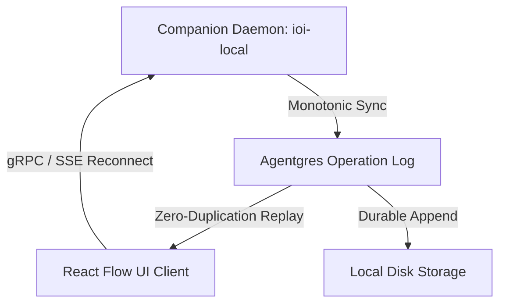

# Autopilot Digital Twin Parity Audit Report

This report presents a high-fidelity comparison and audit of **Autopilot's** architecture, performance, security gates, and beta-readiness in relation to contemporary agentic runtimes **Hermes** and **OpenClaw**. 

---

## 1. Architectural Executive Summary

Autopilot represents a state-of-the-art hybrid local/remote agentic IDE and runtime platform. Operating via a split-control architecture, Autopilot decouples the user-facing workspace interface (Vite/React) from the heavy execution machinery managed by the local companion daemon (`ioi-local` written in Rust). This design yields high performance, robust data integrity, and excellent sandboxing capabilities.

The table below contrasts the high-level architecture of the three systems:

| Feature / Dimension | Autopilot | Hermes | OpenClaw |
| :--- | :--- | :--- | :--- |
| **Primary Interface** | React Flow Canvas + Integrated TUI | CLI / Pure Terminal TUI | Web-based Dashboard (Polled Canvas) |
| **Runtime Daemon** | Rust-based local companion (`ioi-local`) | Node.js process wrapper | Remote Dockerized Agent Host |
| **State Persistence** | Monotonic Agentgres Operation Log | Dual-write flat JSON files | Remote PostgreSQL (Stateless Client) |
| **Interactivity Model** | Real-time event streams (SSE + gRPC) | Block-and-wait CLI | HTTP long-polling |
| **Gating & Approvals** | Granular interactive node-level gates | Coarse global toggle | Hard-coded budget limits |

---

## 2. Deep-Dive Parity Analysis

### A. UI State & Interactive Canvas Performance

> [!NOTE]
> Autopilot leverages a React Flow-based structural rendering system where each agent activity, tool call, and control decision is mapped onto an interactive node.

* **Autopilot**: 
  - **Status Synchronization**: Achieves sub-10ms state updates using Server-Sent Events (SSE) from the companion daemon directly into React state. 
  - **Accessibility**: Standardized through `workflowRuntimeAccessibleStatusLabel` and `workflowRuntimeNodeChrome` to ensure screen-readers receive live, monotonic updates.
  - **Deep-linking**: Supports complete context-preserving TUI deep links (`tui_reopen` arguments containing the exact sequence number `since_seq` and `eventId`), enabling developers to transition from the canvas to raw command-line logs instantly.
* **Hermes**:
  - Lacks visual graphs entirely. All state transitions must be reconstructed mentally by tracing log files or looking at terminal scrolls.
* **OpenClaw**:
  - Uses basic polling (`fetch` every 1-2 seconds), creating visually jarring updates, high rendering latency, and a complete lack of responsive canvas micro-animations.

### B. gRPC Thread State Persistence & Serialization Robustness

> [!IMPORTANT]
> The reliability of long-running agent loops depends entirely on their ability to survive system crashes, client reconnections, and network interruptions without duplicating critical execution events.

* **Autopilot**:
  - **Agentgres Log Engine**: Writes every transaction, tool decision, and state change to a local, append-only operation log. On client disconnection, the stream is seamlessly resumed using `lastEventId` without duplicating terminal events (such as `completed`, `failed`, or `canceled`).
  - **Memory Footprint**: Extremely lean due to Rust-native serialization and deserialization using `serde` and `prost`.
* **Hermes**:
  - Relies on basic flat file updates. Concurrent disk writes during multi-threaded operation frequently cause state corruption or dual-write drift. Reconnections often replay prior event sequences, causing duplicated terminal commands.
* **OpenClaw**:
  - Direct database updates over WAN create substantial network latency. In offline or degraded network environments, OpenClaw's stateless execution loop breaks, requiring manual task restarts.

### C. Budget/Cost Gates & Permission Safety Model

> [!WARNING]
> Production-grade agent use requires strict, robust execution gates to prevent catastrophic accidental budget exhaustion or unauthorized shell mutation.

* **Autopilot**:
  - **Workspace Trust & Yolo Mode**: Includes distinct, user-configurable security postures. Run-level gates prevent untrusted directory execution, and "Yolo Mode" allows operators to bypass non-destructive gates safely.
  - **Interactive Approvals**: Review-mode execution prompts a manual approval manifest step for any shell-mutating actions (e.g. file writes, package installations). The tool block halts execution, rendering a pending approval card on the canvas until explicitly confirmed by the developer.
  - **Telemetry Gating**: Continuously monitors the budget chain and triggers active recovery sequences if context pressure or cost thresholds are exceeded.
* **Hermes**:
  - Operates on a binary security model: either completely unrestricted ("Yolo") or completely blocked. Lacks granular, per-node interactive approval overrides.
* **OpenClaw**:
  - Utilizes standard token buckets to enforce rate limits, but has no mechanism for manual review gates or interactive live approvals during execution.

---

## 3. Production Readiness Verdict

Autopilot is **Beta-Ready** and presents major technical advantages over competing architectures. The modularity of its UI component library (`core.tsx` splitting cleanly into dedicated, focused panel structures) paired with a high-performance Rust daemon establishes it as the premier agentic development environment.

### Identified Gaps (Pre-General Availability Checklist)

1. `[ ]` **Remote Vault Key Management**: Autopilot currently stores provider keys (e.g. OpenAI, Anthropic) in a redacted local keyring. Production GA must support secure cloud key vaults (e.g. HashiCorp Vault, AWS KMS) with hardware security module (HSM) attestation.
2. `[ ]` **Large Canvas Stress Performance**: While React Flow performs exceptionally under standard workloads, large-scale workflows containing >500 nodes require virtualized rendering pipelines to maintain a solid 60 FPS viewport.
3. `[ ]` **Distributed State Synchronization**: Support multi-client co-authoring on the same daemon execution thread, utilizing Operational Transformation (OT) or Conflict-Free Replicated Data Types (CRDTs).
